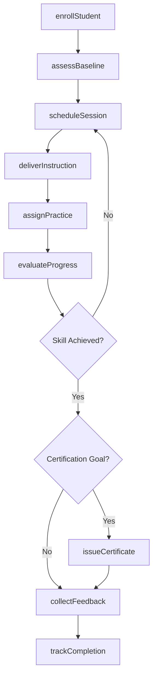
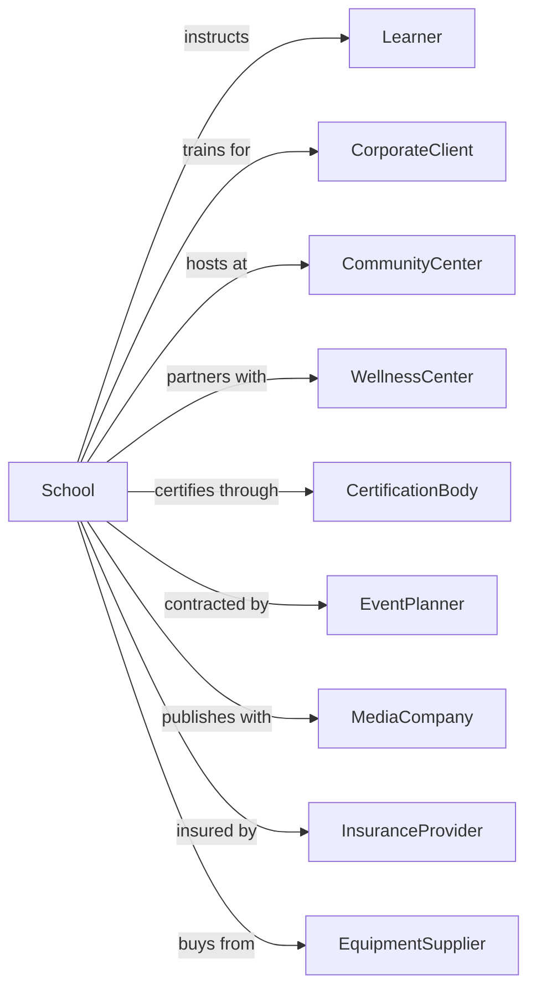

# All Other Miscellaneous Schools and Instruction

> Business-as-Code definition for specialized instruction providers. Models the complete learning lifecycle from enrollment through skill achievement.

## Overview

All other miscellaneous schools and instruction establishments provide specialized training not classified elsewhere, including public speaking, speed reading, survival skills, yoga, meditation, cooking, and personal development courses. This definition exposes actions for student enrollment, instruction delivery, skill assessment, and certification, along with events for workflow automation and searches for program data.

## Actors

| Actor | Description |
|-------|-------------|
| Learner | Individual seeking specialized instruction |
| CorporateClient | Organization sponsoring employee development |
| CommunityCenter | Facility hosting instructional programs |
| WellnessCenter | Spa or retreat partnering for courses |
| CertificationBody | Organization issuing professional credentials |
| EventPlanner | Organizer contracting workshops and seminars |
| MediaCompany | Publisher producing instructional content |
| InsuranceProvider | Carrier covering instruction liability |
| EquipmentSupplier | Provider of specialized training materials |

## Roles

| Role | Description |
|------|-------------|
| ProgramDirector | Oversees curriculum and instructor staff |
| LeadInstructor | Delivers specialized training content |
| WorkshopFacilitator | Conducts intensive short-format sessions |
| GuestExpert | Provides specialized topic expertise |
| ContentDeveloper | Creates instructional materials and exercises |
| StudentCoordinator | Manages enrollment and student experience |
| YogaInstructor | Leads group classes in postures, breathing, and meditation for wellness and fitness |

## Entities

| Entity | Description |
|--------|-------------|
| Student | Individual enrolled in instruction |
| Course | Structured learning program |
| Workshop | Intensive short-duration training event |
| Enrollment | Record of student registration |
| Skill | Competency being developed |
| Assessment | Evaluation of student progress |
| Certificate | Recognition of achievement |
| Material | Instructional content and resources |
| Session | Individual class or practice meeting |
| Retreat | Multi-day immersive learning experience |
| Feedback | Student evaluation of instruction |
| Venue | Location for instruction delivery |

## Actions

| Action | Description |
|--------|-------------|
| enrollStudent | Register learner for instruction program |
| assessBaseline | Evaluate initial skill level |
| deliverInstruction | Conduct class or workshop session |
| assignPractice | Distribute exercises for skill development |
| evaluateProgress | Assess student advancement |
| conductWorkshop | Deliver intensive training event |
| organizeRetreat | Plan and execute immersive experience |
| issueCertificate | Award achievement credential |
| collectFeedback | Gather student evaluations |
| customizeProgram | Tailor content for corporate client |
| hostGuestExpert | Arrange specialized topic instruction |
| processPayment | Handle tuition and fees |
| marketCourse | Promote instructional offerings |
| scheduleSession | Book class or practice meeting |
| trackCompletion | Monitor program finish rates |

## Events

| Event | Description |
|-------|-------------|
| studentEnrolled | Registration completed for program |
| baselineAssessed | Initial evaluation finished |
| instructionDelivered | Class session conducted |
| practiceAssigned | Exercises distributed |
| progressEvaluated | Advancement assessment completed |
| workshopConducted | Intensive event delivered |
| retreatOrganized | Immersive experience planned |
| certificateIssued | Credential awarded |
| feedbackCollected | Evaluations received |
| programCustomized | Client-specific content created |
| guestExpertHosted | Specialized instruction delivered |
| paymentProcessed | Fees received |
| courseMarketed | Promotion completed |
| sessionScheduled | Meeting booked |
| completionTracked | Finish rate recorded |

## Searches

| Search | Description |
|--------|-------------|
| findStudents | Query learners by course, status, or instructor |
| getCourses | List available instruction programs |
| getWorkshops | Find upcoming intensive events |
| getRetreats | List immersive experiences |
| getEnrollments | Query registrations by program or date |
| getAssessments | Query evaluations by student |
| getCertificates | List credentials issued |
| getFeedback | Retrieve student evaluations |

## Workflow



## Actor Relationships



## Usage

### Calling Actions

```typescript
import { instructLearners } from '@headlessly/instruct-learners'

const school = instructLearners()

// List available instruction programs
const courses = await school.getCourses({ category: 'survival-skills' })

// Find upcoming workshops and intensives
const workshops = await school.getWorkshops({ month: 6, year: 2024 })

// Enroll a new student
const enrollment = await school.enrollStudent({
  firstName: 'Rachel',
  lastName: 'Green',
  programId: 'public-speaking-mastery',
  startDate: '2025-09-01',
  format: 'in-person'
})

// Assess baseline abilities
const assessment = await school.assessBaseline({
  studentId: enrollment.studentId,
  skills: ['confidence', 'voice-projection', 'audience-engagement', 'structure'],
  method: 'recorded-presentation'
})

// Conduct intensive workshop
await school.conductWorkshop({
  title: 'Presentation Skills Bootcamp',
  date: '2025-09-20',
  duration: '8-hours',
  instructorId: 'instructor-456',
  participantIds: [enrollment.studentId],
  venue: 'conference-room-a',
  topics: ['storytelling', 'body-language', 'handling-questions']
})
```

### Event-Driven Automation

```typescript
// Issue certificate when skill threshold reached
school.progressEvaluated(async ({ studentId, evaluationId }) => {
  const evaluation = await school.getAssessments({ id: evaluationId })
  const student = await school.findStudents({ id: studentId })
  const program = await school.getCourses({ id: student.programId })

  const averageScore = calculateAverage(evaluation.scores)

  if (averageScore >= program.certificationThreshold) {
    await school.issueCertificate({
      studentId,
      credential: program.certificateName,
      score: averageScore,
      issueDate: new Date().toISOString()
    })
  }
})

// Request feedback after program completion
school.certificateIssued(async ({ studentId, certificateId }) => {
  const student = await school.findStudents({ id: studentId })

  await sendNotification({
    to: student.email,
    subject: 'Congratulations! Share Your Feedback',
    template: 'completion-feedback-request',
    data: {
      certificateId,
      feedbackUrl: `${baseUrl}/feedback/${studentId}`
    }
  })

  await scheduleFollowUp({
    date: addDays(new Date(), 7),
    action: async () => {
      await school.collectFeedback({
        studentId,
        reminder: true
      })
    }
  })
})
```
