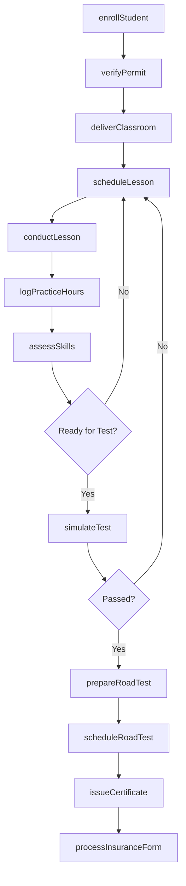
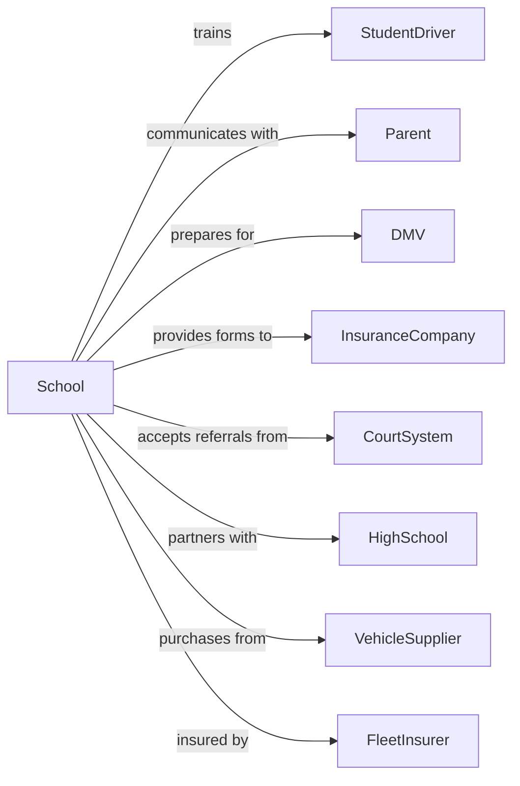

# Automobile Driving Schools

> Business-as-Code definition for driver education and training providers. Models the complete instruction lifecycle from enrollment through licensure.

## Overview

Automobile driving schools provide classroom and behind-the-wheel instruction for new drivers seeking learner's permits and driver's licenses, as well as defensive driving courses for experienced drivers. This definition exposes actions for student enrollment, classroom instruction, driving lessons, and DMV test preparation, along with events for workflow automation and searches for program data.

## Actors

| Actor | Description |
|-------|-------------|
| StudentDriver | Individual seeking driver education |
| Parent | Guardian enrolling minor and providing supervised practice |
| DMV | Department of Motor Vehicles issuing permits and licenses |
| InsuranceCompany | Carrier offering discounts for driver education completion |
| CourtSystem | Authority mandating defensive driving courses |
| HighSchool | Institution partnering for teen driver education |
| VehicleSupplier | Provider of training vehicles |
| FleetInsurer | Carrier covering training vehicle liability |
| EmployerClient | Company requiring employee driver training |

## Roles

| Role | Description |
|------|-------------|
| SchoolOwner | Operates business and manages compliance |
| DrivingInstructor | Delivers behind-the-wheel training |
| ClassroomTeacher | Conducts driver education courses |
| ScheduleCoordinator | Books lessons and manages instructor availability |
| VehicleMaintainer | Keeps training cars safe and operational |
| CustomerService | Handles enrollment and customer inquiries |
| BehindTheWheelInstructor | Rides passenger-side with dual controls to coach new drivers on public roads |

## Entities

| Entity | Description |
|--------|-------------|
| Student | Individual enrolled in driver education |
| Course | Structured driver education program |
| Lesson | Scheduled behind-the-wheel training session |
| Enrollment | Record of student registration |
| Permit | Learner authorization from DMV |
| License | Full driving authorization from DMV |
| Vehicle | Training car equipped with dual controls |
| Certificate | Completion document for insurance or court |
| Assessment | Evaluation of driving skills |
| Route | Planned driving path for lesson |
| Classroom | Facility for instructional sessions |
| Logbook | Record of practice driving hours |

## Actions

| Action | Description |
|--------|-------------|
| enrollStudent | Register student for driver education program |
| verifyPermit | Confirm valid learner's permit status |
| deliverClassroom | Conduct driver education classroom session |
| scheduleLesson | Book behind-the-wheel training appointment |
| conductLesson | Deliver in-vehicle driving instruction |
| logPracticeHours | Record supervised driving time |
| assessSkills | Evaluate driver competency |
| simulateTest | Conduct practice driving examination |
| prepareRoadTest | Ready student for DMV practical exam |
| issueCertificate | Award completion document |
| processInsuranceForm | Complete paperwork for insurance discounts |
| maintainVehicle | Service and inspect training cars |
| scheduleRoadTest | Book DMV appointment for student |
| teachDefensiveDriving | Conduct course for experienced drivers |
| processCourt | Handle court-mandated enrollment |

## Events

| Event | Description |
|-------|-------------|
| studentEnrolled | Registration completed for program |
| permitVerified | Learner's permit status confirmed |
| classroomDelivered | Education session conducted |
| lessonScheduled | Driving appointment booked |
| lessonConducted | Behind-the-wheel training completed |
| practiceHoursLogged | Supervised time recorded |
| skillsAssessed | Driver competency evaluated |
| testSimulated | Practice exam completed |
| roadTestPrepared | DMV readiness confirmed |
| certificateIssued | Completion document awarded |
| insuranceFormProcessed | Discount paperwork completed |
| vehicleMaintained | Training car serviced |
| roadTestScheduled | DMV appointment booked |
| defensiveDrivingTaught | Experienced driver course completed |
| courtProcessed | Mandated enrollment handled |

## Searches

| Search | Description |
|--------|-------------|
| findStudents | Query students by program, status, or instructor |
| getLessons | Retrieve scheduled driving appointments |
| getCourses | List available driver education programs |
| getVehicles | Check training car availability |
| getInstructors | Find teachers by availability or specialty |
| getPracticeHours | Query logged driving time by student |
| getCertificates | List completion documents issued |
| getAssessments | Query skill evaluations by student |

## Workflow



## Actor Relationships



## Usage

### Calling Actions

```typescript
import { instructDrivers } from '@headlessly/instruct-drivers'

const school = instructDrivers()

// Check training vehicle availability
const vehicles = await school.getVehicles({ status: 'available' })

// Find instructors with open slots
const instructors = await school.getInstructors({ available: true })

// Enroll a new student
const enrollment = await school.enrollStudent({
  firstName: 'Alex',
  lastName: 'Johnson',
  dateOfBirth: '2009-05-20',
  programType: 'teen-driver-ed',
  guardianId: 'parent-456',
  permitNumber: 'P123456789'
})

// Schedule behind-the-wheel lesson
const lesson = await school.scheduleLesson({
  studentId: enrollment.studentId,
  instructorId: 'instructor-789',
  vehicleId: 'car-101',
  dateTime: '2025-09-15T16:00:00',
  duration: 60,
  route: 'residential-basics'
})

// Log practice hours after lesson
await school.logPracticeHours({
  studentId: enrollment.studentId,
  date: '2025-09-15',
  hours: 1,
  type: 'professional-instruction',
  conditions: ['daylight', 'clear-weather'],
  instructorId: 'instructor-789'
})
```

### Event-Driven Automation

```typescript
// Notify parent after each lesson
school.lessonConducted(async ({ studentId, lessonId }) => {
  const student = await school.findStudents({ id: studentId })
  const lesson = await school.getLessons({ id: lessonId })

  await sendNotification({
    to: student.guardianEmail,
    subject: `Driving Lesson Complete`,
    template: 'lesson-summary',
    data: {
      skillsWorked: lesson.skills,
      progress: lesson.instructorNotes,
      nextLesson: lesson.nextScheduled
    }
  })
})

// Auto-schedule road test when ready
school.skillsAssessed(async ({ studentId, assessmentId }) => {
  const assessment = await school.getAssessments({ id: assessmentId })

  if (assessment.readyForRoadTest) {
    const practiceHours = await school.getPracticeHours({ studentId })
    const student = await school.findStudents({ id: studentId })

    if (practiceHours.total >= student.state.requiredHours) {
      await school.prepareRoadTest({ studentId })

      await sendNotification({
        to: student.guardianEmail,
        subject: `${student.firstName} is Ready for the Road Test!`,
        template: 'road-test-ready',
        data: {
          practiceHours: practiceHours.total,
          nextSteps: 'Schedule DMV appointment'
        }
      })
    }
  }
})
```
