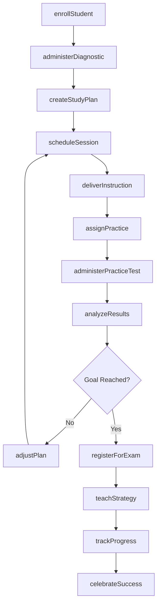
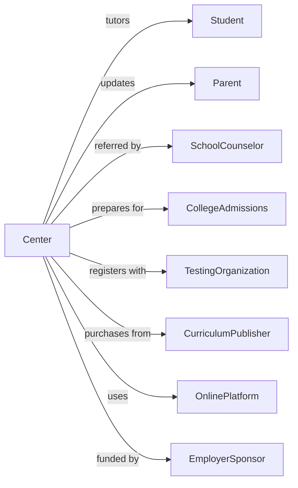

# Exam Preparation and Tutoring

> Business-as-Code definition for test prep and academic tutoring services. Models the complete learning lifecycle from assessment through exam success.

## Overview

Exam preparation and tutoring establishments provide standardized test preparation, academic tutoring, and remedial instruction for students seeking to improve performance on college entrance exams, professional licensure tests, or academic coursework. This definition exposes actions for student assessment, personalized instruction, practice testing, and progress monitoring, along with events for workflow automation and searches for program data.

## Actors

| Actor | Description |
|-------|-------------|
| Student | Individual seeking academic improvement or test preparation |
| Parent | Guardian enrolling minor children and monitoring progress |
| SchoolCounselor | Educational advisor referring students for support |
| CollegeAdmissions | Institution evaluating test scores for admission |
| TestingOrganization | Body administering standardized examinations |
| CurriculumPublisher | Provider of test prep materials and practice tests |
| OnlinePlatform | Digital learning and practice system |
| EmployerSponsor | Company funding employee professional exam preparation |
| LicensingBoard | Body requiring professional examination |

## Roles

| Role | Description |
|------|-------------|
| CenterDirector | Oversees tutoring operations and student success |
| SubjectTutor | Provides one-on-one academic instruction |
| TestPrepInstructor | Teaches standardized exam strategies |
| DiagnosticsSpecialist | Assesses student strengths and weaknesses |
| CurriculumCoordinator | Develops and maintains instructional content |
| StudentCoordinator | Matches students with appropriate tutors |

## Entities

| Entity | Description |
|--------|-------------|
| Student | Individual enrolled in tutoring or test prep |
| Session | Scheduled tutoring or instruction appointment |
| Course | Structured test prep program |
| Enrollment | Record of student registration |
| DiagnosticTest | Assessment identifying knowledge gaps |
| PracticeTest | Simulated exam for preparation |
| StudyPlan | Personalized learning roadmap |
| Subject | Academic area for tutoring |
| Score | Test or assessment result |
| Material | Workbooks, practice questions, and resources |
| Progress | Tracked improvement over time |
| Goal | Target score or academic outcome |

## Actions

| Action | Description |
|--------|-------------|
| enrollStudent | Register student for tutoring or test prep |
| administerDiagnostic | Conduct initial assessment of knowledge |
| createStudyPlan | Develop personalized learning roadmap |
| scheduleSession | Book tutoring or instruction appointment |
| deliverInstruction | Conduct tutoring or test prep session |
| assignPractice | Distribute homework and practice problems |
| administerPracticeTest | Conduct simulated examination |
| analyzeResults | Evaluate test performance and identify gaps |
| adjustPlan | Modify study approach based on progress |
| trackProgress | Monitor improvement toward goals |
| teachStrategy | Instruct test-taking techniques |
| provideFeedback | Share performance insights with student |
| communicateParent | Update guardian on student progress |
| registerForExam | Sign up student for official test date |
| celebrateSuccess | Recognize achievement of goals |

## Events

| Event | Description |
|-------|-------------|
| studentEnrolled | Registration completed for program |
| diagnosticAdministered | Initial assessment completed |
| studyPlanCreated | Learning roadmap finalized |
| sessionScheduled | Appointment booked |
| instructionDelivered | Tutoring session conducted |
| practiceAssigned | Homework distributed |
| practiceTestAdministered | Simulated exam completed |
| resultsAnalyzed | Performance evaluation finished |
| planAdjusted | Study approach modified |
| progressTracked | Improvement recorded |
| strategyTaught | Test techniques instructed |
| feedbackProvided | Performance insights shared |
| parentCommunicated | Guardian update sent |
| examRegistered | Official test signup completed |
| successCelebrated | Goal achievement recognized |

## Searches

| Search | Description |
|--------|-------------|
| findStudents | Query students by exam, subject, or tutor |
| getSessions | Retrieve scheduled appointments |
| getCourses | List test prep programs |
| getDiagnostics | Query initial assessments |
| getPracticeTests | List simulated exams by student |
| getProgress | Track improvement data |
| getTutors | Find instructors by subject or availability |
| getScores | Retrieve test results and analytics |

## Workflow



## Actor Relationships



## Usage

### Calling Actions

```typescript
import { instructStudents } from '@headlessly/instruct-students'

const center = instructStudents()

// List test prep programs by exam type
const courses = await center.getCourses({ exam: 'SAT', format: 'small-group' })

// Find tutors by subject and availability
const tutors = await center.getTutors({ subject: 'math', available: true })

// Enroll a new student
const enrollment = await center.enrollStudent({
  firstName: 'James',
  lastName: 'Park',
  examTarget: 'SAT',
  goalScore: 1450,
  testDate: '2025-12-07',
  guardianId: 'parent-456'
})

// Administer diagnostic test
const diagnostic = await center.administerDiagnostic({
  studentId: enrollment.studentId,
  examType: 'SAT',
  sections: ['reading', 'writing', 'math-no-calc', 'math-calc']
})

// Create personalized study plan
await center.createStudyPlan({
  studentId: enrollment.studentId,
  diagnosticId: diagnostic.id,
  weakAreas: diagnostic.weakestSections,
  hoursPerWeek: 6,
  targetDate: enrollment.testDate,
  milestones: [
    { week: 4, targetScore: 1300 },
    { week: 8, targetScore: 1380 },
    { week: 12, targetScore: 1450 }
  ]
})
```

### Event-Driven Automation

```typescript
// Adjust plan when practice test shows insufficient progress
center.practiceTestAdministered(async ({ studentId, score, examType }) => {
  const student = await center.findStudents({ id: studentId })
  const studyPlan = await getStudyPlan(studentId)
  const expectedScore = getCurrentMilestone(studyPlan).targetScore

  if (score < expectedScore * 0.95) {
    const results = await center.analyzeResults({ studentId, testId: score.testId })

    await center.adjustPlan({
      studentId,
      additionalFocus: results.weakestAreas,
      extraHours: 2,
      reason: 'below-milestone'
    })

    await center.communicateParent({
      guardianId: student.guardianId,
      subject: 'Study Plan Adjustment',
      message: `We've adjusted ${student.firstName}'s plan to focus more on ${results.weakestAreas.join(', ')}`
    })
  }
})

// Celebrate and document success
center.progressTracked(async ({ studentId, latestScore, goalScore }) => {
  if (latestScore >= goalScore) {
    const student = await center.findStudents({ id: studentId })

    await center.celebrateSuccess({
      studentId,
      achievement: `Reached ${latestScore} on ${student.examTarget}`,
      date: new Date().toISOString()
    })

    await sendNotification({
      to: student.guardianEmail,
      subject: `${student.firstName} Reached Their Goal!`,
      template: 'goal-achieved',
      data: { score: latestScore, goal: goalScore }
    })
  }
})
```
