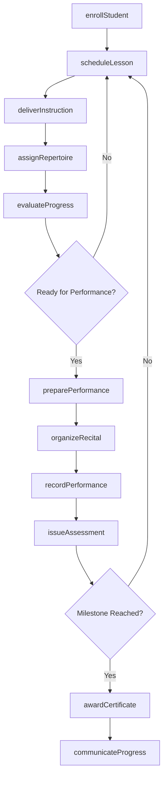
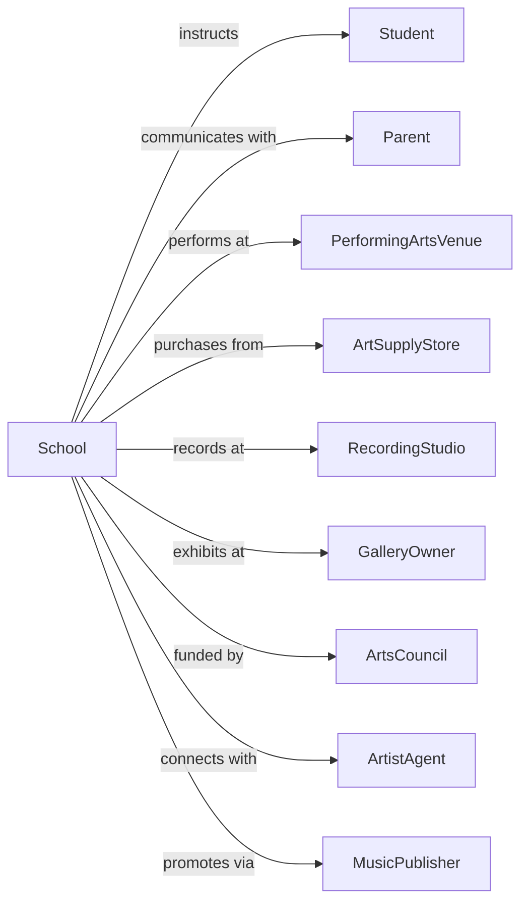

# Fine Arts Schools

> Business-as-Code definition for arts education institutions. Models the complete instruction lifecycle from enrollment through performance or exhibition.

## Overview

Fine arts schools provide instruction in visual arts, music, dance, drama, and photography for personal enrichment or career development. This definition exposes actions for student enrollment, lesson scheduling, performance preparation, and progress assessment, along with events for workflow automation and searches for program data.

## Actors

| Actor | Description |
|-------|-------------|
| Student | Individual seeking arts instruction |
| Parent | Guardian enrolling minor children in programs |
| PerformingArtsVenue | Theater or concert hall hosting student showcases |
| ArtSupplyStore | Retailer providing materials and instruments |
| RecordingStudio | Facility for music recording and production |
| GalleryOwner | Curator displaying student visual artwork |
| ArtistAgent | Representative connecting students with opportunities |
| MusicPublisher | Company licensing compositions and recordings |
| ArtsCouncil | Funding organization supporting arts education |

## Roles

| Role | Description |
|------|-------------|
| SchoolDirector | Oversees institution operations and programming |
| ArtInstructor | Teaches visual arts techniques and theory |
| MusicTeacher | Provides instrumental or vocal instruction |
| DanceInstructor | Teaches movement and choreography |
| DramaCoach | Guides acting and theatrical performance |
| Accompanist | Provides musical support for lessons and performances |

## Entities

| Entity | Description |
|--------|-------------|
| Student | Individual enrolled in arts instruction |
| Lesson | Scheduled instructional session |
| Course | Series of lessons in specific discipline |
| Enrollment | Record of student registration |
| Performance | Recital, concert, or theatrical presentation |
| Exhibition | Display of student visual artwork |
| Repertoire | Collection of pieces student is learning |
| Portfolio | Body of work demonstrating student progress |
| Assessment | Evaluation of student skill and progress |
| Instrument | Musical equipment owned or rented by student |
| Studio | Space for instruction and practice |
| Certificate | Recognition of achievement or completion |

## Actions

| Action | Description |
|--------|-------------|
| enrollStudent | Register student for arts instruction |
| scheduleLesson | Book individual or group instructional session |
| deliverInstruction | Conduct arts lesson or class |
| assignRepertoire | Select pieces for student to learn |
| evaluateProgress | Assess student skill development |
| preparePerfomance | Ready student for recital or concert |
| organizeRecital | Plan and execute student performance event |
| curateExhibition | Select and display student artwork |
| recordPerformance | Capture audio or video of student work |
| issueAssessment | Provide formal evaluation or grading |
| awardCertificate | Recognize achievement or completion |
| rentInstrument | Provide equipment for student use |
| processPayment | Handle tuition and fees |
| communicateProgress | Update parents on student development |
| marketPrograms | Promote courses and enrollment opportunities |

## Events

| Event | Description |
|-------|-------------|
| studentEnrolled | Registration completed for instruction |
| lessonScheduled | Session booked with instructor |
| instructionDelivered | Lesson conducted |
| repertoireAssigned | Pieces selected for learning |
| progressEvaluated | Skill assessment completed |
| performancePrepared | Recital readiness confirmed |
| recitalOrganized | Performance event planned |
| exhibitionCurated | Artwork selected for display |
| performanceRecorded | Audio or video captured |
| assessmentIssued | Formal evaluation provided |
| certificateAwarded | Achievement recognized |
| instrumentRented | Equipment provided to student |
| paymentProcessed | Tuition received |
| progressCommunicated | Parent update sent |
| programMarketed | Enrollment promotion completed |

## Searches

| Search | Description |
|--------|-------------|
| findStudents | Query students by discipline, level, or instructor |
| getLessons | Retrieve scheduled sessions by date or instructor |
| getCourses | List available instruction programs |
| getPerformances | Find upcoming recitals and concerts |
| getExhibitions | List active artwork displays |
| getAssessments | Query evaluations by student |
| getInstructors | Find teachers by discipline or availability |
| getRepertoire | List pieces assigned to student |

## Workflow



## Actor Relationships



## Usage

### Calling Actions

```typescript
import { instructArtists } from '@headlessly/instruct-artists'

const school = instructArtists()

// Find upcoming recitals and student performances
const performances = await school.getPerformances({ month: 5, year: 2024 })

// Find instructors by discipline and availability
const instructors = await school.getInstructors({ discipline: 'piano', available: true })

// Enroll a new student
const enrollment = await school.enrollStudent({
  firstName: 'Sophia',
  lastName: 'Anderson',
  discipline: 'piano',
  level: 'intermediate',
  guardianId: 'parent-456',
  lessonFormat: 'private-weekly'
})

// Schedule a lesson
const lesson = await school.scheduleLesson({
  studentId: enrollment.studentId,
  instructorId: 'teacher-789',
  dateTime: '2025-09-15T15:00:00',
  duration: 45,
  studioId: 'studio-3'
})

// Assign repertoire for upcoming recital
await school.assignRepertoire({
  studentId: enrollment.studentId,
  pieces: [
    { title: 'Fur Elise', composer: 'Beethoven', difficulty: 'intermediate' },
    { title: 'Clair de Lune', composer: 'Debussy', difficulty: 'advanced' }
  ],
  targetDate: '2025-12-15'
})
```

### Event-Driven Automation

```typescript
// Notify parents when lessons completed
school.instructionDelivered(async ({ studentId, lessonId }) => {
  const student = await school.findStudents({ id: studentId })
  const lesson = await school.getLessons({ id: lessonId })

  await sendNotification({
    to: student.guardianEmail,
    subject: `Lesson Complete: ${lesson.date}`,
    template: 'lesson-summary',
    data: {
      practiceAssignment: lesson.notes,
      nextLesson: lesson.nextScheduled
    }
  })
})

// Auto-schedule recital when multiple students ready
school.progressEvaluated(async ({ studentId, readyForPerformance }) => {
  if (readyForPerformance) {
    const readyStudents = await school.findStudents({
      discipline: 'piano',
      status: 'performance-ready'
    })

    if (readyStudents.length >= 8) {
      await school.organizeRecital({
        discipline: 'piano',
        date: getNextSaturday(30),
        venue: 'main-recital-hall',
        performers: readyStudents.map(s => s.id)
      })
    }
  }
})
```
