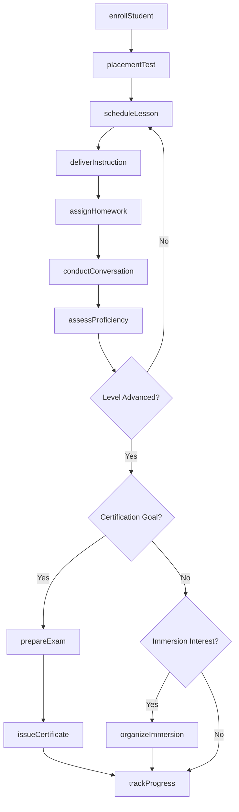
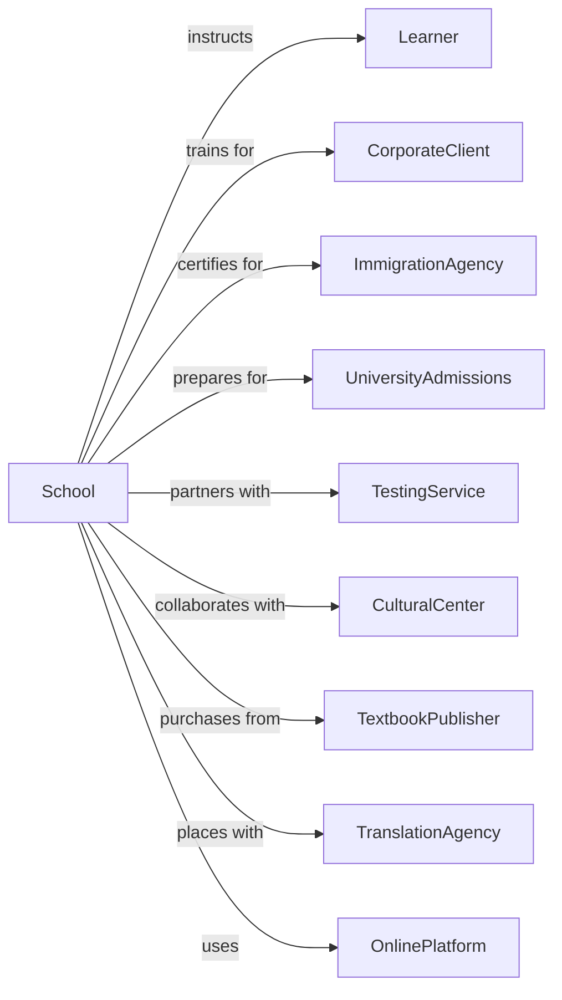

# Language Schools

> Business-as-Code definition for foreign language instruction providers. Models the complete learning lifecycle from enrollment through proficiency certification.

## Overview

Language schools provide instruction in foreign languages and sign language for personal enrichment, career development, or academic requirements. This definition exposes actions for student enrollment, lesson delivery, proficiency assessment, and certification preparation, along with events for workflow automation and searches for program data.

## Actors

| Actor | Description |
|-------|-------------|
| Learner | Individual seeking language instruction |
| CorporateClient | Organization sponsoring employee language training |
| ImmigrationAgency | Government body requiring language proficiency |
| UniversityAdmissions | Institution accepting proficiency certificates |
| TestingService | Organization administering standardized exams |
| CulturalCenter | Embassy or nonprofit promoting language learning |
| TextbookPublisher | Provider of instructional materials |
| OnlinePlatform | Digital learning system provider |
| TranslationAgency | Employer of multilingual professionals |

## Roles

| Role | Description |
|------|-------------|
| SchoolDirector | Oversees language programs and operations |
| LanguageInstructor | Delivers instruction in target language |
| NativeSpeakerTutor | Provides conversation practice and cultural insight |
| CurriculumCoordinator | Develops and maintains course content |
| AssessmentSpecialist | Creates and administers proficiency tests |
| StudentAdvisor | Guides learners on course selection and goals |

## Entities

| Entity | Description |
|--------|-------------|
| Student | Individual enrolled in language instruction |
| Course | Structured instruction program for language level |
| Lesson | Individual instructional session |
| Enrollment | Record of student registration |
| ProficiencyLevel | Standardized measure of language ability |
| Assessment | Test evaluating language competency |
| Certificate | Credential verifying proficiency level |
| Curriculum | Structured learning content and activities |
| ConversationSession | Practice session with native speaker |
| ImmersionProgram | Intensive study abroad or cultural experience |
| Vocabulary | Word sets and phrases for learning |
| Grammar | Language structure rules and exercises |

## Actions

| Action | Description |
|--------|-------------|
| enrollStudent | Register learner for language program |
| placementTest | Assess initial proficiency level |
| scheduleLesson | Book instructional session |
| deliverInstruction | Conduct language class or tutorial |
| assignHomework | Distribute practice exercises |
| conductConversation | Facilitate speaking practice session |
| assessProficiency | Evaluate language competency |
| prepareExam | Ready student for standardized test |
| issueeCertificate | Award proficiency credential |
| organizeImmersion | Plan cultural or study abroad experience |
| trackProgress | Monitor learner advancement |
| customizeCurriculum | Tailor content for corporate client |
| processPayment | Handle tuition and fees |
| communicateProgress | Update learner on advancement |
| referToResources | Recommend supplementary materials |

## Events

| Event | Description |
|-------|-------------|
| studentEnrolled | Registration completed for program |
| placementCompleted | Initial assessment finished |
| lessonScheduled | Session booked with instructor |
| instructionDelivered | Class conducted |
| homeworkAssigned | Practice exercises distributed |
| conversationConducted | Speaking session completed |
| proficiencyAssessed | Competency evaluation finished |
| examPrepared | Test readiness confirmed |
| certificateIssued | Credential awarded |
| immersionOrganized | Cultural program planned |
| progressTracked | Advancement recorded |
| curriculumCustomized | Client-specific content created |
| paymentProcessed | Tuition received |
| progressCommunicated | Learner update sent |
| resourceReferred | Materials recommended |

## Searches

| Search | Description |
|--------|-------------|
| findStudents | Query learners by language, level, or status |
| getCourses | List programs by language and level |
| getLessons | Retrieve scheduled sessions |
| getAssessments | Query proficiency evaluations |
| getCertificates | List credentials issued |
| getInstructors | Find teachers by language or availability |
| getImmersionPrograms | List cultural experiences |
| getCorporateContracts | Find business training agreements |

## Workflow



## Actor Relationships



## Usage

### Calling Actions

```typescript
import { instructLanguages } from '@headlessly/instruct-languages'

const school = instructLanguages()

// List courses by language and proficiency level
const courses = await school.getCourses({ language: 'spanish', level: 'intermediate' })

// Find available instructors by language
const instructors = await school.getInstructors({ language: 'spanish', available: true })

// Enroll a new student
const enrollment = await school.enrollStudent({
  firstName: 'Emma',
  lastName: 'Wilson',
  targetLanguage: 'spanish',
  goal: 'business-fluency',
  nativeLanguage: 'english',
  programType: 'intensive'
})

// Administer placement test
const placement = await school.placementTest({
  studentId: enrollment.studentId,
  language: 'spanish',
  components: ['listening', 'reading', 'writing', 'speaking']
})

// Schedule conversation session with native speaker
await school.conductConversation({
  studentId: enrollment.studentId,
  tutorId: 'native-speaker-456',
  dateTime: '2025-09-20T10:00:00',
  duration: 30,
  topic: 'business-negotiations',
  format: 'video-call'
})
```

### Event-Driven Automation

```typescript
// Recommend certification when proficiency advances
school.proficiencyAssessed(async ({ studentId, level, language }) => {
  const student = await school.findStudents({ id: studentId })
  const certifications = getAvailableCertifications(language, level)

  if (certifications.length > 0 && student.goal.includes('certification')) {
    await sendNotification({
      to: student.email,
      subject: `You're Ready for ${language} Certification!`,
      template: 'certification-recommendation',
      data: { certifications, currentLevel: level }
    })
  }
})

// Suggest immersion when intermediate level reached
school.progressTracked(async ({ studentId, newLevel }) => {
  if (newLevel === 'B1' || newLevel === 'B2') {
    const student = await school.findStudents({ id: studentId })
    const programs = await school.getImmersionPrograms({
      language: student.targetLanguage,
      dateRange: 'next-6-months'
    })

    if (programs.length > 0) {
      await school.communicateProgress({
        studentId,
        message: 'Consider an immersion program to accelerate your learning',
        recommendations: programs.slice(0, 3)
      })
    }
  }
})
```
