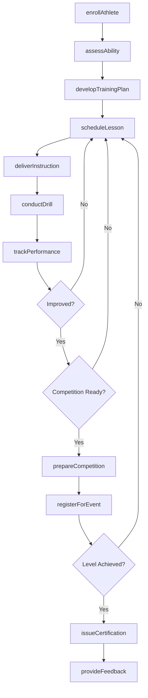
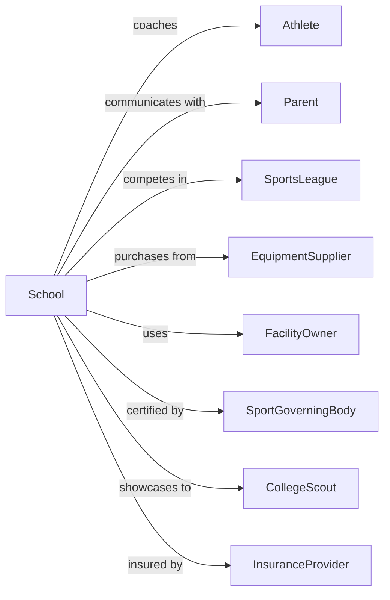

# Sports and Recreation Instruction

> Business-as-Code definition for athletic and recreational training providers. Models the complete instruction lifecycle from enrollment through competition and skill certification.

## Overview

Sports and recreation instruction establishments provide coaching and training in athletic activities including golf, tennis, swimming, martial arts, gymnastics, and team sports for all ages and skill levels. This definition exposes actions for student enrollment, lesson scheduling, skill development, and competition preparation, along with events for workflow automation and searches for program data.

## Actors

| Actor | Description |
|-------|-------------|
| Athlete | Individual seeking sports instruction |
| Parent | Guardian enrolling minor children in programs |
| SportsLeague | Organization hosting competitive events |
| EquipmentSupplier | Provider of athletic gear and supplies |
| FacilityOwner | Operator of fields, courts, or training spaces |
| SportGoverningBody | Organization setting rules and certifications |
| CollegeScout | Recruiter evaluating athletes for scholarships |
| SportsAgent | Representative for elite athletes |
| InsuranceProvider | Carrier covering instruction liability |

## Roles

| Role | Description |
|------|-------------|
| HeadCoach | Leads program and oversees instruction staff |
| SportsInstructor | Delivers skill training and technique coaching |
| FitnessTrainer | Provides conditioning and strength development |
| CampDirector | Manages overnight and day camp operations |
| ScheduleCoordinator | Books facilities, lessons, and events |
| SafetyOfficer | Ensures proper protocols and injury prevention |
| SwimInstructor | Teaches water safety and swimming techniques to students of all ages and skill levels |

## Entities

| Entity | Description |
|--------|-------------|
| Athlete | Individual enrolled in sports instruction |
| Lesson | Scheduled coaching session |
| Camp | Multi-day intensive training program |
| Class | Group instruction session |
| Enrollment | Record of athlete registration |
| Skill | Specific athletic competency |
| Assessment | Evaluation of athletic ability |
| Competition | Tournament, meet, or game event |
| Team | Group of athletes training together |
| Facility | Training venue or playing field |
| Equipment | Athletic gear provided or required |
| Certificate | Recognition of skill level achieved |

## Actions

| Action | Description |
|--------|-------------|
| enrollAthlete | Register individual for sports instruction |
| scheduleLesson | Book private or group coaching session |
| deliverInstruction | Conduct skills training |
| assessAbility | Evaluate athlete skill level |
| developTrainingPlan | Create personalized improvement program |
| conductDrill | Execute specific skill-building exercise |
| organizeCamp | Plan and run intensive training program |
| prepareCompetition | Ready athlete for tournament or meet |
| registerForEvent | Sign up athlete for competitive event |
| trackPerformance | Monitor improvement metrics |
| issueCertification | Award skill level credential |
| provideFeedback | Share coaching observations with athlete |
| coordinateTeam | Manage group training and logistics |
| maintainEquipment | Service and inventory athletic gear |
| processPayment | Handle fees and registrations |

## Events

| Event | Description |
|-------|-------------|
| athleteEnrolled | Registration completed for instruction |
| lessonScheduled | Session booked with coach |
| instructionDelivered | Training session conducted |
| abilityAssessed | Skill evaluation completed |
| trainingPlanDeveloped | Improvement program created |
| drillConducted | Skill exercise executed |
| campOrganized | Intensive program planned |
| competitionPrepared | Event readiness confirmed |
| eventRegistered | Competition signup completed |
| performanceTracked | Metrics recorded |
| certificationIssued | Skill level recognized |
| feedbackProvided | Coaching notes shared |
| teamCoordinated | Group logistics managed |
| equipmentMaintained | Gear serviced |
| paymentProcessed | Fees received |

## Searches

| Search | Description |
|--------|-------------|
| findAthletes | Query athletes by sport, level, or coach |
| getLessons | Retrieve scheduled sessions by date or instructor |
| getCamps | List upcoming intensive programs |
| getClasses | Find group instruction sessions |
| getCompetitions | List registered events |
| getAssessments | Query skill evaluations by athlete |
| getTeams | Find training groups by sport |
| getFacilities | Check venue availability |

## Workflow



## Actor Relationships



## Usage

### Calling Actions

```typescript
import { instructAthletes } from '@headlessly/instruct-athletes'

const academy = instructAthletes()

// Enroll a new athlete
const enrollment = await academy.enrollAthlete({
  firstName: 'Tyler',
  lastName: 'Roberts',
  sport: 'tennis',
  ageGroup: 'junior',
  guardianId: 'parent-456',
  programType: 'competitive-track'
})

// Assess initial skill level
const assessment = await academy.assessAbility({
  athleteId: enrollment.athleteId,
  sport: 'tennis',
  skills: ['forehand', 'backhand', 'serve', 'volley', 'footwork'],
  assessorId: 'coach-789'
})

// Develop training plan based on assessment
await academy.developTrainingPlan({
  athleteId: enrollment.athleteId,
  focusAreas: assessment.weakestSkills,
  goals: ['improve-serve-speed', 'tournament-ready'],
  duration: '12-weeks',
  lessonsPerWeek: 3
})
```

### Event-Driven Automation

```typescript
// Suggest competition when performance improves
academy.performanceTracked(async ({ athleteId, metric, improvement }) => {
  if (improvement >= 0.15) {
    const athlete = await academy.findAthletes({ id: athleteId })
    const competitions = await academy.getCompetitions({
      sport: athlete.sport,
      ageGroup: athlete.ageGroup,
      dateRange: 'next-60-days'
    })

    if (competitions.length > 0) {
      await notifyParent({
        guardianId: athlete.guardianId,
        subject: `${athlete.firstName} is ready for competition!`,
        competitions: competitions.slice(0, 3)
      })
    }
  }
})

// Award certification when skills mastered
academy.abilityAssessed(async ({ athleteId, assessmentId }) => {
  const assessment = await academy.getAssessments({ id: assessmentId })
  const levelRequirements = getLevelRequirements(assessment.sport)

  const currentLevel = determineLevel(assessment.scores, levelRequirements)

  if (currentLevel > assessment.previousLevel) {
    await academy.issueCertification({
      athleteId,
      sport: assessment.sport,
      level: currentLevel,
      issueDate: new Date().toISOString()
    })
  }
})
```
