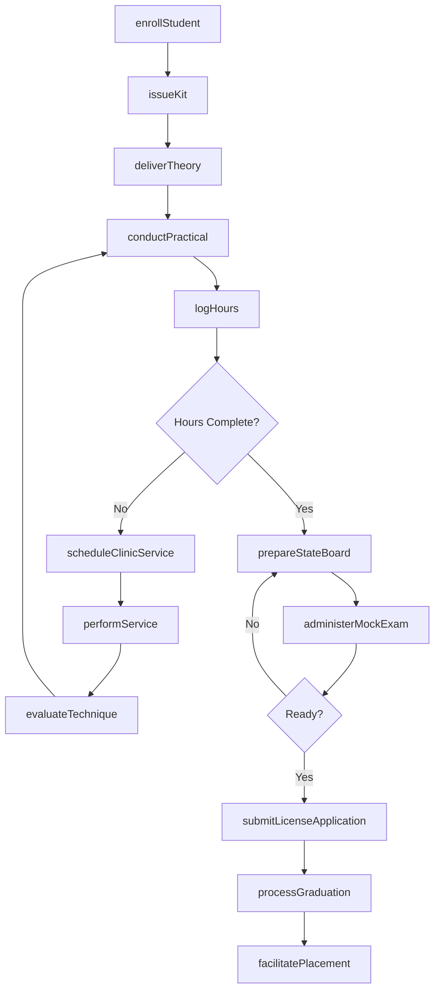
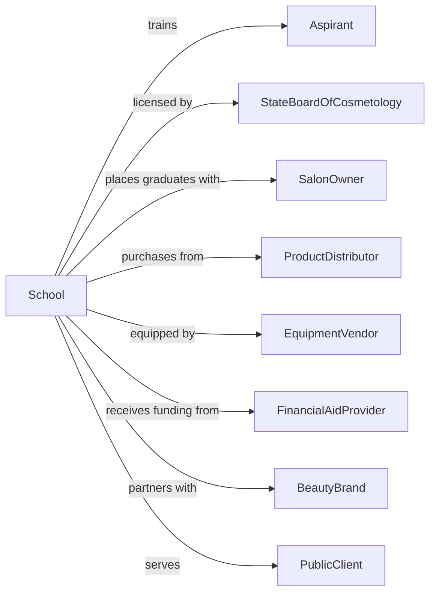

# Cosmetology and Barber Schools

> Business-as-Code definition for beauty and barbering education institutions. Models the complete training lifecycle from enrollment through state licensure and salon placement.

## Overview

Cosmetology and barber schools provide hands-on training in hair styling, cutting, coloring, skin care, nail services, and barbering techniques to prepare students for state licensure examinations. This definition exposes actions for student enrollment, practical training, state board preparation, and career placement, along with events for workflow automation and searches for program data.

## Actors

| Actor | Description |
|-------|-------------|
| Aspirant | Individual seeking career in beauty or barbering |
| StateBoardOfCosmetology | Regulatory body issuing licenses |
| SalonOwner | Employer hiring licensed stylists and barbers |
| ProductDistributor | Supplier of professional beauty products |
| EquipmentVendor | Provider of salon equipment and tools |
| FinancialAidProvider | Agency or lender funding student tuition |
| BeautyBrand | Manufacturer offering product training partnerships |
| IndustryAssociation | Professional group setting standards and trends |
| PublicClient | Customer receiving services in student clinic |

## Roles

| Role | Description |
|------|-------------|
| SchoolDirector | Leads institution and ensures regulatory compliance |
| LicensedInstructor | Teaches techniques and supervises practical training |
| ClinicSupervisor | Oversees student services to public clients |
| AdmissionsRepresentative | Recruits and enrolls prospective students |
| ComplianceOfficer | Manages state board requirements and reporting |
| PlacementCoordinator | Connects graduates with salon employment |
| StudentStylist | Performs supervised haircuts and treatments on public clinic clients while logging required hours |

## Entities

| Entity | Description |
|--------|-------------|
| Student | Individual enrolled in cosmetology or barber program |
| Program | Course of study leading to licensure eligibility |
| Course | Training module covering specific techniques |
| PracticalHours | Supervised hands-on training time required for licensure |
| Clinic | On-site salon serving public clients for student practice |
| Assessment | Written or practical test of student competency |
| Mannequin | Practice head for training before live clients |
| Kit | Professional tools and supplies provided to students |
| License | State credential authorizing professional practice |
| Service | Treatment performed on public or practice client |
| Enrollment | Record of student registration |
| Transcript | Record of courses and hours completed |

## Actions

| Action | Description |
|--------|-------------|
| enrollStudent | Register student for cosmetology or barber program |
| issueKit | Provide student with professional tools and supplies |
| deliverTheory | Teach classroom instruction on techniques and safety |
| conductPractical | Supervise hands-on training on mannequins |
| logHours | Record student practical training hours |
| scheduleClinicService | Book public client appointment for student practice |
| performService | Execute salon treatment under instructor supervision |
| evaluateTechnique | Assess student skill on specific procedures |
| prepareStateBoard | Ready student for written and practical licensing exams |
| administerMockExam | Conduct practice test simulating state board |
| submitLicenseApplication | File paperwork for state board examination |
| processGraduation | Verify hours and requirements for program completion |
| facilitatePlacement | Connect graduate with salon employment |
| orderSupplies | Procure products and materials for training |
| reportCompliance | Submit required data to state regulatory board |

## Events

| Event | Description |
|-------|-------------|
| studentEnrolled | Registration completed for program |
| kitIssued | Tools and supplies provided to student |
| theoryDelivered | Classroom instruction completed |
| practicalConducted | Hands-on training session finished |
| hoursLogged | Training time recorded in student record |
| clinicServiceScheduled | Client appointment booked |
| servicePerformed | Salon treatment completed |
| techniqueEvaluated | Skill assessment scored |
| stateBoardPrepared | Exam readiness confirmed |
| mockExamAdministered | Practice test completed |
| licenseApplicationSubmitted | State board paperwork filed |
| graduationProcessed | Program completion verified |
| placementFacilitated | Graduate connected with employer |
| suppliesOrdered | Products and materials procured |
| complianceReported | Regulatory filing submitted |

## Searches

| Search | Description |
|--------|-------------|
| findStudents | Query students by program, status, or hours completed |
| getPrograms | List available cosmetology and barber programs |
| getHoursLog | Retrieve practical training hours by student |
| getClinicSchedule | Find available appointment times |
| getServices | List services available in student clinic |
| getAssessments | Query skill evaluations by student or technique |
| getPlacements | Track graduate employment outcomes |
| getSupplyInventory | Check product and tool availability |

## Workflow



## Actor Relationships



## Usage

### Calling Actions

```typescript
import { trainStylists } from '@headlessly/train-stylists'

const school = trainStylists()

// Check student clinic schedule for open appointments
const clinic = await school.getClinicSchedule({ date: new Date() })

// Review student practical training hours
const hours = await school.getHoursLog({ studentId: 'student-martinez' })

// Enroll a new student
const enrollment = await school.enrollStudent({
  firstName: 'Jessica',
  lastName: 'Williams',
  programId: 'cosmetology-license',
  startDate: '2025-09-01',
  financialAid: { type: 'pell-grant', amount: 6895 }
})

// Issue professional kit
await school.issueKit({
  studentId: enrollment.studentId,
  kitType: 'cosmetology-starter',
  items: ['shears', 'clippers', 'brushes', 'mannequin', 'products']
})

// Log practical training hours
await school.logHours({
  studentId: enrollment.studentId,
  date: '2025-10-15',
  hours: 6,
  category: 'hair-coloring',
  supervisorId: 'instructor-456'
})
```

### Event-Driven Automation

```typescript
// Schedule state board when hours complete
school.hoursLogged(async ({ studentId }) => {
  const hoursLog = await school.getHoursLog({ studentId })
  const program = await school.getPrograms({ id: hoursLog.programId })

  if (hoursLog.totalHours >= program.requiredHours) {
    await school.prepareStateBoard({
      studentId,
      examType: program.licenseType,
      targetDate: addDays(new Date(), 30)
    })
  }
})

// Notify salon partners of new graduates
school.graduationProcessed(async ({ studentId }) => {
  const student = await school.findStudents({ id: studentId })
  const salons = await getSalonPartners({ location: student.preferredArea })

  for (const salon of salons) {
    await notifySalon({
      salonId: salon.id,
      message: `New graduate available: ${student.name}`,
      specialties: student.topSkills,
      portfolio: student.portfolioUrl
    })
  }
})
```
