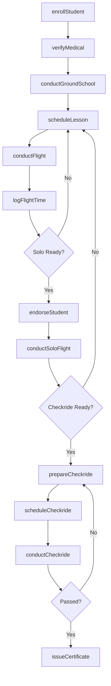
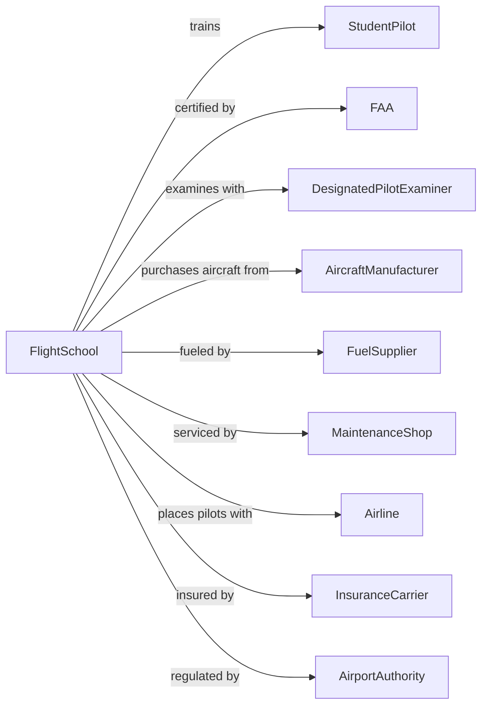

# Flight Training

> Business-as-Code definition for aviation flight schools. Models the complete training lifecycle from enrollment through FAA certification and career placement.

## Overview

Flight training establishments provide instruction for private, commercial, and instrument pilot certificates, as well as advanced ratings and type certifications. This definition exposes actions for student enrollment, ground school instruction, flight hours logging, checkride preparation, and FAA certification, along with events for workflow automation and searches for program data.

## Actors

| Actor | Description |
|-------|-------------|
| StudentPilot | Individual seeking aviation certification |
| FAA | Federal Aviation Administration issuing certificates |
| DesignatedPilotExaminer | FAA-authorized examiner conducting checkrides |
| AircraftManufacturer | Producer of training aircraft |
| FuelSupplier | Provider of aviation fuel |
| MaintenanceShop | Service provider for aircraft repairs and inspections |
| Airline | Employer hiring certified pilots |
| InsuranceCarrier | Provider of aircraft and liability coverage |
| AirportAuthority | Manager of airfield facilities |

## Roles

| Role | Description |
|------|-------------|
| ChiefFlightInstructor | Oversees training programs and instructor staff |
| CertifiedFlightInstructor | Delivers flight training and endorses students |
| GroundInstructor | Teaches aeronautical knowledge courses |
| DispatchCoordinator | Schedules aircraft and instructors |
| MaintenanceDirector | Ensures aircraft airworthiness and compliance |
| SafetyOfficer | Monitors safety practices and incident reporting |
| DesignatedPilotExaminer | FAA-authorized evaluator who conducts practical checkride tests for pilot certification |

## Entities

| Entity | Description |
|--------|-------------|
| Student | Individual enrolled in flight training program |
| Certificate | FAA pilot certificate or rating |
| Aircraft | Training airplane or simulator |
| FlightHours | Logged time in aircraft toward certification |
| Endorsement | Instructor authorization for specific activities |
| Checkride | Practical test for FAA certification |
| GroundSchool | Classroom instruction on aeronautical knowledge |
| Logbook | Official record of flight training and experience |
| Syllabus | Structured curriculum for certificate program |
| MedicalCertificate | FAA health authorization for pilot duties |
| Reservation | Scheduled aircraft and instructor booking |
| WeatherBriefing | Meteorological information for flight planning |

## Actions

| Action | Description |
|--------|-------------|
| enrollStudent | Register student for flight training program |
| verifyMedical | Confirm valid FAA medical certificate |
| conductGroundSchool | Deliver classroom instruction on regulations and theory |
| scheduleLesson | Book aircraft and instructor for flight training |
| conductFlight | Execute in-aircraft training lesson |
| logFlightTime | Record hours and maneuvers in student logbook |
| endorseStudent | Provide instructor authorization for solo or checkride |
| conductSoloFlight | Student flies without instructor aboard |
| prepareCheckride | Ready student for FAA practical test |
| scheduleCheckride | Book designated examiner for practical test |
| conductCheckride | Execute FAA practical examination |
| issueCertificate | Process FAA certificate upon checkride pass |
| maintainAircraft | Perform required inspections and repairs |
| briefWeather | Provide meteorological analysis for flight planning |
| processBilling | Handle student account charges |

## Events

| Event | Description |
|-------|-------------|
| studentEnrolled | Registration completed for program |
| medicalVerified | FAA medical certificate confirmed |
| groundSchoolCompleted | Classroom instruction finished |
| lessonScheduled | Aircraft and instructor booked |
| flightConducted | Training flight completed |
| flightTimeLogged | Hours recorded in logbook |
| studentEndorsed | Instructor authorization granted |
| soloFlightConducted | Unaccompanied student flight completed |
| checkridePrepared | Exam readiness confirmed |
| checkrideScheduled | Examiner appointment booked |
| checkrideConducted | Practical test completed |
| certificateIssued | FAA credential awarded |
| aircraftMaintained | Inspection or repair completed |
| weatherBriefed | Flight planning weather provided |
| billingProcessed | Account charges posted |

## Searches

| Search | Description |
|--------|-------------|
| findStudents | Query students by program, progress, or instructor |
| getFlightHours | Retrieve logged time by student or aircraft |
| getEndorsements | List authorizations by student |
| getAircraftSchedule | Find aircraft availability by date |
| getInstructorSchedule | Query instructor availability |
| getCheckrides | List scheduled practical tests |
| getMaintenanceStatus | Check aircraft airworthiness |
| getWeather | Retrieve current and forecast conditions |

## Workflow



## Actor Relationships



## Usage

### Calling Actions

```typescript
import { trainPilots } from '@headlessly/train-pilots'

const school = trainPilots()

// Check aircraft availability for scheduling
const aircraft = await school.getAircraftSchedule({ date: new Date(), type: 'cessna-172' })

// Review upcoming checkride schedule
const checkrides = await school.getCheckrides({ month: 6, year: 2024 })

// Enroll a new student pilot
const enrollment = await school.enrollStudent({
  firstName: 'Michael',
  lastName: 'Chen',
  programId: 'private-pilot-certificate',
  startDate: '2025-09-01',
  medicalClass: 'third-class'
})

// Schedule a training flight
const lesson = await school.scheduleLesson({
  studentId: enrollment.studentId,
  instructorId: 'cfi-456',
  aircraftId: 'N12345',
  date: '2025-09-15',
  duration: 1.5,
  lessonPlan: 'lesson-5-steep-turns'
})

// Log flight time after lesson
await school.logFlightTime({
  studentId: enrollment.studentId,
  date: '2025-09-15',
  aircraftId: 'N12345',
  instructorId: 'cfi-456',
  dualReceived: 1.3,
  landings: 4,
  maneuvers: ['steep-turns', 'slow-flight', 'power-off-stalls']
})
```

### Event-Driven Automation

```typescript
// Auto-endorse when solo minimums met
school.flightTimeLogged(async ({ studentId }) => {
  const hours = await school.getFlightHours({ studentId })
  const endorsements = await school.getEndorsements({ studentId })

  if (hours.dualReceived >= 15 && !endorsements.includes('solo')) {
    const student = await school.findStudents({ id: studentId })

    await notifyInstructor({
      instructorId: student.primaryInstructorId,
      message: `${student.name} has met solo minimums - review for endorsement`
    })
  }
})

// Schedule checkride when requirements complete
school.studentEndorsed(async ({ studentId, endorsementType }) => {
  if (endorsementType === 'practical-test') {
    const examiners = await getAvailableExaminers({
      location: 'KPAO',
      dateRange: 'next-30-days'
    })

    await school.scheduleCheckride({
      studentId,
      examinerId: examiners[0].id,
      date: examiners[0].nextAvailable,
      testType: 'private-pilot-asel'
    })
  }
})
```
