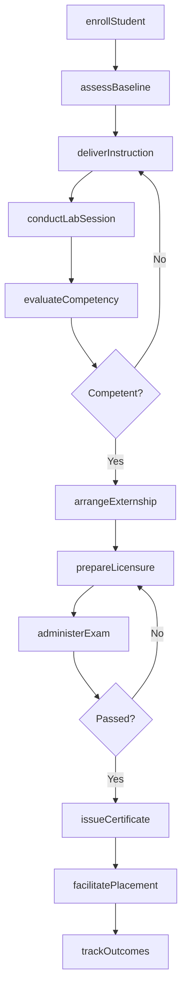
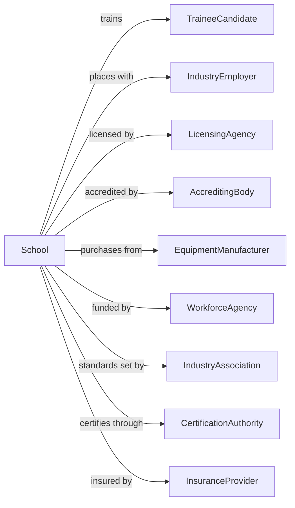

# Other Technical and Trade Schools

> Business-as-Code definition for vocational and technical training institutions. Models the complete training lifecycle from enrollment through certification and job placement.

## Overview

Other technical and trade schools provide job-specific vocational training in fields such as truck driving, HVAC, welding, medical assisting, real estate, and other specialized trades not classified elsewhere. This definition exposes actions for student enrollment, hands-on training, certification preparation, and career placement, along with events for workflow automation and searches for program data.

## Actors

| Actor | Description |
|-------|-------------|
| TraineeCandidate | Individual seeking vocational certification |
| IndustryEmployer | Company hiring trained technicians |
| LicensingAgency | Government body issuing trade licenses |
| AccreditingBody | Organization certifying program quality |
| EquipmentManufacturer | Producer of training machinery and tools |
| WorkforceAgency | Government entity funding vocational training |
| IndustryAssociation | Professional group setting skill standards |
| InsuranceProvider | Carrier covering training operations and liability |
| CertificationAuthority | Body issuing industry credentials |

## Roles

| Role | Description |
|------|-------------|
| SchoolDirector | Oversees institution operations and compliance |
| TradeInstructor | Delivers hands-on training in specialized skills |
| LabSupervisor | Manages equipment and safety in practical training |
| CareerAdvisor | Guides students on employment opportunities |
| AdmissionsRepresentative | Recruits and enrolls prospective students |
| ComplianceManager | Ensures regulatory and accreditation requirements |
| ShopInstructor | Teaches hands-on equipment operation and safety in a workshop or lab setting |

## Entities

| Entity | Description |
|--------|-------------|
| Student | Individual enrolled in vocational program |
| Program | Course of study for specific trade or skill |
| Course | Training module with defined competencies |
| Enrollment | Record of student registration |
| Certificate | Credential awarded upon program completion |
| License | State or industry authorization for practice |
| LabSession | Hands-on practical training period |
| Equipment | Machinery and tools used for training |
| Assessment | Test evaluating student competency |
| Externship | Supervised work experience at employer site |
| Transcript | Record of courses completed and scores |
| PlacementRecord | Documentation of graduate employment |

## Actions

| Action | Description |
|--------|-------------|
| enrollStudent | Register student for vocational program |
| assessBaseline | Evaluate prerequisite knowledge and aptitude |
| deliverInstruction | Conduct classroom and hands-on training |
| conductLabSession | Supervise practical equipment operation |
| evaluateCompetency | Test student mastery of trade skills |
| arrangeExternship | Place student in supervised work experience |
| prepareLicensure | Ready student for state or industry examination |
| administerExam | Conduct licensing or certification test |
| issueCertificate | Award program completion credential |
| facilitatePlacement | Connect graduate with employment opportunities |
| maintainEquipment | Service and upgrade training machinery |
| trackOutcomes | Monitor graduate employment success |
| updateCurriculum | Revise programs based on industry changes |
| processFinancialAid | Administer student funding and payments |
| reportCompliance | Submit required data to accreditors |

## Events

| Event | Description |
|-------|-------------|
| studentEnrolled | Registration completed for program |
| baselineAssessed | Aptitude evaluation completed |
| instructionDelivered | Training session conducted |
| labSessionConducted | Practical training completed |
| competencyEvaluated | Skills assessment scored |
| externshipArranged | Work placement confirmed |
| licensurePrepared | Exam readiness confirmed |
| examAdministered | Licensing test completed |
| certificateIssued | Credential awarded to student |
| placementFacilitated | Graduate connected with employer |
| equipmentMaintained | Machinery serviced |
| outcomesTracked | Employment data recorded |
| curriculumUpdated | Program content revised |
| financialAidProcessed | Funding disbursed |
| complianceReported | Regulatory filing submitted |

## Searches

| Search | Description |
|--------|-------------|
| findStudents | Query students by program, status, or cohort |
| getPrograms | List available vocational training programs |
| getCourses | Retrieve courses by trade or skill area |
| getEnrollments | Query registrations by program or date |
| getLabSchedule | Find available training sessions |
| getExternships | List active work placements |
| getPlacements | Track graduate employment outcomes |
| getCertificates | List credentials issued to students |

## Workflow



## Actor Relationships



## Usage

### Calling Actions

```typescript
import { trainTechnicians } from '@headlessly/train-technicians'

const school = trainTechnicians()

// List available vocational programs
const programs = await school.getPrograms({ category: 'hvac', status: 'enrolling' })

// Track graduate employment outcomes
const placements = await school.getPlacements({ cohort: '2024-spring' })

// Enroll a new student
const enrollment = await school.enrollStudent({
  firstName: 'David',
  lastName: 'Thompson',
  programId: 'cdl-class-a',
  startDate: '2025-09-01',
  financialAid: { type: 'wioa-grant', amount: 5000 }
})

// Conduct lab session
await school.conductLabSession({
  studentId: enrollment.studentId,
  sessionType: 'behind-the-wheel',
  equipment: 'truck-101',
  hours: 4,
  skills: ['shifting', 'backing', 'coupling'],
  instructorId: 'instructor-456'
})

// Administer CDL examination
const examResult = await school.administerExam({
  studentId: enrollment.studentId,
  examType: 'cdl-skills-test',
  components: ['pre-trip', 'basic-controls', 'road-test'],
  examiner: 'state-examiner-789'
})
```

### Event-Driven Automation

```typescript
// Auto-arrange externship when competencies achieved
school.competencyEvaluated(async ({ studentId, competency, passed }) => {
  if (passed) {
    const student = await school.findStudents({ id: studentId })
    const requiredCompetencies = getRequiredCompetencies(student.programId)
    const achievedCompetencies = await getAchievedCompetencies(studentId)

    if (achievedCompetencies.length >= requiredCompetencies.length * 0.8) {
      const employers = await school.findEmployerPartners({
        trade: student.programId,
        hasExternships: true
      })

      await school.arrangeExternship({
        studentId,
        employerId: employers[0].id,
        duration: '2-weeks',
        startDate: nextMonday()
      })
    }
  }
})

// Report outcomes to workforce agency
school.placementFacilitated(async ({ studentId, employerId, startDate }) => {
  const student = await school.findStudents({ id: studentId })

  if (student.fundingSource === 'wioa-grant') {
    await reportToWorkforceAgency({
      studentId,
      employerId,
      wage: student.startingWage,
      startDate,
      program: student.programId
    })
  }
})
```
