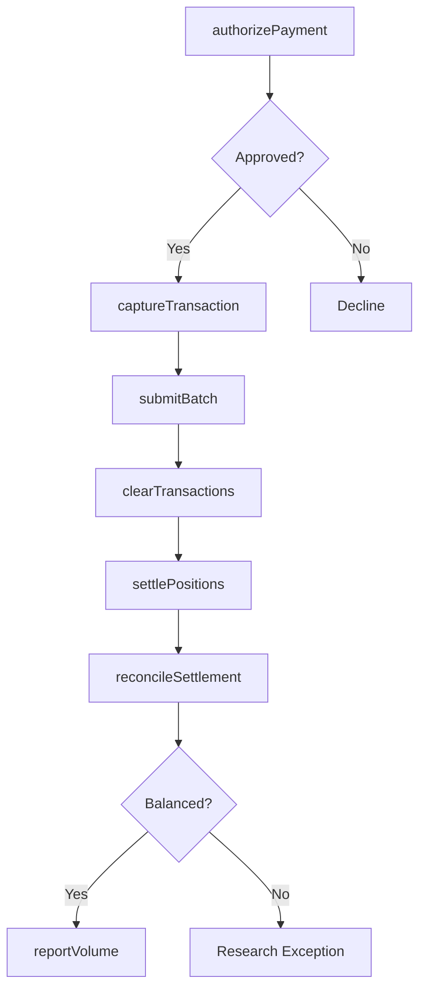
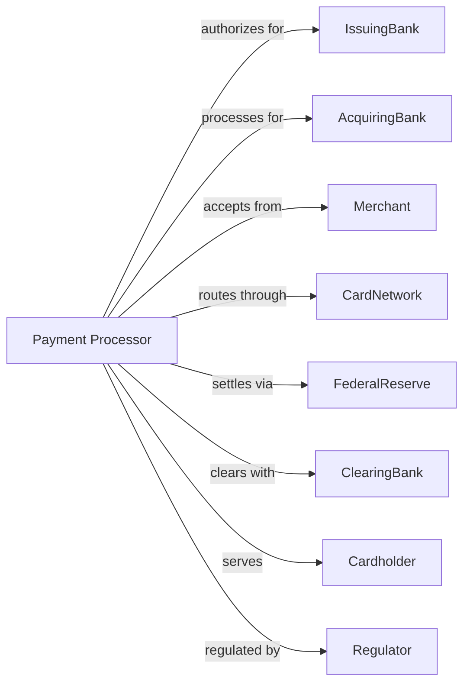

# Financial Transactions Processing, Reserve, and Clearinghouse Activities

> Business-as-Code definition for payment processing operations. Models the complete transaction lifecycle from authorization through settlement, clearing, and reconciliation.

## Overview

Payment processors, clearinghouses, and reserve services facilitate the movement of funds between financial institutions and their customers. This definition exposes actions for transaction authorization, clearing, settlement, and reconciliation, enabling programmatic access to payment infrastructure operations.

## Actors

| Actor | Description |
|-------|-------------|
| IssuingBank | Financial institution issuing payment cards to consumers |
| AcquiringBank | Merchant's bank receiving card transactions |
| Merchant | Business accepting electronic payments |
| CardNetwork | Visa, Mastercard, or other payment network |
| FederalReserve | Central bank operating Fedwire and ACH systems |
| ClearingBank | Institution providing interbank settlement |
| Cardholder | Consumer initiating payment transactions |
| Regulator | Authority overseeing payment system operations |

## Roles

| Role | Description |
|------|-------------|
| NetworkOperator | Staff managing payment network infrastructure |
| SettlementAnalyst | Specialist reconciling interbank positions |
| FraudAnalyst | Investigator identifying suspicious transactions |
| OperationsManager | Executive overseeing daily processing |
| ComplianceOfficer | Specialist ensuring regulatory adherence |
| TechnologyArchitect | Engineer designing processing systems |

## Entities

| Entity | Description |
|--------|-------------|
| Transaction | Payment instruction moving funds between parties |
| Authorization | Real-time approval or decline of payment request |
| Batch | Group of transactions submitted for processing |
| Settlement | Final transfer of funds between institutions |
| Clearing | Calculation of net positions between participants |
| ACHFile | Automated Clearing House batch submission |
| WireTransfer | Real-time gross settlement funds transfer |
| Interchange | Fee paid by acquirer to issuer on card transactions |
| Chargeback | Disputed transaction reversed to merchant |
| ReconciliationReport | Statement matching processed and settled items |

## Actions

| Action | Description |
|--------|-------------|
| authorizePayment | Approve or decline transaction in real-time |
| captureTransaction | Finalize authorized payment for settlement |
| submitBatch | Send group of transactions for clearing |
| clearTransactions | Calculate net positions between participants |
| settlePositions | Transfer funds to satisfy net obligations |
| processACH | Handle automated clearing house transactions |
| processWire | Execute real-time gross settlement transfer |
| detectFraud | Identify suspicious transaction patterns |
| handleChargeback | Process disputed transaction reversal |
| reconcileSettlement | Match processed items to settled amounts |
| calculateInterchange | Determine network fees for transactions |
| reportVolume | Generate transaction statistics and metrics |

## Events

| Event | Description |
|-------|-------------|
| paymentAuthorized | Transaction approved in real-time |
| transactionCaptured | Payment finalized for settlement |
| batchSubmitted | Transaction group sent for clearing |
| transactionsCleared | Net positions calculated |
| positionsSettled | Funds transferred between institutions |
| achProcessed | Clearing house transactions completed |
| wireProcessed | Real-time transfer executed |
| fraudDetected | Suspicious activity identified |
| chargebackHandled | Dispute reversal processed |
| settlementReconciled | Items matched to settled amounts |
| interchangeCalculated | Network fees determined |
| volumeReported | Statistics generated |

## Searches

| Search | Description |
|--------|-------------|
| findTransactions | List transactions by merchant, amount, or status |
| getSettlementPosition | Retrieve net amounts due between institutions |
| findChargebacks | List disputed transactions by reason code |
| getProcessingVolume | Retrieve transaction counts and amounts by period |
| findFailedAuthorizations | Identify declined transactions for analysis |
| getInterchangeRevenue | Calculate interchange income by card type |
| getReconciliationExceptions | List unmatched items requiring research |

## Workflow



## Actor Relationships



## Usage

### Calling Actions

```typescript
import { processTransactions } from '@headlessly/process-transactions'

const processor = processTransactions()

// Review current settlement positions
const positions = await processor.getSettlementPosition({ date: '2024-04-01', participantId: 'bank-12345' })

// Authorize card payment
const auth = await processor.authorizePayment({
  cardNumber: '4111111111111111',
  amount: 125.50,
  merchantId: 'merch-12345',
  merchantCategory: '5411',
  currency: 'USD'
})

// Capture and submit batch
if (auth.approved) {
  await processor.captureTransaction({
    authorizationId: auth.id,
    amount: 125.50,
    batchId: 'batch-67890'
  })
}

// Check for open chargebacks on this merchant
const chargebacks = await processor.findChargebacks({ merchantId: 'merch-12345', status: 'open' })

await processor.submitBatch({
  batchId: 'batch-67890',
  merchantId: 'merch-12345',
  transactionCount: 150,
  totalAmount: 15750.00
})
```

### Event-Driven Automation

```typescript
// Auto-settle after clearing
processor.transactionsCleared(async ({ clearingDate, participants }) => {
  for (const participant of participants) {
    await processor.settlePositions({
      participantId: participant.id,
      netAmount: participant.netPosition,
      settlementDate: clearingDate,
      method: participant.netPosition > 0 ? 'credit' : 'debit'
    })
  }
})

// Detect fraud on authorizations
processor.paymentAuthorized(async ({ transactionId, amount, location, velocity }) => {
  await processor.detectFraud({
    transactionId,
    riskSignals: ['velocity', 'geolocation', 'amount'],
    velocityCount: velocity.last24Hours,
    location
  })
})
```
