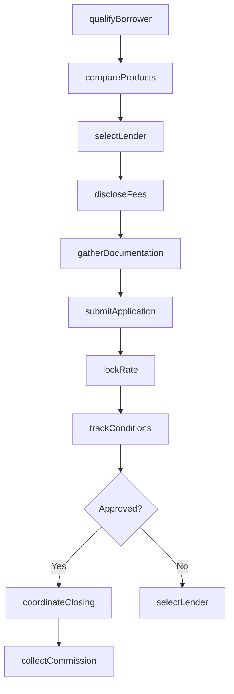
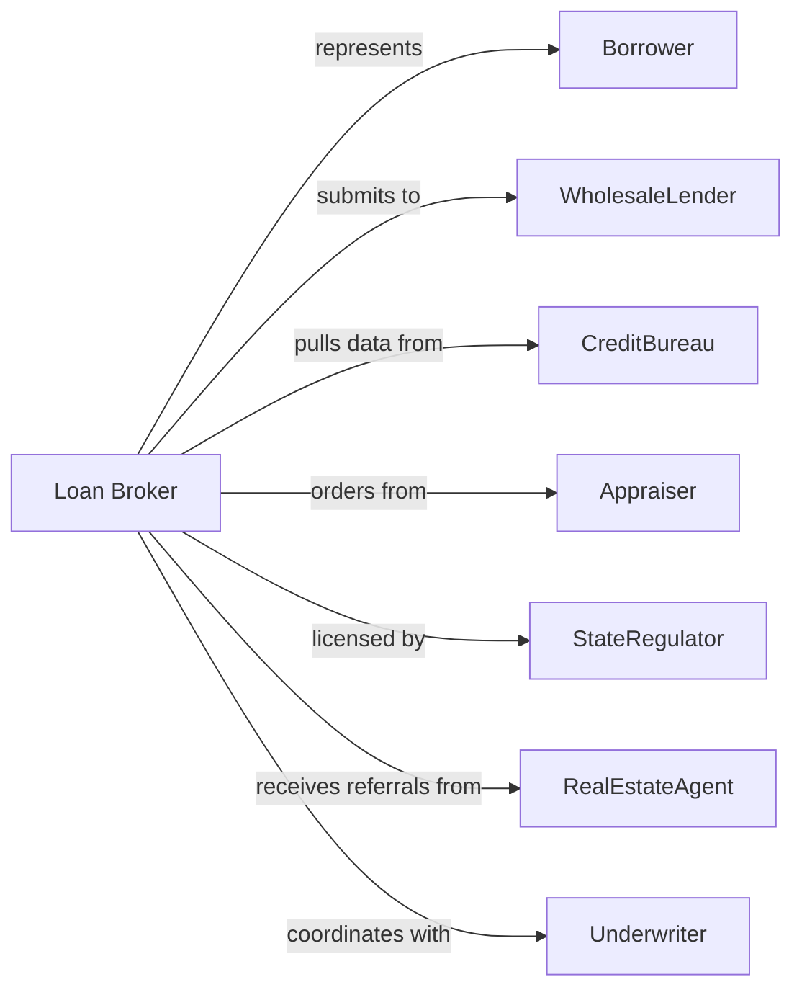

# Mortgage and Nonmortgage Loan Brokers

> Business-as-Code definition for loan brokerage operations. Models the complete origination cycle from borrower intake through lender placement and commission collection.

## Overview

Loan brokers arrange financing by matching borrowers with appropriate lenders on a commission or fee basis without funding loans themselves. This definition exposes actions for borrower qualification, lender selection, application submission, and commission tracking, enabling programmatic access to mortgage and commercial loan brokerage operations.

## Actors

| Actor | Description |
|-------|-------------|
| Borrower | Individual or business seeking loan financing |
| Lender | Bank or finance company funding loans |
| WholesaleLender | Institution accepting broker-submitted applications |
| CreditBureau | Agency providing credit reports and scores |
| Appraiser | Licensed professional valuing collateral |
| StateRegulator | Authority licensing mortgage and loan brokers |
| RealEstateAgent | Professional referring homebuyers for mortgages |
| Underwriter | Lender staff evaluating loan applications |

## Roles

| Role | Description |
|------|-------------|
| LoanBroker | Licensed professional originating and placing loans |
| LoanProcessor | Staff gathering documentation and preparing files |
| BranchManager | Executive overseeing broker office operations |
| ComplianceOfficer | Specialist ensuring licensing and disclosure compliance |
| ReferralCoordinator | Staff managing referral partner relationships |
| CommissionAnalyst | Administrator tracking and reconciling broker fees |

## Entities

| Entity | Description |
|--------|-------------|
| LoanApplication | Borrower request submitted to potential lenders |
| BrokerAgreement | Contract defining broker-lender relationship |
| GoodFaithEstimate | Disclosure of estimated loan costs |
| RateLock | Commitment securing interest rate for borrower |
| Commission | Broker fee earned on funded loans |
| YieldSpreadPremium | Lender payment for above-par rate placement |
| Disclosure | Required borrower notices and acknowledgments |
| ReferralAgreement | Contract with referral source |
| LicenseStatus | Current state licensing and registration |
| PricingSheet | Wholesale lender rate and fee schedule |

## Actions

| Action | Description |
|--------|-------------|
| qualifyBorrower | Assess creditworthiness and loan eligibility |
| selectLender | Match borrower profile to appropriate wholesale lender |
| submitApplication | Send loan package to selected lender |
| lockRate | Secure interest rate commitment from lender |
| gatherDocumentation | Collect income, asset, and identity verification |
| discloseFees | Provide required cost estimates to borrower |
| trackConditions | Monitor underwriting requirements and clear items |
| coordinateClosing | Arrange final loan document execution |
| collectCommission | Receive broker fee from lender after funding |
| maintainLicense | Ensure current state licensing and continuing education |
| manageReferrals | Track and compensate referral sources |
| compareProducts | Evaluate multiple lender offerings for borrower |

## Events

| Event | Description |
|-------|-------------|
| borrowerQualified | Initial eligibility assessment completed |
| lenderSelected | Wholesale lender chosen for submission |
| applicationSubmitted | Loan package sent to lender |
| rateLocked | Interest rate commitment secured |
| documentationGathered | Required documents collected |
| feesDisclosed | Cost estimates provided to borrower |
| conditionsCleared | Underwriting requirements satisfied |
| closingCoordinated | Document execution arranged |
| commissionCollected | Broker fee received |
| licenseMaintained | Licensing renewed and current |
| referralCompensated | Referral fee paid |
| productsCompared | Multiple offerings evaluated |

## Searches

| Search | Description |
|--------|-------------|
| findApplications | List loans by status, lender, or borrower |
| getLenderProducts | Retrieve available wholesale programs and rates |
| getCommissionsPending | Identify earned fees awaiting payment |
| findExpiredLocks | List rate locks nearing expiration |
| getReferralVolume | Retrieve origination by referral source |
| getComplianceStatus | Check licensing and disclosure requirements |
| getPipelineValue | Calculate potential commission on pending loans |

## Workflow



## Actor Relationships



## Usage

### Calling Actions

```typescript
import { brokerLoans } from '@headlessly/broker-loans'

const broker = brokerLoans()

// Retrieve available wholesale lender programs
const products = await broker.getLenderProducts({ loanType: 'conventional', minCreditScore: 700 })

// Qualify borrower for financing
const qualification = await broker.qualifyBorrower({
  borrowerId: 'cust-12345',
  creditScore: 720,
  income: 95000,
  debtPayments: 1200,
  loanPurpose: 'purchase'
})

// Compare lender products
const options = await broker.compareProducts({
  loanAmount: 400000,
  ltv: 80,
  creditScore: qualification.creditScore,
  loanType: 'conventional'
})

// Check pending commissions
const commissions = await broker.getCommissionsPending({ status: 'earned', lenderId: options.bestMatch.lenderId })

// Submit to selected lender
await broker.submitApplication({
  borrowerId: 'cust-12345',
  lenderId: options.bestMatch.lenderId,
  loanAmount: 400000,
  rate: options.bestMatch.rate,
  product: '30-year-fixed'
})
```

### Event-Driven Automation

```typescript
// Auto-lock rate on submission
broker.applicationSubmitted(async ({ applicationId, lenderId, rate }) => {
  await broker.lockRate({
    applicationId,
    lenderId,
    rate,
    lockDays: 45
  })
})

// Track commission after closing
broker.closingCoordinated(async ({ applicationId, lenderId, loanAmount }) => {
  await broker.collectCommission({
    applicationId,
    lenderId,
    expectedAmount: loanAmount * 0.01,
    paymentMethod: 'wire'
  })
})
```
