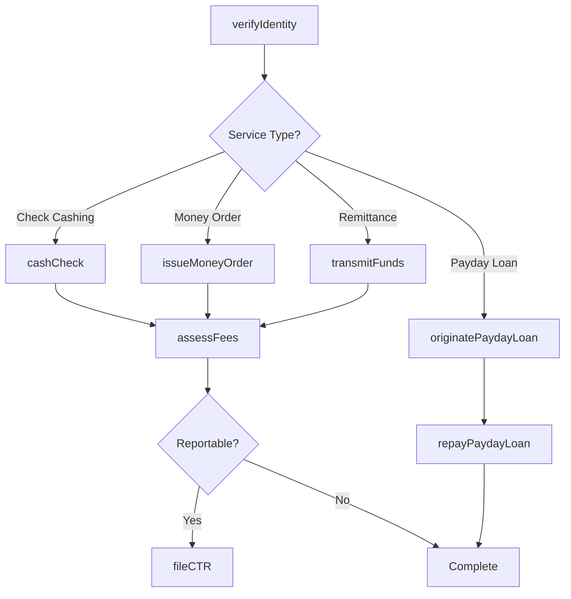
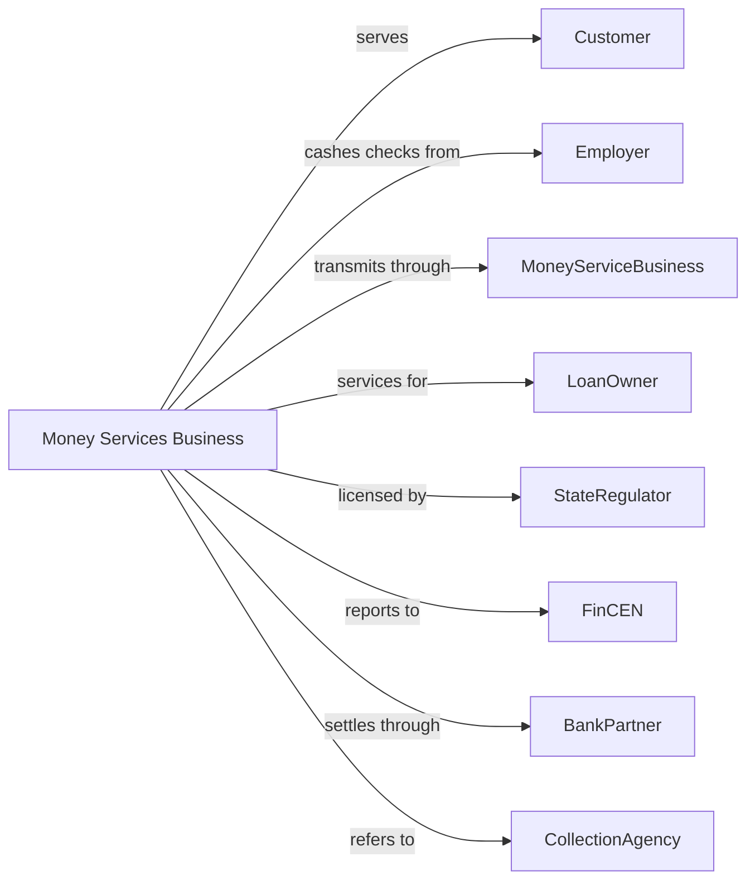

# Other Activities Related to Credit Intermediation

> Business-as-Code definition for alternative credit services. Models check cashing, money transmission, loan servicing, and payday lending operations from customer intake through transaction completion.

## Overview

This industry encompasses check cashing services, money order and traveler's check issuance, money transmission, loan servicing, and short-term consumer lending. This definition exposes actions for check verification, remittance processing, loan payment collection, and payday loan origination, enabling programmatic access to alternative financial services.

## Actors

| Actor | Description |
|-------|-------------|
| Customer | Individual using check cashing or money services |
| Employer | Company issuing payroll checks to employees |
| MoneyServiceBusiness | Licensed entity transmitting funds |
| LoanOwner | Investor or institution owning serviced loans |
| StateRegulator | Authority licensing money services businesses |
| FinCEN | Financial Crimes Enforcement Network for BSA compliance |
| BankPartner | Depository institution providing settlement |
| CollectionAgency | Third party pursuing delinquent payday loans |

## Roles

| Role | Description |
|------|-------------|
| Teller | Staff processing check cashing and money orders |
| ComplianceOfficer | Specialist ensuring BSA/AML adherence |
| ServicerManager | Executive overseeing loan payment collection |
| RemittanceAgent | Staff processing money transfers |
| UnderwritingAnalyst | Specialist evaluating payday loan applications |
| BranchManager | Officer supervising retail location operations |

## Entities

| Entity | Description |
|--------|-------------|
| Check | Negotiable instrument presented for cashing |
| MoneyOrder | Prepaid payment instrument issued for remittance |
| WireRemittance | International or domestic money transfer |
| ServicedLoan | Loan with payments collected on behalf of owner |
| PaydayLoan | Short-term advance against expected income |
| EscrowAccount | Custodial account for tax and insurance payments |
| CurrencyTransaction | Cash exchange exceeding reporting thresholds |
| SuspiciousActivityReport | BSA filing for unusual transactions |
| LoanPaymentRecord | History of payments collected on serviced loan |
| FeeSchedule | Pricing for check cashing and money services |

## Actions

| Action | Description |
|--------|-------------|
| cashCheck | Verify and exchange check for cash less fee |
| issueMoneyOrder | Create prepaid payment instrument |
| transmitFunds | Send money domestically or internationally |
| collectLoanPayment | Receive and apply payment on serviced loan |
| manageEscrow | Collect and disburse tax and insurance payments |
| originatePaydayLoan | Evaluate and fund short-term consumer advance |
| repayPaydayLoan | Collect principal and fees at maturity |
| fileCTR | Report currency transactions over threshold |
| fileSAR | Report suspicious activity to FinCEN |
| verifyIdentity | Confirm customer identity for BSA compliance |
| trackServicingPerformance | Monitor delinquency and collection rates |
| assessFees | Apply charges for services rendered |

## Events

| Event | Description |
|-------|-------------|
| checkCashed | Check exchanged for cash |
| moneyOrderIssued | Payment instrument created |
| fundsTransmitted | Remittance sent to recipient |
| loanPaymentCollected | Serviced loan payment received |
| escrowManaged | Tax or insurance payment disbursed |
| paydayLoanOriginated | Short-term advance funded |
| paydayLoanRepaid | Advance collected at maturity |
| ctrFiled | Currency transaction reported |
| sarFiled | Suspicious activity reported |
| identityVerified | Customer identification confirmed |
| servicingPerformanceTracked | Metrics calculated |
| feesAssessed | Service charges applied |

## Searches

| Search | Description |
|--------|-------------|
| findChecksCashed | List checks by customer, amount, or date |
| getRemittanceVolume | Retrieve money transfer volume by corridor |
| getServicingPortfolio | List loans serviced by owner and status |
| findDelinquentLoans | Identify past-due serviced loans |
| getPaydayLoanPerformance | Retrieve origination and collection metrics |
| findReportableTransactions | Identify CTR and SAR filing requirements |
| getEscrowBalances | Retrieve custodial account balances |

## Workflow



## Actor Relationships



## Usage

### Calling Actions

```typescript
import { processCredit } from '@headlessly/process-credit'

const msb = processCredit()

// Check for reportable transactions today
const reportable = await msb.findReportableTransactions({ date: '2024-04-01', type: 'ctr' })

// Cash payroll check
const transaction = await msb.cashCheck({
  customerId: 'cust-12345',
  checkAmount: 1500.00,
  checkType: 'payroll',
  payorName: 'ABC Company',
  feePercent: 2.5
})

// Issue money order for remittance
const moneyOrder = await msb.issueMoneyOrder({
  customerId: 'cust-12345',
  amount: 500.00,
  payee: 'Maria Garcia',
  memo: 'Family support'
})

// Review remittance volume for compliance
const remittances = await msb.getRemittanceVolume({ corridor: 'US-MX', period: '2024-03' })

// Originate payday loan
const loan = await msb.originatePaydayLoan({
  customerId: 'cust-12345',
  amount: 400.00,
  fee: 60.00,
  dueDate: '2024-04-15',
  repaymentSource: 'nextPaycheck'
})
```

### Event-Driven Automation

```typescript
// Auto-file CTR for large transactions
msb.checkCashed(async ({ transactionId, amount, customerId }) => {
  if (amount > 10000) {
    await msb.fileCTR({
      transactionId,
      customerId,
      amount,
      transactionType: 'checkCashing'
    })
  }
})

// Collect payday loan at maturity
msb.paydayLoanOriginated(async ({ loanId, customerId, amount, fee, dueDate }) => {
  // Schedule repayment collection
  await msb.repayPaydayLoan({
    loanId,
    totalDue: amount + fee,
    collectionDate: dueDate,
    method: 'achDebit'
  })
})
```
