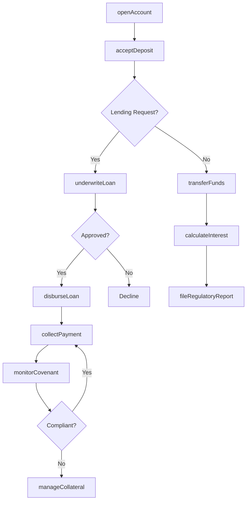
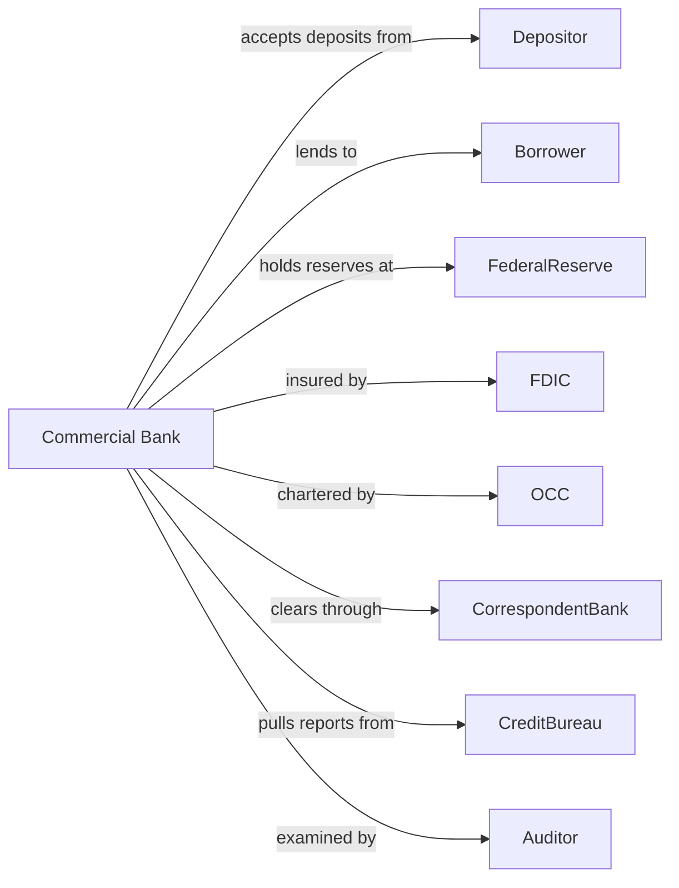

# Commercial Banking

> Business-as-Code definition for commercial banking operations. Models the complete deposit-taking and lending lifecycle from account opening through loan servicing and treasury management.

## Overview

Commercial banks accept demand and time deposits from businesses and consumers while making commercial, industrial, and consumer loans. This definition exposes actions for deposit management, credit underwriting, and cash management services, enabling programmatic access to core banking functions.

## Actors

| Actor | Description |
|-------|-------------|
| Depositor | Individual or business maintaining deposit accounts |
| Borrower | Customer receiving loans or lines of credit |
| FederalReserve | Central bank providing reserves and regulatory oversight |
| FDIC | Federal Deposit Insurance Corporation insuring deposits |
| OCC | Office of the Comptroller of the Currency chartering and supervising |
| CorrespondentBank | Partner bank providing clearing and international services |
| CreditBureau | Agency providing consumer and business credit reports |
| Auditor | External firm examining financial statements and controls |

## Roles

| Role | Description |
|------|-------------|
| BranchManager | Officer overseeing local branch operations and staff |
| LoanOfficer | Specialist originating and underwriting credit facilities |
| Teller | Staff processing deposits, withdrawals, and transactions |
| ComplianceOfficer | Specialist ensuring regulatory adherence and AML compliance |
| TreasuryAnalyst | Professional managing bank liquidity and investments |
| RelationshipManager | Banker serving commercial and high-net-worth clients |

## Entities

| Entity | Description |
|--------|-------------|
| DemandDeposit | Checking account with immediate withdrawal access |
| SavingsAccount | Interest-bearing account with withdrawal limits |
| CertificateOfDeposit | Time deposit with fixed term and rate |
| CommercialLoan | Credit facility for business operations or expansion |
| Mortgage | Real estate secured loan for property purchase |
| LineOfCredit | Revolving credit facility with approved limit |
| WireTransfer | Electronic funds transfer between accounts |
| ACHTransaction | Automated clearing house payment or receipt |
| LoanCovenant | Contractual requirement borrower must maintain |
| CollateralLien | Security interest in pledged assets |

## Actions

| Action | Description |
|--------|-------------|
| openAccount | Establish new deposit account with KYC verification |
| acceptDeposit | Receive and credit funds to customer account |
| processWithdrawal | Debit account and disburse funds to customer |
| underwriteLoan | Evaluate creditworthiness and structure credit facility |
| disburseLoan | Fund approved loan to borrower account |
| collectPayment | Receive and apply loan payments to principal and interest |
| transferFunds | Move money between accounts via wire or ACH |
| calculateInterest | Compute and post interest to deposit and loan accounts |
| monitorCovenant | Track borrower compliance with loan agreements |
| manageCollateral | Perfect and maintain security interests in pledged assets |
| fileRegulatoryReport | Submit call reports and compliance filings |
| detectFraud | Identify and investigate suspicious transactions |

## Events

| Event | Description |
|-------|-------------|
| accountOpened | New deposit account created and funded |
| depositAccepted | Funds credited to customer account |
| withdrawalProcessed | Funds debited and disbursed |
| loanApproved | Credit facility underwritten and committed |
| loanDisbursed | Funds transferred to borrower |
| paymentReceived | Loan payment applied to account |
| fundsTransferred | Wire or ACH transaction completed |
| interestPosted | Interest credited or debited to accounts |
| covenantBreached | Borrower failed to meet loan requirement |
| collateralReleased | Security interest terminated after payoff |
| reportFiled | Regulatory submission completed |
| fraudDetected | Suspicious activity identified for review |

## Searches

| Search | Description |
|--------|-------------|
| findAccounts | List accounts by customer, type, or balance range |
| getLoanPortfolio | Retrieve loans by status, type, or risk rating |
| getTransactionHistory | List transactions by account and date range |
| findDelinquentLoans | Identify past-due loans by days delinquent |
| getDepositBalances | Retrieve aggregate deposits by product and branch |
| findSuspiciousActivity | List flagged transactions for AML review |
| getLiquidityPosition | Calculate available reserves and funding capacity |

## Workflow



## Actor Relationships



## Usage

### Calling Actions

```typescript
import { bankDeposits } from '@headlessly/bank-deposits'

const bank = bankDeposits()

// Check existing accounts for customer
const existing = await bank.findAccounts({ customerId: 'cust-12345', type: 'demandDeposit' })

// Open new checking account
const account = await bank.openAccount({
  customerId: 'cust-12345',
  type: 'demandDeposit',
  initialDeposit: 5000,
  features: ['overdraftProtection', 'debitCard']
})

// Review delinquent loans before new origination
const delinquent = await bank.findDelinquentLoans({ borrowerId: 'biz-67890', daysDelinquent: 30 })

// Underwrite commercial loan
const loan = await bank.underwriteLoan({
  borrowerId: 'biz-67890',
  type: 'termLoan',
  amount: 500000,
  purpose: 'equipmentPurchase',
  term: 60,
  collateral: ['equipment', 'inventory']
})

// Process wire transfer
await bank.transferFunds({
  fromAccount: account.id,
  toAccount: 'external-aba-123456789',
  amount: 25000,
  method: 'wire',
  memo: 'Supplier payment'
})
```

### Event-Driven Automation

```typescript
// Auto-monitor covenant compliance
bank.loanDisbursed(async ({ loanId, covenants }) => {
  for (const covenant of covenants) {
    await bank.monitorCovenant({
      loanId,
      covenantType: covenant.type,
      threshold: covenant.threshold,
      frequency: 'monthly'
    })
  }
})

// Detect fraud on large transactions
bank.fundsTransferred(async ({ amount, accountId, destination }) => {
  if (amount > 10000) {
    await bank.detectFraud({
      accountId,
      transactionType: 'wireTransfer',
      amount,
      destination,
      riskFactors: ['largeAmount', 'newDestination']
    })
  }
})
```
