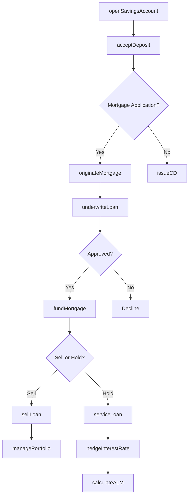
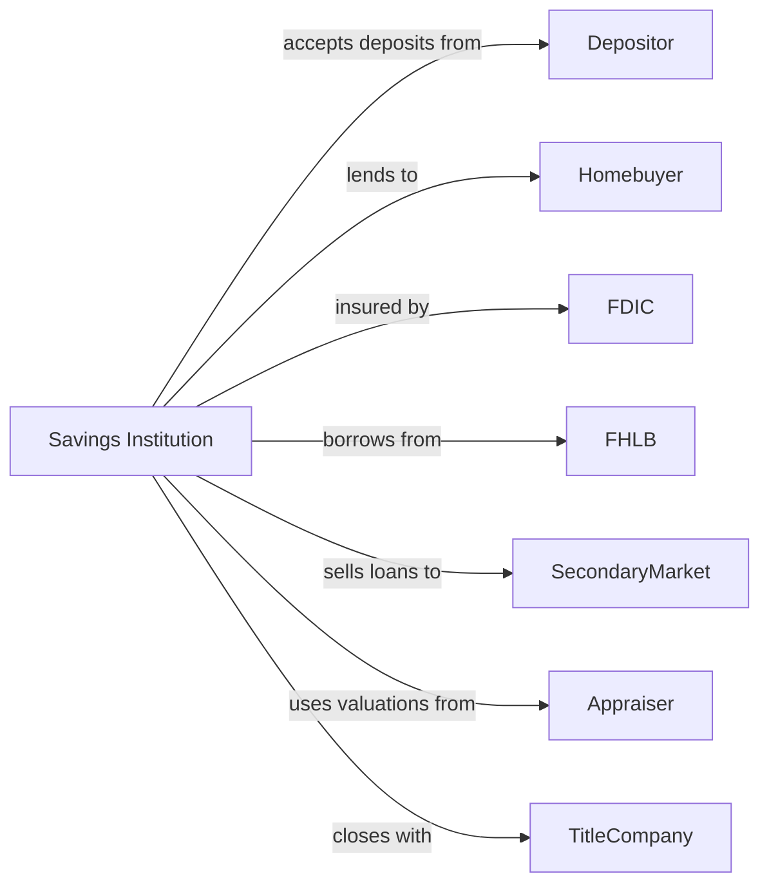

# Savings Institutions and Other Depository Credit Intermediation

> Business-as-Code definition for savings institution operations. Models thrift banking from deposit gathering through mortgage lending and investment portfolio management.

## Overview

Savings institutions including savings and loan associations, savings banks, and industrial banks accept deposits and focus primarily on mortgage and real estate lending while investing in high-grade securities. This definition exposes actions for savings account management, residential lending, and asset-liability management unique to thrift operations.

## Actors

| Actor | Description |
|-------|-------------|
| Depositor | Individual maintaining savings and time deposit accounts |
| Homebuyer | Customer seeking residential mortgage financing |
| OTS | Office of Thrift Supervision providing historical regulatory framework |
| FDIC | Federal Deposit Insurance Corporation insuring deposits |
| FHLB | Federal Home Loan Bank providing advances and liquidity |
| SecondaryMarket | Fannie Mae and Freddie Mac purchasing conforming mortgages |
| Appraiser | Licensed professional valuing residential properties |
| TitleCompany | Firm providing title insurance and closing services |

## Roles

| Role | Description |
|------|-------------|
| BranchManager | Officer overseeing branch operations and deposit growth |
| MortgageOriginator | Specialist originating residential loan applications |
| Underwriter | Analyst evaluating borrower qualification and property value |
| LoanServicer | Staff managing payment collection and escrow accounts |
| TreasuryManager | Executive managing interest rate risk and investments |
| ComplianceOfficer | Specialist ensuring TILA, RESPA, and fair lending compliance |

## Entities

| Entity | Description |
|--------|-------------|
| SavingsAccount | Passbook or statement savings with interest earnings |
| MoneyMarket | Higher-yield savings with limited transactions |
| CertificateOfDeposit | Fixed-term time deposit with guaranteed rate |
| ResidentialMortgage | Loan secured by owner-occupied residential property |
| HomeEquityLoan | Second lien loan against home equity |
| EscrowAccount | Impound account for taxes and insurance |
| MortgageServicingRight | Asset representing servicing income stream |
| InvestmentPortfolio | Holdings of government and agency securities |
| InterestRateSwap | Derivative hedging interest rate exposure |
| LoanLossReserve | Allowance for potential credit losses |

## Actions

| Action | Description |
|--------|-------------|
| openSavingsAccount | Establish new savings or money market account |
| acceptDeposit | Credit funds to savings or time deposit account |
| issueCD | Create certificate of deposit with fixed term and rate |
| originateMortgage | Process residential loan from application through closing |
| underwriteLoan | Evaluate borrower credit, income, and property value |
| fundMortgage | Disburse loan proceeds at closing |
| serviceLoan | Collect payments, manage escrow, and handle inquiries |
| sellLoan | Transfer mortgage to secondary market investor |
| managePortfolio | Invest in and rebalance securities holdings |
| hedgeInterestRate | Execute swaps or options to manage rate risk |
| foreclose | Pursue property recovery on defaulted mortgage |
| calculateALM | Model asset-liability duration and interest sensitivity |

## Events

| Event | Description |
|-------|-------------|
| savingsAccountOpened | New savings account established |
| depositAccepted | Funds credited to savings account |
| cdIssued | Certificate of deposit created and funded |
| mortgageOriginated | Loan application approved and documented |
| loanFunded | Mortgage proceeds disbursed at closing |
| paymentReceived | Monthly mortgage payment applied |
| loanSold | Mortgage transferred to secondary market |
| portfolioRebalanced | Investment holdings adjusted |
| hedgeExecuted | Interest rate derivative position established |
| foreclosureInitiated | Default proceedings commenced |
| almCalculated | Interest rate sensitivity report generated |
| escrowDisbursed | Tax or insurance payment made from escrow |

## Searches

| Search | Description |
|--------|-------------|
| getSavingsBalances | Retrieve aggregate deposits by product type |
| findMortgages | List residential loans by status, rate, or LTV |
| getDelinquencies | Identify past-due mortgages by days delinquent |
| getInvestmentHoldings | List securities by type, maturity, and yield |
| findEscrowShortages | Identify accounts requiring escrow analysis |
| getInterestRateExposure | Calculate duration gap and sensitivity |
| getServicingPortfolio | List loans serviced for investors |

## Workflow



## Actor Relationships



## Usage

### Calling Actions

```typescript
import { bankSavings } from '@headlessly/bank-savings'

const thrift = bankSavings()

// Check current savings balances by product
const balances = await thrift.getSavingsBalances({ product: 'moneyMarket', branch: 'main' })

// Open money market account
const account = await thrift.openSavingsAccount({
  customerId: 'cust-12345',
  type: 'moneyMarket',
  initialDeposit: 25000,
  interestRate: 4.25
})

// Originate residential mortgage
const mortgage = await thrift.originateMortgage({
  borrowerId: 'cust-12345',
  propertyAddress: '123 Main St, Anytown, USA',
  loanAmount: 400000,
  term: 360,
  type: 'fixed',
  ltv: 80
})

// Check servicing portfolio before selling
const portfolio = await thrift.getServicingPortfolio({ investor: 'fannieMae', status: 'active' })

// Sell conforming loan to secondary market
await thrift.sellLoan({
  loanId: mortgage.id,
  investor: 'fannieMae',
  servicingRetained: true,
  deliveryType: 'cashWindow'
})
```

### Event-Driven Automation

```typescript
// Auto-hedge new portfolio mortgages
thrift.loanFunded(async ({ loanId, amount, rate, term }) => {
  const portfolio = await thrift.getInvestmentHoldings()
  if (portfolio.durationGap > 2.0) {
    await thrift.hedgeInterestRate({
      notional: amount,
      type: 'interestRateSwap',
      payFixed: true,
      term: Math.min(term, 120)
    })
  }
})

// Monitor escrow and disburse payments
thrift.paymentReceived(async ({ loanId, escrowPortion }) => {
  const escrow = await thrift.findEscrowShortages({ loanId })
  if (escrow.taxDue) {
    await thrift.serviceLoan({
      loanId,
      action: 'disburseTax',
      amount: escrow.taxAmount
    })
  }
})
```
