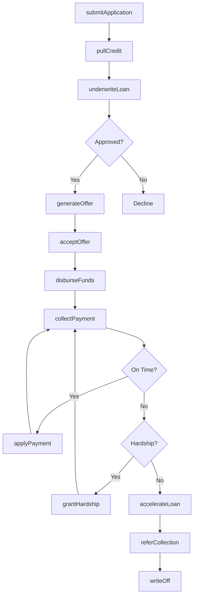
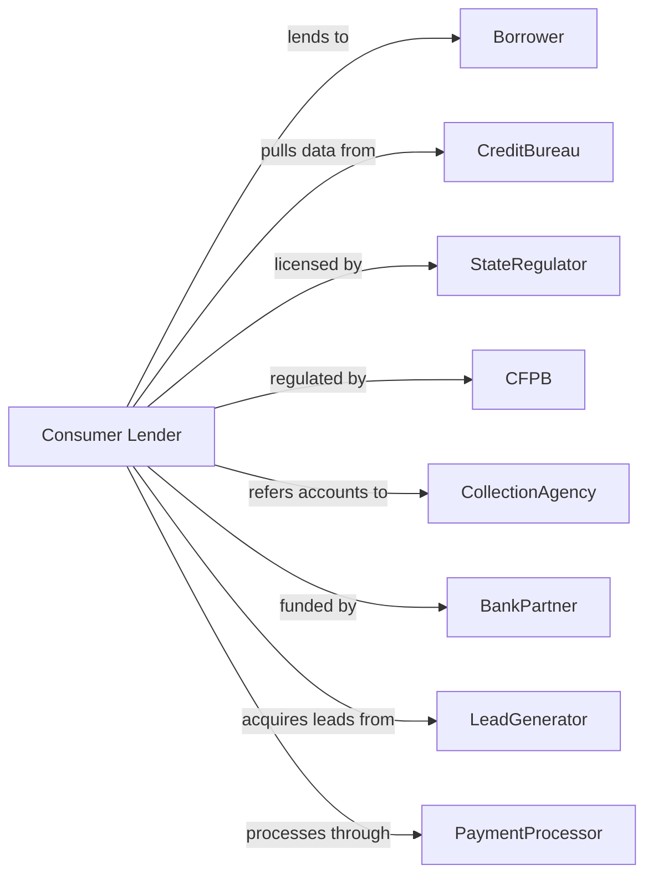

# Consumer Lending

> Business-as-Code definition for consumer lending operations. Models unsecured personal lending from application through disbursement, servicing, and collections.

## Overview

Consumer lenders provide unsecured cash loans to individuals for personal, family, or household purposes including debt consolidation, medical expenses, and major purchases. This definition exposes actions for credit evaluation, loan origination, payment processing, and debt recovery, enabling programmatic access to personal finance company operations.

## Actors

| Actor | Description |
|-------|-------------|
| Borrower | Individual seeking unsecured personal credit |
| CreditBureau | Agency providing credit reports and scores |
| StateRegulator | Authority licensing and examining consumer lenders |
| CFPB | Consumer Financial Protection Bureau overseeing practices |
| CollectionAgency | Third party pursuing delinquent accounts |
| BankPartner | Depository institution providing loan funding |
| LeadGenerator | Marketing firm providing qualified applicants |
| PaymentProcessor | Service handling ACH and debit transactions |

## Roles

| Role | Description |
|------|-------------|
| LoanOfficer | Specialist originating and closing personal loans |
| UnderwritingAnalyst | Staff evaluating creditworthiness and ability to repay |
| CustomerServiceRep | Agent handling borrower inquiries and requests |
| CollectionsSpecialist | Staff pursuing payment on past-due loans |
| ComplianceManager | Officer ensuring lending law adherence |
| RiskAnalyst | Professional modeling portfolio credit risk |
| SkipTracer | Investigator locating borrowers who have defaulted |

## Entities

| Entity | Description |
|--------|-------------|
| PersonalLoan | Unsecured installment loan with fixed term |
| LoanApplication | Request for credit with borrower information |
| CreditDecision | Approval, decline, or counteroffer determination |
| PaymentSchedule | Amortization of principal and interest |
| APR | All-in annual percentage rate including fees |
| OriginationFee | Upfront charge deducted from loan proceeds |
| Hardship | Temporary payment modification for struggling borrowers |
| Refinance | New loan paying off existing balance |
| ChargeOff | Balance written off as uncollectible |
| PromissoryNote | Legal document evidencing loan obligation |

## Actions

| Action | Description |
|--------|-------------|
| submitApplication | Receive loan request with income and identity verification |
| pullCredit | Retrieve credit report and score from bureau |
| underwriteLoan | Evaluate ability to repay and assign risk tier |
| generateOffer | Create loan terms based on underwriting decision |
| acceptOffer | Finalize loan agreement with e-signature |
| disburseFunds | Transfer loan proceeds to borrower account |
| collectPayment | Process scheduled ACH or debit payments |
| applyPayment | Allocate payment to interest, principal, and fees |
| grantHardship | Modify terms for borrowers experiencing difficulty |
| accelerateLoan | Demand full balance on severe default |
| referCollection | Transfer delinquent account to collection agency |
| writeOff | Recognize uncollectible balance as loss |

## Events

| Event | Description |
|-------|-------------|
| applicationSubmitted | Loan request received from borrower |
| creditPulled | Credit report and score retrieved |
| loanUnderwritten | Risk tier and terms determined |
| offerGenerated | Loan terms presented to borrower |
| offerAccepted | Loan agreement executed |
| fundsDisbursed | Loan proceeds transferred to borrower |
| paymentCollected | Scheduled payment received |
| paymentApplied | Payment allocated to loan balance |
| hardshipGranted | Modified terms activated |
| loanAccelerated | Full balance demanded |
| collectionReferred | Account transferred to agency |
| loanWrittenOff | Balance recognized as loss |

## Searches

| Search | Description |
|--------|-------------|
| findLoans | List loans by status, risk tier, or origination date |
| getDelinquencies | Identify past-due loans by days delinquent |
| getPaymentHistory | Retrieve payment records for borrower |
| getPortfolioMetrics | Calculate yield, loss rate, and delinquency rate |
| findHardshipCases | List loans with active payment modifications |
| getOriginationVolume | Retrieve loan volume by channel and product |
| getCollectionInventory | List accounts in third-party collection |

## Workflow



## Actor Relationships



## Usage

### Calling Actions

```typescript
import { lendConsumerLoans } from '@headlessly/lend-consumer-loans'

const lender = lendConsumerLoans()

// Check origination volume for current quarter
const volume = await lender.getOriginationVolume({ channel: 'online', period: '2024-Q1' })

// Submit loan application
const application = await lender.submitApplication({
  borrowerId: 'cust-12345',
  requestedAmount: 15000,
  purpose: 'debtConsolidation',
  income: 65000,
  employmentStatus: 'fullTime'
})

// Check for existing loans by this borrower
const existingLoans = await lender.findLoans({ borrowerId: 'cust-12345', status: 'active' })

// Pull credit and underwrite
const credit = await lender.pullCredit({ borrowerId: 'cust-12345' })
const decision = await lender.underwriteLoan({
  applicationId: application.id,
  creditScore: credit.score,
  dti: 0.35,
  employmentVerified: true
})

// Disburse approved loan
if (decision.approved) {
  await lender.disburseFunds({
    loanId: decision.loanId,
    amount: decision.approvedAmount - decision.originationFee,
    disbursementMethod: 'ach',
    accountNumber: 'ext-acct-67890'
  })
}
```

### Event-Driven Automation

```typescript
// Auto-offer hardship for struggling borrowers
lender.paymentCollected(async ({ loanId, daysLate, missedPayments }) => {
  if (missedPayments >= 2 && daysLate < 60) {
    await lender.grantHardship({
      loanId,
      modificationType: 'paymentReduction',
      durationMonths: 3,
      reducedPaymentPercent: 50
    })
  }
})

// Refer severely delinquent to collections
lender.loanAccelerated(async ({ loanId, outstandingBalance }) => {
  await lender.referCollection({
    loanId,
    balance: outstandingBalance,
    agency: 'agency-partner-1',
    commissionRate: 0.25
  })
})
```
