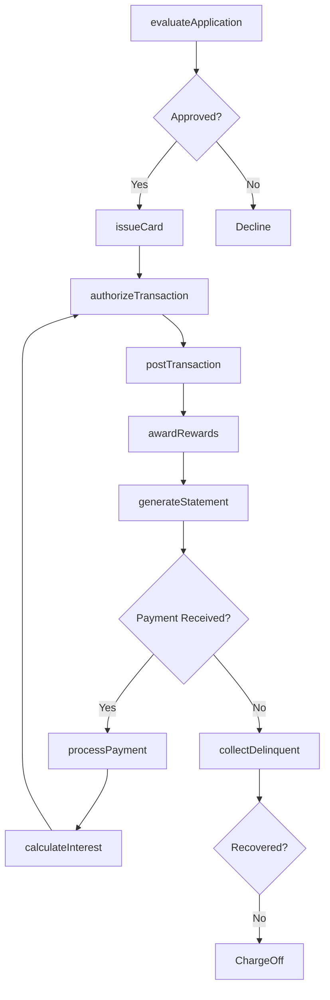
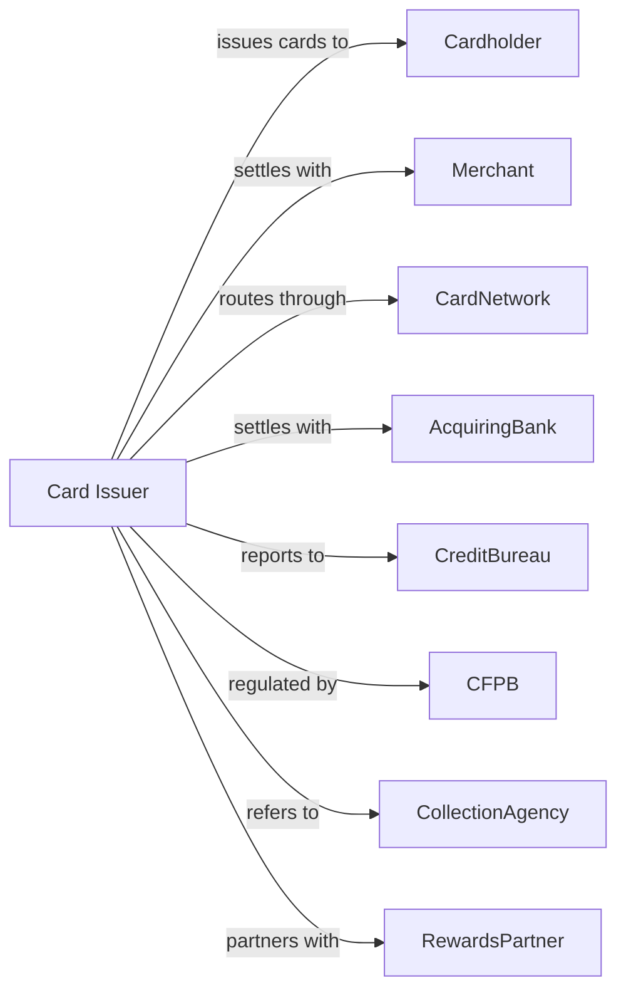

# Credit Card Issuing

> Business-as-Code definition for credit card issuing operations. Models the complete card lifecycle from application through statement billing, rewards management, and collections.

## Overview

Credit card issuers provide revolving credit by issuing cards that allow cardholders to purchase goods and services with deferred payment. This definition exposes actions for account origination, authorization processing, statement generation, and rewards fulfillment, enabling programmatic access to card portfolio management.

## Actors

| Actor | Description |
|-------|-------------|
| Cardholder | Individual or business using credit card for purchases |
| Merchant | Business accepting card payments for goods and services |
| CardNetwork | Visa, Mastercard, or other network routing transactions |
| AcquiringBank | Merchant's bank processing card transactions |
| CreditBureau | Agency providing consumer credit reports and scores |
| CFPB | Consumer Financial Protection Bureau overseeing card practices |
| CollectionAgency | Third party collecting delinquent balances |
| RewardsPartner | Airline, hotel, or retailer providing redemption options |

## Roles

| Role | Description |
|------|-------------|
| ProductManager | Executive designing card features and pricing |
| UnderwritingAnalyst | Specialist evaluating applicant creditworthiness |
| FraudAnalyst | Investigator identifying suspicious transactions |
| CustomerServiceRep | Agent handling cardholder inquiries and disputes |
| CollectionsSpecialist | Staff pursuing past-due account recovery |
| RewardsAdministrator | Manager overseeing loyalty program operations |

## Entities

| Entity | Description |
|--------|-------------|
| CreditCard | Physical or virtual card linked to revolving credit account |
| CardAccount | Credit line with balance, limit, and payment terms |
| Transaction | Purchase, payment, or adjustment posted to account |
| Statement | Monthly billing document with balance and minimum due |
| CreditLimit | Maximum authorized balance for account |
| APR | Annual percentage rate applied to carried balances |
| RewardsBalance | Accumulated points, miles, or cashback earned |
| Dispute | Cardholder challenge to transaction accuracy |
| ChargeOff | Written-off balance deemed uncollectible |
| BalanceTransfer | Moving debt from another card at promotional rate |

## Actions

| Action | Description |
|--------|-------------|
| evaluateApplication | Score applicant and determine creditworthiness |
| issueCard | Create account and mail physical or virtual card |
| authorizeTransaction | Approve or decline purchase in real-time |
| postTransaction | Apply authorized purchase to account balance |
| generateStatement | Create monthly billing with balance and minimum payment |
| processPayment | Apply cardholder payment to account balance |
| calculateInterest | Compute and post finance charges on carried balance |
| awardRewards | Credit points, miles, or cashback for purchases |
| redeemRewards | Process redemption for travel, merchandise, or statement credit |
| investigateFraud | Review suspicious activity and protect account |
| fileDispute | Initiate chargeback process for contested transaction |
| collectDelinquent | Pursue payment on past-due accounts |

## Events

| Event | Description |
|-------|-------------|
| applicationApproved | Credit line granted to new cardholder |
| cardIssued | New card shipped or provisioned digitally |
| transactionAuthorized | Purchase approved in real-time |
| transactionPosted | Purchase applied to account balance |
| statementGenerated | Monthly billing ready for delivery |
| paymentProcessed | Cardholder payment credited to account |
| interestCharged | Finance charges posted to balance |
| rewardsAwarded | Points, miles, or cashback credited |
| rewardsRedeemed | Redemption processed for cardholder |
| fraudDetected | Suspicious activity identified on account |
| disputeFiled | Chargeback initiated with merchant |
| accountChargedOff | Balance written off as uncollectible |

## Searches

| Search | Description |
|--------|-------------|
| findAccounts | List card accounts by status, balance, or risk tier |
| getTransactionHistory | Retrieve transactions by account and date range |
| getDelinquentAccounts | Identify past-due accounts by days delinquent |
| getRewardsLiability | Calculate outstanding rewards redemption obligation |
| findFraudCases | List accounts with pending fraud investigations |
| getPortfolioMetrics | Retrieve yield, loss rate, and payment rate statistics |
| getDisputeQueue | List open disputes requiring resolution |

## Workflow



## Actor Relationships



## Usage

### Calling Actions

```typescript
import { lendCreditCards } from '@headlessly/lend-credit-cards'

const cardIssuer = lendCreditCards()

// Evaluate new application
const decision = await cardIssuer.evaluateApplication({
  applicantId: 'app-12345',
  requestedLimit: 10000,
  income: 75000,
  creditScore: 720
})

// Issue approved card
if (decision.approved) {
  const card = await cardIssuer.issueCard({
    applicantId: 'app-12345',
    creditLimit: decision.approvedLimit,
    apr: decision.assignedAPR,
    rewardsProgram: 'cashback',
    cardType: 'virtual'
  })
}

// Process real-time authorization
const auth = await cardIssuer.authorizeTransaction({
  cardNumber: card.number,
  amount: 125.50,
  merchantId: 'merch-67890',
  merchantCategory: '5411'
})
```

### Event-Driven Automation

```typescript
// Auto-award rewards on posted transactions
cardIssuer.transactionPosted(async ({ accountId, amount, category }) => {
  const multiplier = category === 'dining' ? 3 : 1
  await cardIssuer.awardRewards({
    accountId,
    points: Math.floor(amount * multiplier),
    transactionType: 'purchase'
  })
})

// Detect fraud patterns
cardIssuer.transactionAuthorized(async ({ accountId, amount, location, merchantId }) => {
  await cardIssuer.investigateFraud({
    accountId,
    riskSignals: ['velocityCheck', 'geolocationAnomaly', 'merchantRisk'],
    transactionAmount: amount,
    location
  })
})
```
