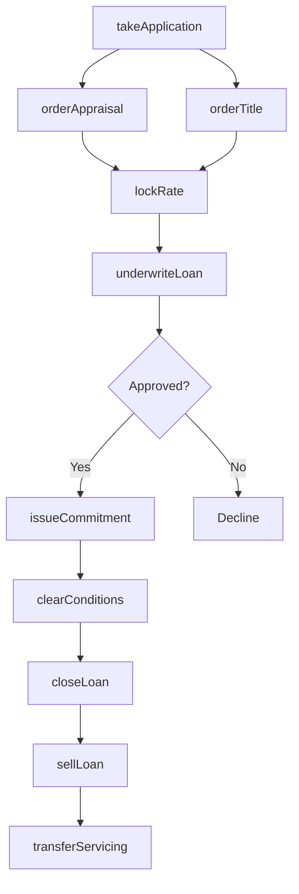

# Real Estate Credit

> Business-as-Code definition for real estate credit operations. Models nondepository mortgage lending from origination through secondary market sale and loan servicing.

## Overview

Real estate credit companies provide loans secured by residential and commercial real property without accepting deposits. This definition exposes actions for mortgage origination, underwriting, secondary market delivery, and loan servicing, enabling programmatic access to mortgage banking operations.

## Actors

| Actor | Description |
|-------|-------------|
| Borrower | Individual or entity seeking mortgage financing |
| RealEstateAgent | Professional facilitating property purchase transactions |
| Appraiser | Licensed professional valuing subject property |
| TitleCompany | Firm providing title insurance and closing services |
| SecondaryMarket | Fannie Mae, Freddie Mac, and Ginnie Mae purchasing loans |
| Warehouse Lender | Bank providing short-term loan funding |
| Servicer | Entity collecting payments and managing escrow |
| InvestorGroup | Private institution purchasing mortgage pools |

## Roles

| Role | Description |
|------|-------------|
| LoanOriginator | Licensed professional taking mortgage applications |
| Underwriter | Analyst evaluating borrower and property qualification |
| Processor | Staff gathering documentation and preparing files |
| Closer | Specialist preparing loan documents and funding |
| SecondaryMarketAnalyst | Professional managing loan sales and delivery |
| ServicingManager | Executive overseeing payment collection operations |

## Entities

| Entity | Description |
|--------|-------------|
| MortgageLoan | Debt secured by real property lien |
| LoanApplication | Request for mortgage with borrower and property details |
| Appraisal | Professional valuation of subject property |
| TitleCommitment | Preliminary title report with requirements |
| LockCommitment | Agreement fixing interest rate for specified period |
| ClosingDisclosure | Final loan terms and settlement charges |
| MortgageNote | Promissory note evidencing debt obligation |
| DeedOfTrust | Security instrument creating property lien |
| ServicingRight | Asset representing servicing income stream |
| WarehouseLine | Credit facility funding loans before sale |

## Actions

| Action | Description |
|--------|-------------|
| takeApplication | Collect borrower and property information |
| orderAppraisal | Request property valuation from licensed appraiser |
| orderTitle | Request title search and commitment |
| lockRate | Commit to interest rate for specified period |
| underwriteLoan | Evaluate borrower credit, income, and property |
| issueCommitment | Provide conditional approval with requirements |
| clearConditions | Verify satisfaction of underwriting requirements |
| closeLoan | Execute documents and fund mortgage |
| sellLoan | Deliver loan to secondary market investor |
| transferServicing | Move loan to servicer for payment collection |
| originateHeloc | Create home equity line of credit |
| processRefinance | Replace existing mortgage with new loan |

## Events

| Event | Description |
|-------|-------------|
| applicationTaken | Mortgage application submitted |
| appraisalOrdered | Valuation request sent to appraiser |
| titleOrdered | Search request sent to title company |
| rateLocked | Interest rate commitment secured |
| loanUnderwritten | Credit decision rendered |
| commitmentIssued | Conditional approval delivered |
| conditionsCleared | All requirements satisfied |
| loanClosed | Documents executed and funds disbursed |
| loanSold | Mortgage delivered to investor |
| servicingTransferred | Loan moved to servicer |
| helocOriginated | Home equity line activated |
| refinanceCompleted | Existing mortgage replaced |

## Searches

| Search | Description |
|--------|-------------|
| findLoansInProcess | List applications by status and lock expiration |
| getPipeline | Retrieve loans by stage and expected close date |
| getWarehousePosition | Calculate outstanding funded loans on line |
| findExpiredLocks | Identify rate locks nearing or past expiration |
| getProductionVolume | Retrieve origination volume by product and channel |
| getServicingPortfolio | List loans being serviced |
| findConditionsPending | Identify loans with outstanding requirements |

## Workflow



## Actor Relationships

```mermaid
graph LR
    MBC[Mortgage Company]

    MBC -->|lends to| Borrower
    MBC -->|coordinates with| RealEstateAgent
    MBC -->|orders from| Appraiser
    MBC -->|closes with| TitleCompany
    MBC -->|sells to| SecondaryMarket
    MBC -->|funded by| WarehouseLender
    MBC -->|transfers to| Servicer
    MBC -->|sells pools to| InvestorGroup
    MBC -->|financed by| Warehouse Lender
```

## Usage

### Calling Actions

```typescript
import { lendMortgages } from '@headlessly/lend-mortgages'

const mortgageCompany = lendMortgages()

// Review current pipeline and warehouse position
const pipeline = await mortgageCompany.getPipeline({ stage: 'underwriting', expectedCloseDate: '2024-04' })
const warehouse = await mortgageCompany.getWarehousePosition({ lineId: 'wh-main' })

// Take mortgage application
const application = await mortgageCompany.takeApplication({
  borrowerId: 'cust-12345',
  propertyAddress: '456 Oak Ave, Somewhere, ST 12345',
  loanAmount: 350000,
  purchasePrice: 425000,
  loanType: 'conventional',
  occupancy: 'primaryResidence'
})

// Lock interest rate
await mortgageCompany.lockRate({
  applicationId: application.id,
  rate: 6.75,
  lockDays: 45,
  product: '30-year-fixed'
})

// Close and sell loan
const loan = await mortgageCompany.closeLoan({
  applicationId: application.id,
  closingDate: '2024-04-15',
  fundingAmount: 350000
})

await mortgageCompany.sellLoan({
  loanId: loan.id,
  investor: 'fannieMae',
  deliveryType: 'bestEfforts',
  servicingRetained: true
})
```

### Event-Driven Automation

```typescript
// Auto-order appraisal on new applications
mortgageCompany.applicationTaken(async ({ applicationId, propertyAddress }) => {
  await mortgageCompany.orderAppraisal({
    applicationId,
    propertyAddress,
    appraisalType: 'full',
    rushRequested: false
  })
  await mortgageCompany.orderTitle({
    applicationId,
    propertyAddress,
    productType: 'ownerPolicy'
  })
})

// Sell loans immediately after closing
mortgageCompany.loanClosed(async ({ loanId, investor, commitmentId }) => {
  await mortgageCompany.sellLoan({
    loanId,
    investor,
    commitmentId,
    deliveryType: 'mandatory'
  })
})
```
