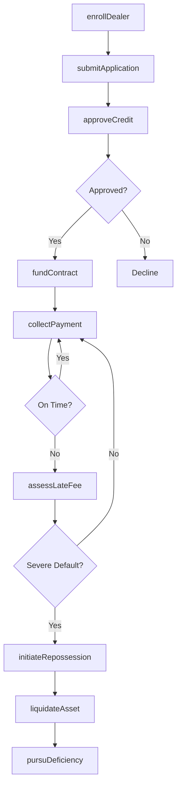
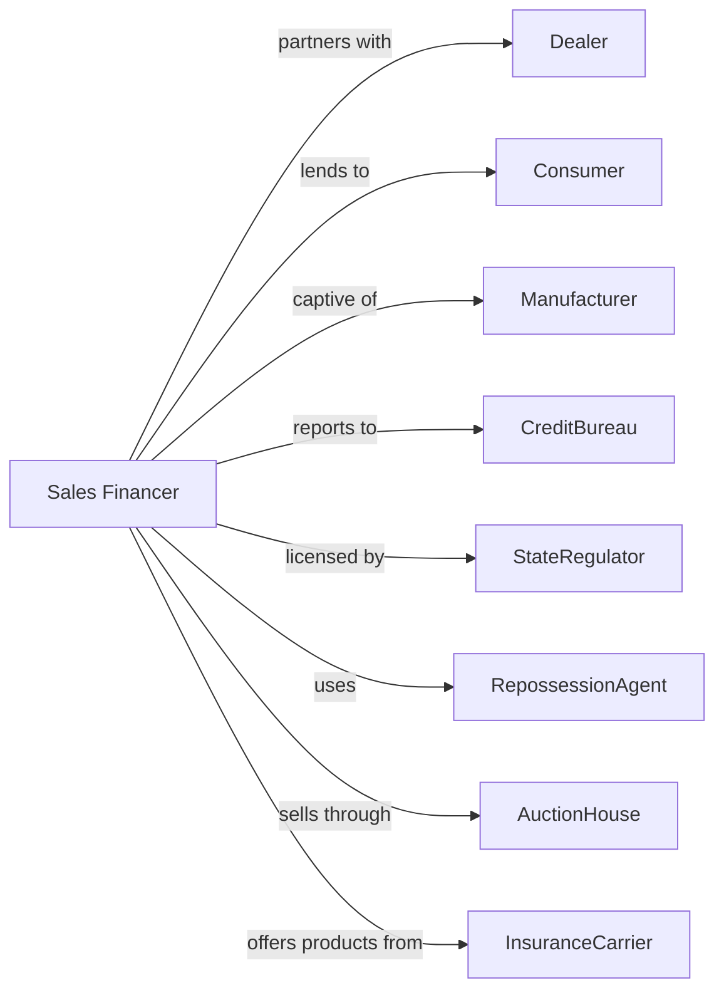

# Sales Financing

> Business-as-Code definition for sales financing operations. Models point-of-sale credit from dealer arrangement through installment collection and asset recovery.

## Overview

Sales financing companies provide credit for purchases of consumer goods and equipment through contractual installment agreements with dealers and retailers. This definition exposes actions for dealer enrollment, contract origination, payment processing, and collateral recovery, enabling programmatic access to captive and independent financing operations.

## Actors

| Actor | Description |
|-------|-------------|
| Dealer | Retailer or merchant originating financing contracts |
| Consumer | Individual purchasing goods with installment credit |
| Manufacturer | Producer offering captive financing for products |
| CreditBureau | Agency providing consumer credit reports |
| StateRegulator | Authority licensing and overseeing consumer lenders |
| RepossessionAgent | Third party recovering collateral on defaulted contracts |
| AuctionHouse | Firm liquidating repossessed assets |
| InsuranceCarrier | Provider of credit life and GAP coverage |

## Roles

| Role | Description |
|------|-------------|
| DealerRelationsManager | Executive managing retail partner relationships |
| CreditAnalyst | Specialist evaluating applicant creditworthiness |
| ContractProcessor | Staff preparing and funding installment agreements |
| CollectionsAgent | Representative pursuing past-due payments |
| RecoverySpecialist | Staff managing repossession and liquidation |
| ComplianceOfficer | Specialist ensuring lending law compliance |

## Entities

| Entity | Description |
|--------|-------------|
| InstallmentContract | Agreement for fixed payments over specified term |
| DealerAgreement | Master contract defining dealer compensation and procedures |
| Collateral | Financed asset securing the installment obligation |
| PaymentSchedule | Amortization of principal and interest over term |
| DealerReserve | Holdback protecting against early defaults |
| FinanceCharge | Total interest and fees over contract life |
| Deficiency | Balance owed after collateral liquidation |
| GAP | Guaranteed Asset Protection covering loss shortfall |
| BuyRate | Wholesale rate quoted to dealer |
| DealerMarkup | Spread between buy rate and contract rate |

## Actions

| Action | Description |
|--------|-------------|
| enrollDealer | Onboard retail partner with agreement and training |
| submitApplication | Receive and score consumer credit application |
| approveCredit | Authorize financing with terms and conditions |
| fundContract | Purchase installment contract from dealer |
| collectPayment | Process scheduled installment payments |
| assessLateFee | Apply penalty for overdue payments |
| initiateRepossession | Authorize collateral recovery on default |
| liquidateAsset | Sell repossessed collateral at auction |
| pursuDeficiency | Collect balance after asset liquidation |
| calculateDealerReserve | Determine and release holdback amounts |
| processPayoff | Handle early contract payoff requests |
| reportCredit | Submit payment history to credit bureaus |

## Events

| Event | Description |
|-------|-------------|
| dealerEnrolled | New retail partner activated |
| applicationSubmitted | Credit application received from dealer |
| creditApproved | Financing authorized for consumer |
| contractFunded | Dealer paid for installment contract |
| paymentCollected | Scheduled payment received |
| lateFeeAssessed | Penalty applied to past-due account |
| repossessionInitiated | Collateral recovery authorized |
| assetLiquidated | Repossessed item sold |
| deficiencyPursued | Collection started for remaining balance |
| dealerReserveReleased | Holdback paid to dealer |
| contractPaidOff | Loan satisfied early |
| creditReported | Payment history submitted to bureau |

## Searches

| Search | Description |
|--------|-------------|
| findContracts | List installment contracts by status or dealer |
| getDelinquencies | Identify past-due accounts by days delinquent |
| getDealerPerformance | Retrieve origination volume and default rates by dealer |
| getRecoveryPipeline | List accounts in repossession or liquidation |
| getPortfolioYield | Calculate weighted average rate and income |
| findPayoffs | Identify contracts with pending payoff requests |
| getDealerReserves | Retrieve holdback balances by dealer |

## Workflow



## Actor Relationships



## Usage

### Calling Actions

```typescript
import { lendPurchases } from '@headlessly/lend-purchases'

const financer = lendPurchases()

// Review dealer performance metrics
const performance = await financer.getDealerPerformance({ dealerId: 'dealer-12345', period: '2024-Q1' })

// Enroll new dealer
const dealer = await financer.enrollDealer({
  dealerId: 'dealer-12345',
  name: 'ABC Motors',
  products: ['auto', 'powersports'],
  reservePercentage: 3,
  volumeTarget: 50
})

// Process credit application
const decision = await financer.approveCredit({
  applicationId: 'app-67890',
  dealerId: dealer.id,
  amount: 25000,
  term: 60,
  collateral: {
    type: 'automobile',
    vin: '1HGBH41JXMN109186',
    value: 28000
  }
})

// Check delinquencies for risk assessment
const delinquencies = await financer.getDelinquencies({ dealerId: dealer.id, daysDelinquent: 30 })

// Fund approved contract
await financer.fundContract({
  contractId: decision.contractId,
  dealerId: dealer.id,
  fundingAmount: 24250,
  dealerMarkup: 1.5
})
```

### Event-Driven Automation

```typescript
// Auto-assess late fees
financer.paymentCollected(async ({ contractId, daysLate }) => {
  if (daysLate > 10) {
    await financer.assessLateFee({
      contractId,
      amount: 25,
      gracePeriodExpired: true
    })
  }
})

// Trigger repossession on severe delinquency
financer.lateFeeAssessed(async ({ contractId, daysDelinquent, balance }) => {
  if (daysDelinquent > 90) {
    await financer.initiateRepossession({
      contractId,
      reason: 'paymentDefault',
      outstandingBalance: balance,
      assignAgent: true
    })
  }
})
```
