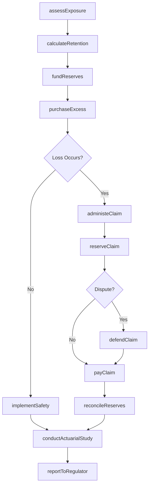
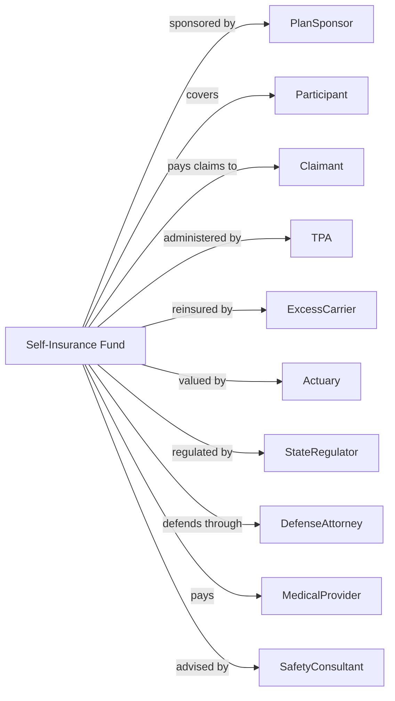

# Other Insurance Funds

> Business-as-Code definition for self-insurance and captive fund operations. Models risk retention from exposure analysis through loss funding, claims administration, and reserve management.

## Overview

Other insurance funds are legal entities organized to provide insurance exclusively for the sponsor, firm, or its employees or members. This includes self-insurance funds, workers' compensation insurance funds, and captive insurance arrangements. This definition exposes actions for risk assessment, loss reserve funding, claims administration, and regulatory compliance, enabling programmatic access to alternative risk transfer operations.

## Actors

| Actor | Description |
|-------|-------------|
| PlanSponsor | Employer or entity funding self-insurance program |
| Participant | Employee or member covered by fund |
| Claimant | Party filing claim against fund |
| TPA | Third party administrator managing claims |
| ExcessCarrier | Insurer providing stop-loss coverage |
| Actuary | Professional calculating reserves and funding |
| StateRegulator | Authority overseeing self-insurance programs |
| DefenseAttorney | Counsel defending litigated claims |
| MedicalProvider | Healthcare facility treating injured parties |
| SafetyConsultant | Professional advising on loss prevention |

## Roles

| Role | Description |
|------|-------------|
| FundAdministrator | Executive overseeing fund operations |
| RiskManager | Professional managing enterprise exposures |
| ClaimsManager | Staff overseeing claim adjudication |
| ReserveAnalyst | Specialist calculating loss reserves |
| ComplianceOfficer | Staff ensuring regulatory adherence |
| SafetyDirector | Executive managing loss prevention programs |

## Entities

| Entity | Description |
|--------|-------------|
| SelfInsuredRetention | Amount retained before excess coverage |
| LossReserve | Funds set aside for anticipated claims |
| Claim | Request for payment for covered loss |
| StopLossPolicy | Coverage for losses exceeding threshold |
| FundingLevel | Current capitalization of self-insurance fund |
| ActuarialStudy | Professional assessment of required reserves |
| ExperienceModifier | Factor adjusting premium based on loss history |
| SuretyBond | Security guaranteeing claim payment ability |
| LossDevelopment | Projection of claim cost over time |
| CertificateOfSelfInsurance | Regulatory approval to self-insure |

## Actions

| Action | Description |
|--------|-------------|
| assessExposure | Evaluate risk profile and loss potential |
| calculateRetention | Determine optimal self-insured amount |
| fundReserves | Contribute capital to loss reserves |
| purchaseExcess | Obtain stop-loss coverage |
| administeClaim | Process and adjudicate loss claim |
| reserveClaim | Set aside funds for specific loss |
| defendClaim | Manage litigation of disputed claims |
| conductActuarialStudy | Commission reserve adequacy analysis |
| reportToRegulator | Submit required filings to state authority |
| implementSafety | Deploy loss prevention programs |
| renewCertificate | Maintain self-insurance authorization |
| reconcileReserves | Adjust reserves based on experience |

## Events

| Event | Description |
|-------|-------------|
| exposureAssessed | Risk profile evaluated |
| retentionCalculated | Self-insured amount determined |
| reservesFunded | Capital contributed to fund |
| excessPurchased | Stop-loss coverage obtained |
| claimAdministered | Loss processed and adjudicated |
| claimReserved | Funds allocated for specific loss |
| claimDefended | Litigation managed |
| actuarialStudyConducted | Reserve analysis completed |
| regulatorReported | Required filings submitted |
| safetyImplemented | Prevention programs deployed |
| certificateRenewed | Authorization maintained |
| reservesReconciled | Reserves adjusted |

## Searches

| Search | Description |
|--------|-------------|
| findClaims | List claims by status, type, or reserve amount |
| getReserveStatus | Retrieve current funding levels by category |
| getExperienceHistory | Retrieve loss history and trends |
| findOpenLitigation | List claims in active defense |
| getActuarialRecommendations | Retrieve reserve adequacy opinions |
| getComplianceDeadlines | List upcoming regulatory filings |
| getSafetyMetrics | Calculate loss prevention effectiveness |

## Workflow



## Actor Relationships



## Usage

### Calling Actions

```typescript
import { administerReserves } from '@headlessly/administer-reserves'

const selfInsuranceFund = administerReserves()

// Review current reserve status and open claims
const reserveStatus = await selfInsuranceFund.getReserveStatus({ fundId: 'wcf-67890', category: 'workersComp' })
const openClaims = await selfInsuranceFund.findClaims({ fundId: 'wcf-67890', status: 'open' })

// Assess risk exposure
const exposure = await selfInsuranceFund.assessExposure({
  sponsorId: 'employer-12345',
  coverageType: 'workersComp',
  payroll: 25000000,
  employeeCount: 500,
  industryCode: '238'
})

// Calculate optimal retention
const retention = await selfInsuranceFund.calculateRetention({
  sponsorId: 'employer-12345',
  exposureId: exposure.id,
  riskTolerance: 'moderate',
  cashFlowCapacity: 500000
})

// Fund reserves based on actuarial recommendation
await selfInsuranceFund.fundReserves({
  fundId: 'wcf-67890',
  amount: retention.recommendedReserve,
  fiscalYear: 2024,
  fundingSchedule: 'quarterly'
})

// Process workers compensation claim
const claim = await selfInsuranceFund.administeClaim({
  fundId: 'wcf-67890',
  claimantId: 'emp-11111',
  injuryDate: '2024-03-10',
  injuryType: 'strain',
  initialReserve: 15000
})
```

### Event-Driven Automation

```typescript
// Auto-reserve claims upon filing
selfInsuranceFund.claimAdministered(async ({ claimId, injuryType }) => {
  const reserveTable = getReserveByInjuryType(injuryType)
  await selfInsuranceFund.reserveClaim({
    claimId,
    indemnityReserve: reserveTable.indemnity,
    medicalReserve: reserveTable.medical,
    expenseReserve: reserveTable.expense
  })
})

// Trigger actuarial review on threshold
selfInsuranceFund.reservesReconciled(async ({ fundId, totalReserves }) => {
  const fundingLevel = await getFundingLevel(fundId)
  if (totalReserves / fundingLevel > 0.8) {
    await selfInsuranceFund.conductActuarialStudy({
      fundId,
      studyType: 'reserveAdequacy',
      urgency: 'high'
    })
  }
})
```
