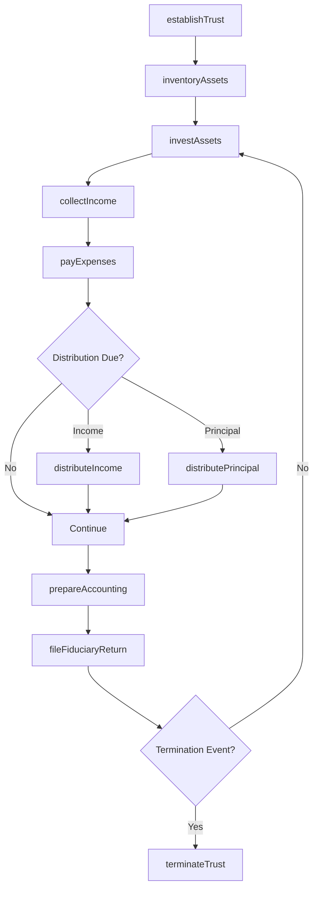
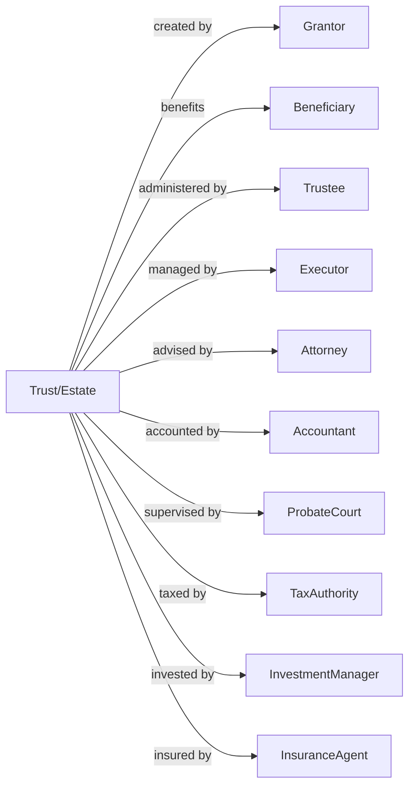

# Trusts, Estates, and Agency Accounts

> Business-as-Code definition for fiduciary administration operations. Models trust and estate management from establishment through asset management, distribution, and termination.

## Overview

Trusts, estates, and agency accounts are legal entities administered on behalf of beneficiaries under the terms of a trust agreement, will, or agency agreement. This includes personal investment trusts, testamentary trusts, bankruptcy estates, and private estates. This definition exposes actions for fiduciary administration, asset management, beneficiary distributions, and regulatory compliance, enabling programmatic access to fiduciary operations.

## Actors

| Actor | Description |
|-------|-------------|
| Grantor | Individual creating trust or estate plan |
| Beneficiary | Party entitled to receive distributions |
| Trustee | Fiduciary administering trust assets |
| Executor | Personal representative of decedent estate |
| Attorney | Counsel advising on trust and estate matters |
| Accountant | Professional preparing tax returns and accountings |
| ProbateCourt | Authority supervising estate administration |
| TaxAuthority | Federal tax authority governing fiduciary taxation |
| InvestmentManager | Professional managing trust investments |
| InsuranceAgent | Provider of fiduciary liability coverage |

## Roles

| Role | Description |
|------|-------------|
| TrustOfficer | Professional managing trust accounts |
| EstateAdministrator | Staff processing estate matters |
| DistributionSpecialist | Staff handling beneficiary payments |
| TaxCompliance Officer | Specialist preparing fiduciary returns |
| AccountingManager | Staff maintaining trust records |
| ClientRelationsOfficer | Staff communicating with beneficiaries |

## Entities

| Entity | Description |
|--------|-------------|
| TrustAgreement | Document establishing trust terms |
| Will | Testamentary document directing estate |
| Estate | Assets and liabilities of decedent |
| Beneficiary | Party entitled to distributions |
| Distribution | Payment to beneficiary |
| FiduciaryAccounting | Statement of receipts and disbursements |
| TrustCorpus | Principal assets of trust |
| Income | Earnings from trust assets |
| LettersTestamentary | Court authority to act as executor |
| Form1041 | Fiduciary income tax return |

## Actions

| Action | Description |
|--------|-------------|
| establishTrust | Create trust and accept initial funding |
| acceptEstate | Begin estate administration |
| inventoryAssets | Catalog all trust or estate property |
| investAssets | Manage trust portfolio per guidelines |
| collectIncome | Receive dividends, interest, and rents |
| payExpenses | Disburse administrative costs |
| distributeIncome | Pay periodic income to beneficiaries |
| distributePrincipal | Pay corpus to beneficiaries |
| prepareAccounting | Generate fiduciary financial statements |
| fileFiduciaryReturn | Submit Form 1041 tax return |
| terminateTrust | Close trust upon termination event |
| settleEstate | Complete probate and close estate |

## Events

| Event | Description |
|-------|-------------|
| trustEstablished | Trust created and funded |
| estateAccepted | Administration commenced |
| assetsInventoried | Property cataloged |
| assetsInvested | Portfolio managed |
| incomeCollected | Earnings received |
| expensesPaid | Costs disbursed |
| incomeDistributed | Periodic payment made |
| principalDistributed | Corpus payment made |
| accountingPrepared | Statements generated |
| fiduciaryReturnFiled | Tax return submitted |
| trustTerminated | Trust closed |
| estateSettled | Probate completed |

## Searches

| Search | Description |
|--------|-------------|
| findTrusts | List trusts by type, grantor, or beneficiary |
| findEstates | List estates by status or decedent |
| getAssetInventory | Retrieve trust or estate holdings |
| getBeneficiaries | List parties entitled to distributions |
| getDistributionHistory | Retrieve payments by beneficiary |
| getPendingDistributions | Identify scheduled or required payments |
| getAccountings | Retrieve fiduciary financial statements |

## Workflow



## Actor Relationships



## Usage

### Calling Actions

```typescript
import { poolTrusts } from '@headlessly/pool-trusts'

const fiduciary = poolTrusts()

// Check existing trusts for this grantor
const existingTrusts = await fiduciary.findTrusts({ grantorId: 'client-12345', status: 'active' })

// Review pending distributions
const pendingDist = await fiduciary.getPendingDistributions({ trustType: 'revocable' })

// Establish new revocable trust
const trust = await fiduciary.establishTrust({
  grantorId: 'client-12345',
  trustType: 'revocable',
  trustName: 'Smith Family Trust',
  initialFunding: 500000,
  beneficiaries: [
    { name: 'John Smith Jr.', share: 0.5 },
    { name: 'Jane Smith', share: 0.5 }
  ]
})

// Inventory trust assets
await fiduciary.inventoryAssets({
  trustId: trust.id,
  assets: [
    { type: 'securities', value: 300000, description: 'Brokerage account' },
    { type: 'realEstate', value: 200000, description: 'Vacation property' }
  ]
})

// Distribute quarterly income
await fiduciary.distributeIncome({
  trustId: trust.id,
  period: 'Q1-2024',
  distributions: [
    { beneficiaryId: 'ben-001', amount: 5000 },
    { beneficiaryId: 'ben-002', amount: 5000 }
  ]
})

// Prepare annual accounting
const accounting = await fiduciary.prepareAccounting({
  trustId: trust.id,
  accountingPeriod: '2024',
  includeDetails: true
})
```

### Event-Driven Automation

```typescript
// Auto-invest cash above threshold
fiduciary.incomeCollected(async ({ trustId, amount }) => {
  const cashBalance = await getCashBalance(trustId)
  if (cashBalance > 10000) {
    await fiduciary.investAssets({
      trustId,
      amount: cashBalance - 5000,
      investmentGuideline: 'prudentInvestor'
    })
  }
})

// Schedule required minimum distributions
fiduciary.trustEstablished(async ({ trustId, trustType }) => {
  if (trustType === 'charitableRemainder') {
    scheduleAnnually(async () => {
      const corpus = await getTrustCorpus(trustId)
      await fiduciary.distributeIncome({
        trustId,
        amount: corpus * 0.05,
        distributionType: 'required'
      })
    })
  }
})
```
