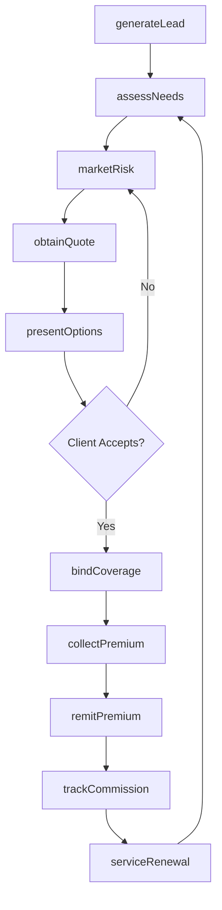
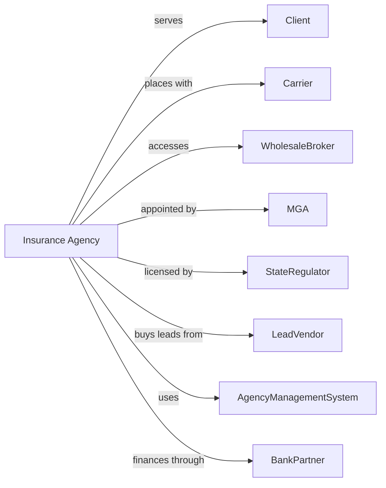

# Insurance Agencies and Brokerages

> Business-as-Code definition for insurance distribution operations. Models policy sales from prospect identification through carrier placement, premium collection, and commission accounting.

## Overview

Insurance agents and brokers act as intermediaries selling annuities and insurance policies on behalf of carriers to individuals and businesses. This definition exposes actions for client acquisition, risk assessment, policy placement, and ongoing service, enabling programmatic access to insurance distribution operations.

## Actors

| Actor | Description |
|-------|-------------|
| Client | Individual or business seeking insurance coverage |
| Carrier | Insurance company underwriting and issuing policies |
| WholesaleBroker | Intermediary placing specialty or surplus lines |
| MGA | Managing General Agent with underwriting authority |
| StateRegulator | Authority licensing agents and brokers |
| LeadVendor | Provider of prospective client information |
| AgencyManagementSystem | Software platform for agency operations |
| BankPartner | Institution offering premium financing |

## Roles

| Role | Description |
|------|-------------|
| Producer | Licensed agent selling insurance to clients |
| AccountManager | Staff servicing existing client relationships |
| CSR | Customer service representative handling inquiries |
| PrincipalOwner | Agency owner managing operations |
| Underwriter | Specialist evaluating risks for MGA operations |
| AccountingClerk | Staff managing premium and commission accounting |

## Entities

| Entity | Description |
|--------|-------------|
| Policy | Insurance contract placed with carrier |
| Quote | Premium estimate from carrier |
| Application | Client request for coverage |
| Commission | Agent compensation from carrier |
| Renewal | Policy continuation at expiration |
| Endorsement | Policy modification during term |
| Submission | Package sent to carrier for quote |
| BindOrder | Instruction to carrier to issue coverage |
| ClientFile | Complete record of client coverage |
| ProducerAgreement | Contract with carrier defining terms |

## Actions

| Action | Description |
|--------|-------------|
| generateLead | Identify prospective insurance clients |
| assessNeeds | Evaluate client coverage requirements |
| marketRisk | Submit application to multiple carriers |
| obtainQuote | Receive premium estimate from carrier |
| presentOptions | Review coverage alternatives with client |
| bindCoverage | Instruct carrier to issue policy |
| collectPremium | Receive payment from client |
| remitPremium | Forward payment to carrier |
| processEndorsement | Handle policy modifications |
| serviceRenewal | Manage policy continuation |
| trackCommission | Monitor earned compensation |
| maintainLicense | Ensure current agent licensing |

## Events

| Event | Description |
|-------|-------------|
| leadGenerated | Prospect identified |
| needsAssessed | Requirements evaluated |
| riskMarketed | Submission sent to carriers |
| quoteObtained | Premium estimate received |
| optionsPresented | Alternatives reviewed with client |
| coverageBound | Policy issued by carrier |
| premiumCollected | Payment received from client |
| premiumRemitted | Payment forwarded to carrier |
| endorsementProcessed | Modification completed |
| renewalServiced | Continuation processed |
| commissionTracked | Compensation recorded |
| licenseMaintained | Licensing current |

## Searches

| Search | Description |
|--------|-------------|
| findClients | List clients by coverage type or renewal date |
| getPoliciesInForce | Retrieve active policies by carrier |
| getQuotesPending | List submissions awaiting response |
| getCommissionsDue | Retrieve earned compensation by carrier |
| getRenewalPipeline | List policies approaching expiration |
| getProducerBook | Retrieve business by producing agent |
| getLicenseStatus | Check agent licensing by state |

## Workflow



## Actor Relationships



## Usage

### Calling Actions

```typescript
import { brokerPolicies } from '@headlessly/broker-policies'

const agency = brokerPolicies()

// Check renewal pipeline for upcoming expirations
const renewals = await agency.getRenewalPipeline({ daysUntilExpiration: 60 })

// Assess client needs
const assessment = await agency.assessNeeds({
  clientId: 'client-12345',
  coverageTypes: ['autoPersonal', 'homeowners', 'umbrella'],
  currentCarriers: ['carrier-001'],
  renewalDate: '2024-05-01'
})

// Market to multiple carriers
const submissions = await agency.marketRisk({
  clientId: 'client-12345',
  coverageType: 'homeowners',
  propertyDetails: assessment.propertyInfo,
  carriers: ['carrier-001', 'carrier-002', 'carrier-003']
})

// Bind coverage with best quote
const bestQuote = submissions.quotes.sort((a, b) => a.premium - b.premium)[0]
await agency.bindCoverage({
  quoteId: bestQuote.id,
  effectiveDate: '2024-05-01',
  paymentPlan: 'monthly'
})
```

### Event-Driven Automation

```typescript
// Auto-service renewals
agency.renewalServiced(async ({ clientId, policyId, renewalDate }) => {
  await agency.marketRisk({
    clientId,
    policyId,
    marketType: 'renewal',
    compareToExpiring: true
  })
})

// Track commissions after premium remittance
agency.premiumRemitted(async ({ policyId, carrierId, premium }) => {
  await agency.trackCommission({
    policyId,
    carrierId,
    premiumAmount: premium,
    expectedRate: 0.15
  })
})
```
