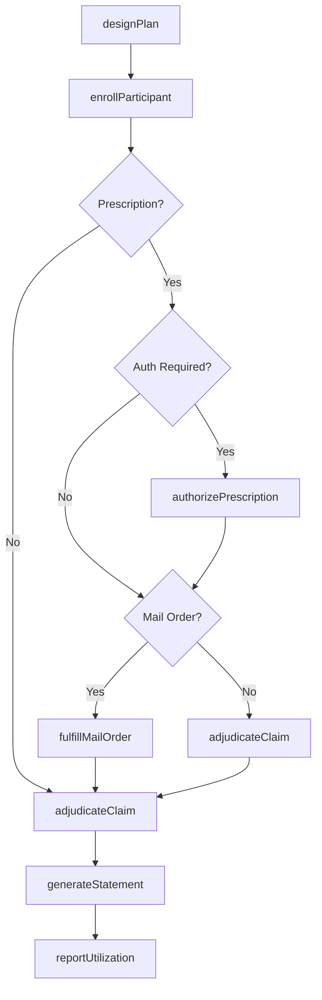
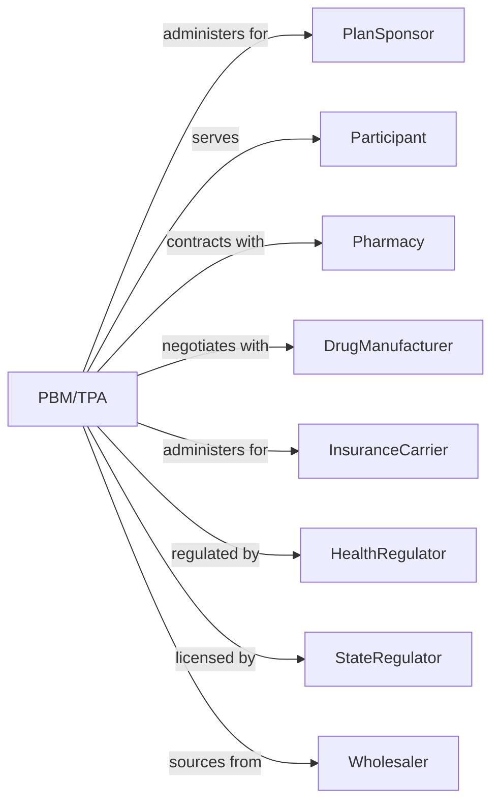

# Pharmacy Benefit Management and Other Third Party Administration of Insurance and Pension Funds

> Business-as-Code definition for benefits administration operations. Models pharmacy benefit management and third party administration from plan design through claims processing and reporting.

## Overview

Pharmacy benefit managers and third party administrators provide administrative services to insurance carriers, self-insured employers, and pension plans including claims processing, formulary management, and participant communication. This definition exposes actions for plan administration, claims adjudication, and network management, enabling programmatic access to TPA operations.

## Actors

| Actor | Description |
|-------|-------------|
| PlanSponsor | Employer or fund providing benefits to participants |
| Participant | Employee or member receiving plan benefits |
| Pharmacy | Retail or mail-order dispensary filling prescriptions |
| DrugManufacturer | Pharmaceutical company producing medications |
| InsuranceCarrier | Company delegating administration |
| HealthRegulator | Centers for Medicare and Medicaid Services regulating plans |
| StateRegulator | Authority licensing administrators |
| Wholesaler | Distributor supplying pharmacies with medications |

## Roles

| Role | Description |
|------|-------------|
| AccountManager | Executive managing plan sponsor relationships |
| ClaimsProcessor | Staff adjudicating pharmacy and medical claims |
| PharmacistReviewer | Licensed professional evaluating clinical criteria |
| FormularyManager | Specialist maintaining drug coverage lists |
| NetworkManager | Staff contracting with pharmacies and providers |
| ComplianceOfficer | Specialist ensuring ERISA and regulatory adherence |

## Entities

| Entity | Description |
|--------|-------------|
| BenefitPlan | Document defining coverage terms and limits |
| Formulary | List of covered medications with tier placement |
| Claim | Request for payment for pharmacy or medical services |
| Rebate | Payment from manufacturer for preferred status |
| PriorAuthorization | Pre-approval required for certain medications |
| MailOrderFulfillment | Prescription dispensed through mail service |
| NetworkContract | Agreement with pharmacy or provider |
| ParticipantStatement | Summary of benefits and claims |
| StepTherapy | Requirement to try lower-cost drugs first |
| UtilizationReport | Analysis of plan usage patterns |

## Actions

| Action | Description |
|--------|-------------|
| designPlan | Create benefit structure and coverage terms |
| enrollParticipant | Add member to benefit plan |
| adjudicateClaim | Process pharmacy or medical claim |
| managFormulary | Maintain covered drug list and tiers |
| authorizePrescription | Pre-approve medication requiring review |
| fulfillMailOrder | Dispense prescription via mail service |
| negotiateRebate | Secure manufacturer payment for formulary status |
| contractNetwork | Establish pharmacy or provider agreements |
| generateStatement | Create participant benefit summary |
| reportUtilization | Analyze and present plan usage data |
| processAppeal | Handle participant challenge to denial |
| terminateParticipant | Remove member from benefit plan |

## Events

| Event | Description |
|-------|-------------|
| planDesigned | Benefit structure created |
| participantEnrolled | Member added to plan |
| claimAdjudicated | Payment determination made |
| formularyManaged | Drug list updated |
| prescriptionAuthorized | Pre-approval granted |
| mailOrderFulfilled | Prescription shipped |
| rebateNegotiated | Manufacturer payment secured |
| networkContracted | Agreement executed |
| statementGenerated | Summary delivered |
| utilizationReported | Analysis presented |
| appealProcessed | Challenge decided |
| participantTerminated | Member removed |

## Searches

| Search | Description |
|--------|-------------|
| findParticipants | List members by plan, status, or eligibility |
| getClaimsHistory | Retrieve claims by participant or pharmacy |
| getFormularyDrugs | List covered medications by tier |
| findPendingAuthorizations | Identify requests awaiting decision |
| getRebateEarnings | Calculate manufacturer payments by drug |
| getNetworkPharmacies | List contracted dispensing locations |
| getUtilizationMetrics | Calculate usage statistics by plan |

## Workflow



## Actor Relationships



## Usage

### Calling Actions

```typescript
import { brokerBenefits } from '@headlessly/broker-benefits'

const pbm = brokerBenefits()

// Check formulary coverage for requested drug
const formulary = await pbm.getFormularyDrugs({ tier: 'preferred', therapeutic: 'antiInflammatory' })

// Review pending prior authorizations
const pendingAuths = await pbm.findPendingAuthorizations({ status: 'awaiting', urgency: 'urgent' })

// Design pharmacy benefit plan
const plan = await pbm.designPlan({
  sponsorId: 'employer-12345',
  planType: 'pharmacy',
  formulary: 'standard-2024',
  copayTiers: [
    { tier: 'generic', copay: 10 },
    { tier: 'preferred', copay: 30 },
    { tier: 'nonPreferred', copay: 60 }
  ]
})

// Adjudicate pharmacy claim
const claim = await pbm.adjudicateClaim({
  participantId: 'mem-67890',
  pharmacyId: 'pharm-11111',
  ndc: '00069015401',
  quantity: 30,
  daysSupply: 30
})

// Authorize specialty medication
await pbm.authorizePrescription({
  participantId: 'mem-67890',
  drug: 'adalimumab',
  diagnosis: 'M05.79',
  priorTreatments: ['methotrexate', 'sulfasalazine']
})
```

### Event-Driven Automation

```typescript
// Auto-generate statements monthly
pbm.claimAdjudicated(async ({ participantId }) => {
  const monthEnd = isMonthEnd()
  if (monthEnd) {
    await pbm.generateStatement({
      participantId,
      period: getCurrentMonth(),
      includeEOB: true
    })
  }
})

// Report utilization quarterly
pbm.formularyManaged(async ({ planId }) => {
  await pbm.reportUtilization({
    planId,
    period: 'quarterly',
    metrics: ['genericRate', 'mailOrderRate', 'adherence']
  })
})
```
