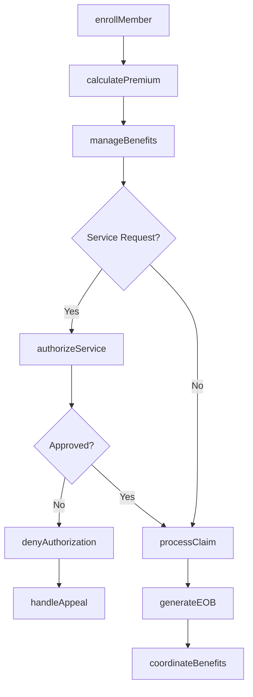
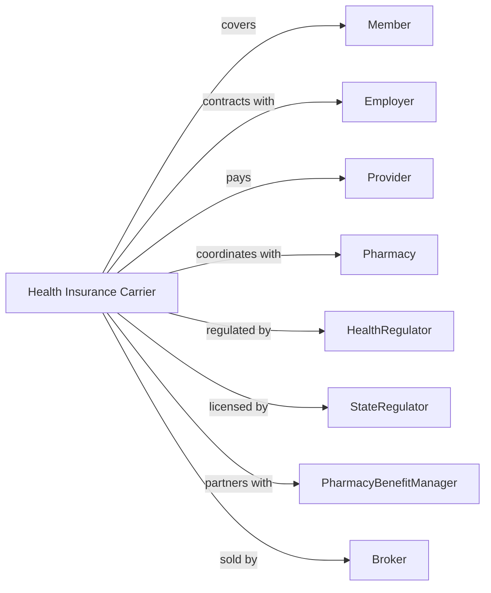

# Direct Health and Medical Insurance Carriers

> Business-as-Code definition for health insurance operations. Models coverage underwriting from enrollment through claims adjudication, provider network management, and member services.

## Overview

Health insurance carriers underwrite medical, hospital, and supplemental health policies for individuals and groups. This definition exposes actions for enrollment processing, claims adjudication, utilization management, and provider contracting, enabling programmatic access to health plan administration.

## Actors

| Actor | Description |
|-------|-------------|
| Member | Individual enrolled in health coverage |
| Employer | Group sponsor providing health benefits to employees |
| Provider | Physician, hospital, or facility delivering care |
| Pharmacy | Retail or mail-order dispensary filling prescriptions |
| HealthRegulator | Centers for Medicare and Medicaid Services regulating plans |
| StateRegulator | Insurance commissioner overseeing carrier operations |
| PharmacyBenefitManager | Entity managing prescription drug benefits |
| Broker | Agent selling group health coverage |

## Roles

| Role | Description |
|------|-------------|
| ClaimsProcessor | Staff adjudicating medical claims |
| MedicalDirector | Physician overseeing clinical coverage decisions |
| NetworkManager | Executive contracting with healthcare providers |
| Underwriter | Specialist pricing group health coverage |
| MemberServicesRep | Staff handling member inquiries |
| ComplianceOfficer | Specialist ensuring HIPAA and regulatory adherence |

## Entities

| Entity | Description |
|--------|-------------|
| HealthPlan | Contract providing medical coverage |
| Claim | Request for payment for healthcare services |
| MemberEnrollment | Active coverage record for individual |
| ProviderNetwork | Contracted healthcare delivery system |
| PriorAuthorization | Pre-approval required for certain services |
| Deductible | Amount member pays before coverage begins |
| Copayment | Fixed member payment for service |
| ExplanationOfBenefits | Statement showing claim processing |
| UtilizationReview | Assessment of medical necessity |
| Premium | Payment required for coverage |

## Actions

| Action | Description |
|--------|-------------|
| enrollMember | Add individual to health plan coverage |
| processClaim | Adjudicate provider request for payment |
| authorizeService | Pre-approve medical treatment or procedure |
| denyAuthorization | Decline coverage for requested service |
| contractProvider | Negotiate rates and terms with healthcare provider |
| calculatePremium | Determine group or individual rate |
| manageBenefits | Administer covered services and limits |
| reviewUtilization | Assess medical necessity and appropriateness |
| handleAppeal | Process member challenge to coverage decision |
| coordinateBenefits | Determine payment when multiple coverage exists |
| generateEOB | Create explanation of benefits statement |
| renewCoverage | Process annual plan renewal |

## Events

| Event | Description |
|-------|-------------|
| memberEnrolled | Individual added to coverage |
| claimProcessed | Payment determination made |
| serviceAuthorized | Pre-approval granted |
| authorizationDenied | Coverage declined for service |
| providerContracted | Network agreement executed |
| premiumCalculated | Rate determined |
| benefitsManaged | Coverage administered |
| utilizationReviewed | Medical necessity assessed |
| appealHandled | Challenge decision rendered |
| benefitsCoordinated | Multiple coverage resolved |
| eobGenerated | Statement created |
| coverageRenewed | Plan continuation processed |

## Searches

| Search | Description |
|--------|-------------|
| findMembers | List enrollees by plan, group, or status |
| getClaimsHistory | Retrieve claims by member or provider |
| findPendingAuthorizations | Identify requests awaiting decision |
| getProviderNetwork | List contracted providers by specialty |
| getUtilizationMetrics | Calculate service usage statistics |
| findAppeals | List coverage challenges by status |
| getPremiumRevenue | Retrieve premium income by product |

## Workflow



## Actor Relationships



## Usage

### Calling Actions

```typescript
import { insureHealth } from '@headlessly/insure-health'

const healthPlan = insureHealth()

// Check provider network coverage for requested plan
const providers = await healthPlan.getProviderNetwork({ specialty: 'primaryCare', region: 'northeast' })

// Review pending authorizations
const pendingAuths = await healthPlan.findPendingAuthorizations({ status: 'awaiting', urgency: 'routine' })

// Enroll new member
const enrollment = await healthPlan.enrollMember({
  memberId: 'mem-12345',
  groupId: 'group-67890',
  planType: 'PPO',
  effectiveDate: '2024-01-01',
  dependents: ['dep-1', 'dep-2']
})

// Process medical claim
const claim = await healthPlan.processClaim({
  claimId: 'claim-11111',
  memberId: 'mem-12345',
  providerId: 'prov-22222',
  serviceDate: '2024-03-15',
  procedureCode: '99213',
  billedAmount: 150.00
})

// Authorize surgical procedure
const auth = await healthPlan.authorizeService({
  memberId: 'mem-12345',
  serviceType: 'surgery',
  procedureCode: '27447',
  requestingProvider: 'prov-33333',
  clinicalInfo: { diagnosis: 'M17.11', necessity: 'conservative-failed' }
})
```

### Event-Driven Automation

```typescript
// Generate EOB after claim processing
healthPlan.claimProcessed(async ({ claimId, memberId, allowedAmount, paidAmount }) => {
  await healthPlan.generateEOB({
    claimId,
    memberId,
    summary: { billed: claim.billedAmount, allowed: allowedAmount, paid: paidAmount }
  })
})

// Review utilization for high-cost services
healthPlan.serviceAuthorized(async ({ authId, serviceType, estimatedCost }) => {
  if (estimatedCost > 50000) {
    await healthPlan.reviewUtilization({
      authId,
      reviewType: 'concurrent',
      triggers: ['highCost', 'inpatient']
    })
  }
})
```
