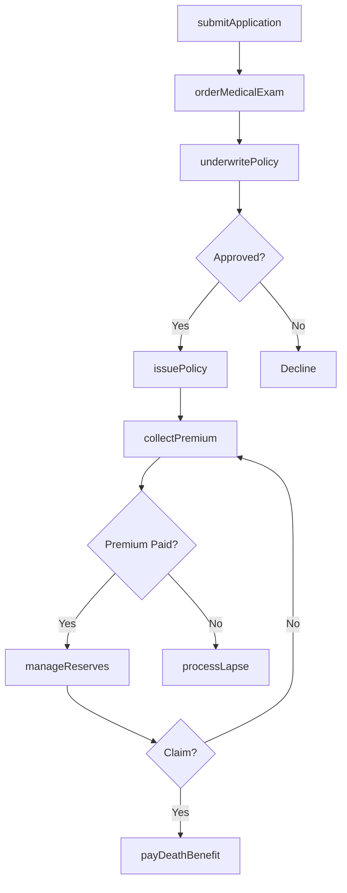
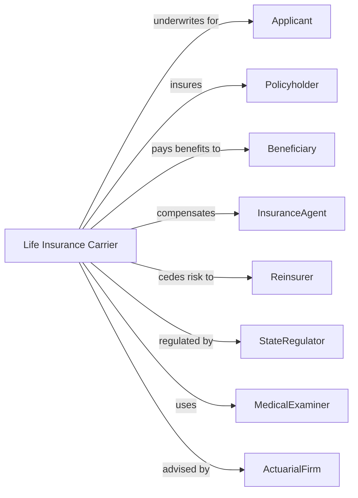

# Direct Life Insurance Carriers

> Business-as-Code definition for life insurance operations. Models policy underwriting from application through premium collection, death benefit payment, and annuity administration.

## Overview

Life insurance carriers underwrite policies providing death benefits, disability income, and annuities to policyholders and beneficiaries. This definition exposes actions for application processing, risk assessment, premium billing, and claims payment, enabling programmatic access to life insurance operations.

## Actors

| Actor | Description |
|-------|-------------|
| Applicant | Individual seeking life insurance coverage |
| Policyholder | Owner of active insurance policy |
| Beneficiary | Designated recipient of death benefits |
| InsuranceAgent | Licensed professional selling policies |
| Reinsurer | Carrier assuming portion of underwritten risk |
| StateRegulator | Insurance commissioner overseeing carrier operations |
| MedicalExaminer | Professional conducting health assessments |
| ActuarialFirm | Consultant developing pricing and reserves |

## Roles

| Role | Description |
|------|-------------|
| Underwriter | Specialist evaluating mortality risk and setting premiums |
| ClaimsExaminer | Staff processing death benefit claims |
| Actuary | Professional calculating premiums and reserves |
| PolicyAdministrator | Staff managing policy records and changes |
| InvestmentManager | Executive overseeing premium investment portfolio |
| ComplianceOfficer | Specialist ensuring regulatory adherence |

## Entities

| Entity | Description |
|--------|-------------|
| LifePolicy | Contract providing death benefit to beneficiaries |
| Annuity | Contract providing periodic payments for life |
| DisabilityPolicy | Coverage replacing income during disability |
| Premium | Payment required to maintain coverage |
| DeathBenefit | Amount paid to beneficiaries upon insured death |
| CashValue | Accumulated savings in permanent life policy |
| Underwriting | Process of evaluating and pricing risk |
| Reserve | Funds set aside for future claims |
| MortalityTable | Statistical basis for life expectancy pricing |
| Rider | Optional coverage added to base policy |

## Actions

| Action | Description |
|--------|-------------|
| submitApplication | Receive and process insurance application |
| orderMedicalExam | Request health assessment for underwriting |
| underwritePolicy | Evaluate risk and determine premium |
| issuePolicy | Create and deliver approved insurance contract |
| collectPremium | Bill and receive premium payments |
| processLapse | Handle policy termination for non-payment |
| payDeathBenefit | Disburse claim to beneficiaries |
| calculateCashValue | Determine accumulated policy savings |
| processWithdrawal | Handle cash value loans and withdrawals |
| cedeRisk | Transfer portion of risk to reinsurer |
| manageReserves | Calculate and maintain claim reserves |
| annuitize | Convert accumulated value to income stream |

## Events

| Event | Description |
|-------|-------------|
| applicationSubmitted | Insurance request received |
| medicalExamOrdered | Health assessment scheduled |
| policyUnderwritten | Risk evaluated and premium set |
| policyIssued | Contract delivered to policyholder |
| premiumCollected | Payment received and applied |
| policyLapsed | Coverage terminated for non-payment |
| deathBenefitPaid | Claim disbursed to beneficiaries |
| cashValueCalculated | Policy savings determined |
| withdrawalProcessed | Cash value disbursed |
| riskCeded | Portion transferred to reinsurer |
| reservesManaged | Claim funds updated |
| annuityStarted | Income payments began |

## Searches

| Search | Description |
|--------|-------------|
| findPolicies | List policies by status, type, or agent |
| getInForce | Retrieve active policies and face amounts |
| findClaimsPending | Identify death claims awaiting payment |
| getPremiumsDue | List policies with outstanding premiums |
| getCashValues | Retrieve accumulated savings by policy |
| getReserves | Calculate liability reserves by product |
| getLapseRisk | Identify policies at risk of termination |

## Workflow



## Actor Relationships



## Usage

### Calling Actions

```typescript
import { insureLives } from '@headlessly/insure-lives'

const carrier = insureLives()

// Check existing policies for applicant
const existing = await carrier.findPolicies({ applicantId: 'app-12345', status: 'active' })

// Review current reserve position
const reserves = await carrier.getReserves({ product: 'termLife' })

// Submit life insurance application
const application = await carrier.submitApplication({
  applicantId: 'app-12345',
  productType: 'termLife',
  faceAmount: 500000,
  term: 20,
  smoker: false,
  age: 35
})

// Underwrite after medical exam
const policy = await carrier.underwritePolicy({
  applicationId: application.id,
  medicalResults: { bloodPressure: 'normal', cholesterol: 'normal' },
  riskClass: 'preferred'
})

// Issue approved policy
await carrier.issuePolicy({
  policyId: policy.id,
  effectiveDate: '2024-04-01',
  premium: policy.annualPremium
})
```

### Event-Driven Automation

```typescript
// Auto-cede large risks to reinsurer
carrier.policyIssued(async ({ policyId, faceAmount }) => {
  if (faceAmount > 1_000_000) {
    await carrier.cedeRisk({
      policyId,
      reinsurer: 'reinsurer-001',
      retentionLimit: 1_000_000,
      cedePercent: 50
    })
  }
})

// Process death claims
carrier.deathBenefitPaid(async ({ policyId, beneficiaryId, amount }) => {
  await carrier.manageReserves({
    policyId,
    action: 'release',
    amount
  })
})
```
