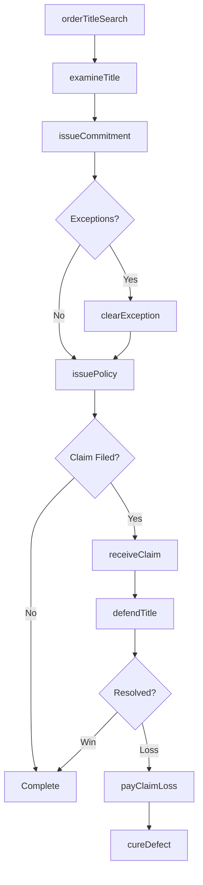
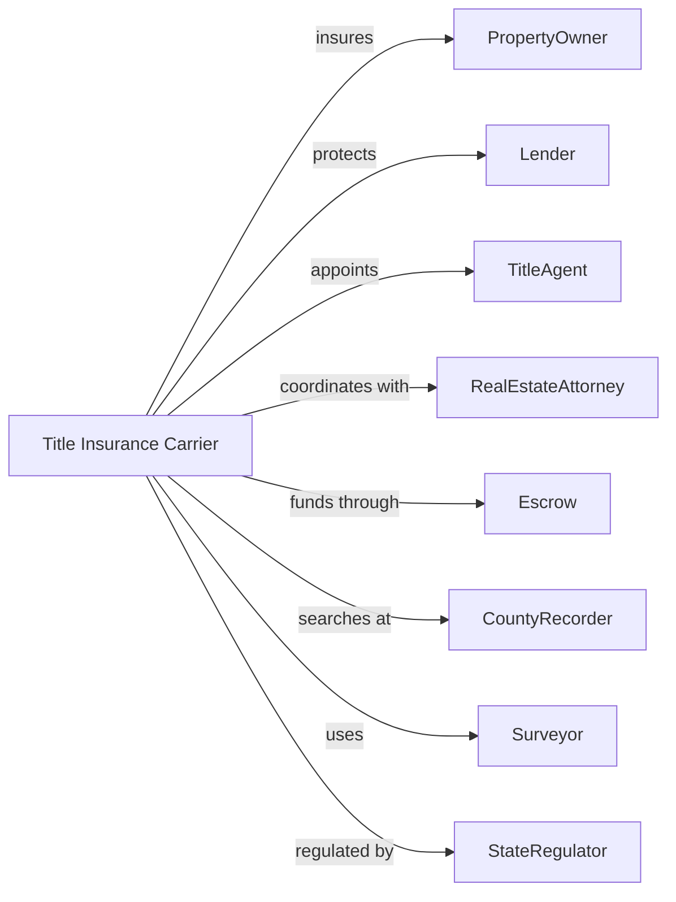

# Direct Title Insurance Carriers

> Business-as-Code definition for title insurance operations. Models coverage underwriting from title search through policy issuance and claims defense.

## Overview

Title insurance carriers underwrite policies protecting real estate owners and lenders against losses from defects in property titles, liens, or encumbrances. This definition exposes actions for title examination, commitment issuance, and claims handling, enabling programmatic access to title insurance operations.

## Actors

| Actor | Description |
|-------|-------------|
| PropertyOwner | Individual or entity purchasing owner's coverage |
| Lender | Mortgage lender requiring title insurance |
| TitleAgent | Licensed professional issuing policies for carrier |
| RealEstateAttorney | Counsel representing parties in transaction |
| Escrow | Third party holding funds pending closing |
| CountyRecorder | Government office maintaining property records |
| Surveyor | Professional mapping property boundaries |
| StateRegulator | Insurance commissioner overseeing operations |

## Roles

| Role | Description |
|------|-------------|
| TitleExaminer | Specialist searching and analyzing property records |
| Underwriter | Professional evaluating title risk and approving coverage |
| ClaimsAttorney | Counsel defending or resolving title claims |
| EscrowOfficer | Staff managing closing fund disbursement |
| PolicyIssuer | Specialist preparing and delivering policies |
| ComplianceOfficer | Specialist ensuring regulatory adherence |

## Entities

| Entity | Description |
|--------|-------------|
| TitleCommitment | Preliminary report offering to insure title |
| OwnerPolicy | Coverage protecting property owner against defects |
| LoanPolicy | Coverage protecting lender's mortgage interest |
| TitleSearch | Examination of public records for defects |
| Exception | Known defect excluded from coverage |
| Endorsement | Additional coverage extending base policy |
| Lien | Recorded claim against property |
| Encumbrance | Restriction or interest affecting title |
| Claim | Challenge to insured title requiring defense |
| Curative | Action taken to resolve title defect |

## Actions

| Action | Description |
|--------|-------------|
| orderTitleSearch | Request examination of property records |
| examineTitle | Review records and identify defects |
| issueCommitment | Provide preliminary title report with requirements |
| clearException | Resolve defect prior to closing |
| issuePolicy | Deliver owner or loan title policy |
| processEndorsement | Add special coverage to policy |
| receiveClaim | Accept notice of title challenge |
| defendTitle | Litigate or negotiate title dispute |
| payClaimLoss | Disburse settlement for title defect |
| cureDefect | Take action to resolve covered issue |
| calculatePremium | Determine one-time policy charge |
| filePolicy | Record policy with regulatory authority |

## Events

| Event | Description |
|-------|-------------|
| titleSearchOrdered | Record examination requested |
| titleExamined | Records reviewed and defects identified |
| commitmentIssued | Preliminary report delivered |
| exceptionCleared | Defect resolved |
| policyIssued | Title coverage delivered |
| endorsementProcessed | Additional coverage added |
| claimReceived | Title challenge accepted |
| titleDefended | Dispute litigated or negotiated |
| claimLossPaid | Settlement disbursed |
| defectCured | Issue resolved |
| premiumCalculated | Policy charge determined |
| policyFiled | Coverage recorded with regulator |

## Searches

| Search | Description |
|--------|-------------|
| findOrders | List title orders by property or status |
| getCommitments | Retrieve pending commitments |
| findExceptions | List open exceptions requiring clearance |
| getPoliciesIssued | Retrieve issued policies by period |
| findClaims | List title claims by status |
| getPremiumVolume | Calculate premium income by region |
| getClaimReserves | Retrieve loss reserves by claim |

## Workflow



## Actor Relationships



## Usage

### Calling Actions

```typescript
import { insureTitles } from '@headlessly/insure-titles'

const titleCo = insureTitles()

// Check for existing orders on this property
const existingOrders = await titleCo.findOrders({ parcelNumber: '123-456-789', status: 'active' })

// Order title search
const order = await titleCo.orderTitleSearch({
  propertyAddress: '456 Oak Ave, Somewhere, ST 12345',
  parcelNumber: '123-456-789',
  buyerName: 'John Smith',
  sellerName: 'Jane Doe',
  transactionType: 'purchase'
})

// Examine title and issue commitment
const commitment = await titleCo.issueCommitment({
  orderId: order.id,
  exceptions: ['easement-001', 'mortgage-002'],
  requirements: ['payoffMortgage', 'obtainRelease'],
  effectiveDate: '2024-04-01'
})

// Verify all exceptions are cleared
const openExceptions = await titleCo.findExceptions({ commitmentId: commitment.id, status: 'open' })

// Issue owner and loan policies at closing
await titleCo.issuePolicy({
  commitmentId: commitment.id,
  policyTypes: ['owner', 'loan'],
  purchasePrice: 425000,
  loanAmount: 340000
})
```

### Event-Driven Automation

```typescript
// Auto-clear standard exceptions
titleCo.commitmentIssued(async ({ commitmentId, exceptions }) => {
  for (const exception of exceptions) {
    if (exception.type === 'priorMortgage') {
      await titleCo.clearException({
        commitmentId,
        exceptionId: exception.id,
        method: 'payoffLetter'
      })
    }
  }
})

// Defend claims automatically
titleCo.claimReceived(async ({ claimId, claimType, estimatedExposure }) => {
  await titleCo.defendTitle({
    claimId,
    strategy: claimType === 'lien' ? 'negotiate' : 'litigate',
    retainCounsel: estimatedExposure > 100000
  })
})
```
