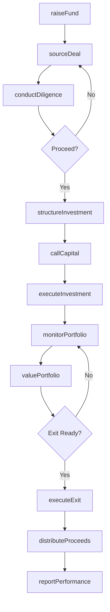
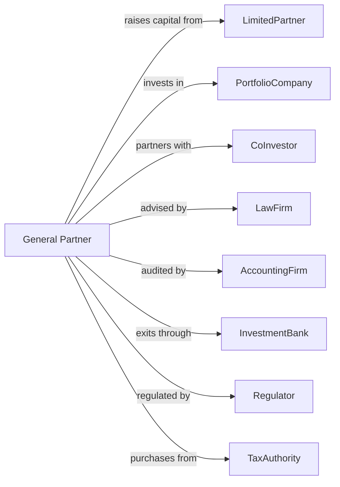

# Miscellaneous Intermediation

> Business-as-Code definition for alternative investment intermediation. Models venture capital, private equity, and specialty finance operations from deal sourcing through portfolio management and exit.

## Overview

Miscellaneous intermediaries invest as principals in financial contracts, venture capital, tax liens, mineral royalties, and other alternative assets. This definition exposes actions for deal sourcing, due diligence, investment structuring, portfolio monitoring, and exit execution, enabling programmatic access to alternative investment operations.

## Actors

| Actor | Description |
|-------|-------------|
| LimitedPartner | Institutional or individual investor providing capital |
| PortfolioCompany | Business receiving venture or private equity investment |
| CoInvestor | Partner sharing investment alongside fund |
| LawFirm | Counsel structuring transactions and agreements |
| AccountingFirm | Auditor examining fund and portfolio financials |
| InvestmentBank | Advisor facilitating exits and capital raises |
| Regulator | SEC or state authority overseeing fund operations |
| TaxAuthority | Government collecting taxes and issuing liens |

## Roles

| Role | Description |
|------|-------------|
| ManagingPartner | Senior executive leading fund strategy and operations |
| PrincipalInvestor | Professional sourcing and executing investments |
| PortfolioManager | Staff monitoring and supporting portfolio companies |
| AnalystAssociate | Junior professional conducting due diligence |
| InvestorRelations | Staff communicating with limited partners |
| ComplianceOfficer | Specialist ensuring regulatory adherence |

## Entities

| Entity | Description |
|--------|-------------|
| Fund | Investment vehicle pooling capital from LPs |
| Investment | Equity or debt position in portfolio company or asset |
| CapitalCall | Request for LP committed capital |
| Distribution | Return of capital and profits to LPs |
| Carried Interest | Manager share of fund profits |
| ManagementFee | Annual charge for fund administration |
| InvestmentMemo | Analysis supporting investment decision |
| TermSheet | Summary of proposed investment terms |
| PortfolioValuation | Current fair value of fund holdings |
| TaxLien | Government claim on property for unpaid taxes |

## Actions

| Action | Description |
|--------|-------------|
| raiseFund | Secure LP commitments for new investment vehicle |
| sourceDeal | Identify and screen investment opportunities |
| conductDiligence | Investigate target business or asset |
| structureInvestment | Design terms and documentation |
| executeInvestment | Close transaction and fund investment |
| callCapital | Request committed funds from LPs |
| monitorPortfolio | Track performance and provide support |
| valuePortfolio | Calculate current fair value of holdings |
| executeExit | Sell or liquidate investment position |
| distributeProceeds | Return capital and profits to LPs |
| reportPerformance | Provide LP statements and fund updates |
| purchaseTaxLien | Acquire government claim on property |

## Events

| Event | Description |
|-------|-------------|
| fundRaised | LP commitments secured |
| dealSourced | Investment opportunity identified |
| diligenceConducted | Target investigation completed |
| investmentStructured | Terms finalized |
| investmentExecuted | Transaction closed |
| capitalCalled | LP funds requested |
| portfolioMonitored | Performance tracked |
| portfolioValued | Fair value calculated |
| exitExecuted | Position sold or liquidated |
| proceedsDistributed | Capital returned to LPs |
| performanceReported | LP statements delivered |
| taxLienPurchased | Government claim acquired |

## Searches

| Search | Description |
|--------|-------------|
| findDeals | List pipeline opportunities by stage |
| getPortfolio | Retrieve current fund holdings |
| getLPCommitments | List limited partner capital status |
| getPerformanceMetrics | Calculate IRR, MOIC, and other returns |
| findExitCandidates | Identify investments ready for sale |
| getCapitalActivity | List calls and distributions by period |
| getTaxLienInventory | Retrieve owned government claims |

## Workflow



## Actor Relationships



## Usage

### Calling Actions

```typescript
import { investFunds } from '@headlessly/invest-funds'

const gp = investFunds()

// Review LP commitments and fund capacity
const commitments = await gp.getLPCommitments({ fundId: 'fund-III', status: 'unfunded' })

// Check pipeline for active opportunities
const pipeline = await gp.findDeals({ stage: 'screening', sector: 'enterprise-software' })

// Source and evaluate deal
const deal = await gp.sourceDeal({
  companyName: 'TechStartup Inc',
  sector: 'enterprise-software',
  stage: 'seriesB',
  targetAmount: 25_000_000
})

const diligence = await gp.conductDiligence({
  dealId: deal.id,
  areas: ['financial', 'commercial', 'legal', 'technical'],
  advisors: ['law-firm-1', 'accounting-firm-1']
})

// Structure and execute investment
const investment = await gp.structureInvestment({
  dealId: deal.id,
  amount: 20_000_000,
  valuation: 100_000_000,
  securityType: 'preferredStock',
  boardSeat: true
})

await gp.callCapital({
  fundId: 'fund-III',
  amount: 20_000_000,
  purpose: 'TechStartup Series B'
})
```

### Event-Driven Automation

```typescript
// Auto-value portfolio quarterly
gp.portfolioMonitored(async ({ fundId }) => {
  await gp.valuePortfolio({
    fundId,
    methodology: 'fairValue',
    asOfDate: quarterEnd()
  })
})

// Distribute proceeds after exit
gp.exitExecuted(async ({ investmentId, proceeds }) => {
  await gp.distributeProceeds({
    investmentId,
    grossProceeds: proceeds,
    waterfall: 'european',
    includedCarry: true
  })
})
```
