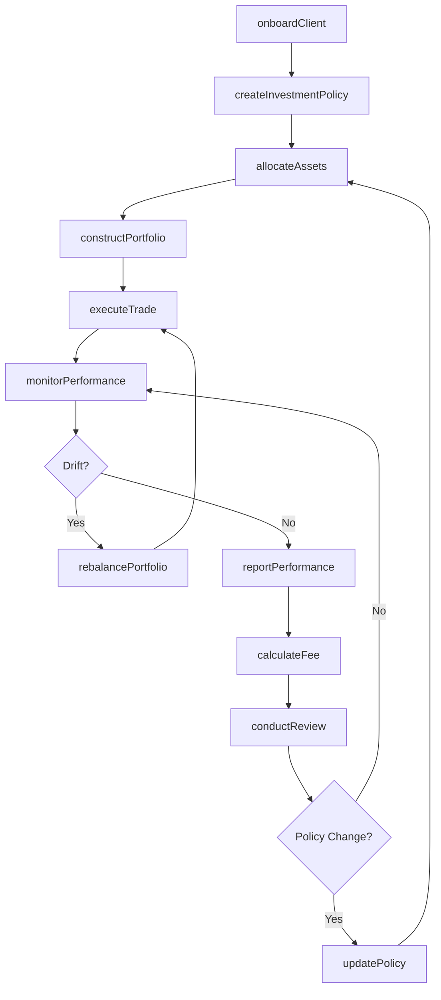
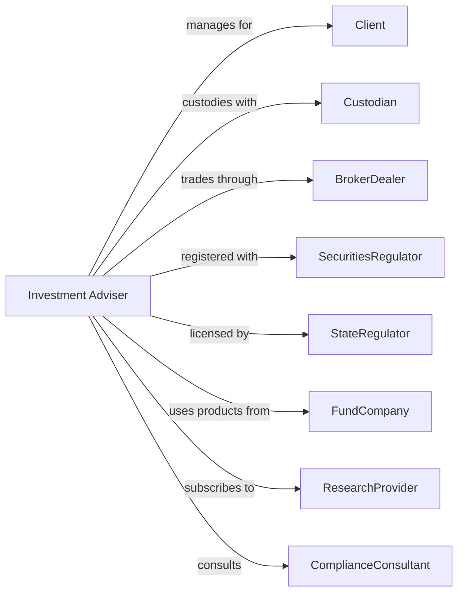

# Portfolio Management and Investment Advice

> Business-as-Code definition for investment management operations. Models client portfolio management from onboarding through asset allocation, rebalancing, and performance reporting.

## Overview

Investment advisers and portfolio managers oversee client assets on a discretionary or advisory basis, providing financial planning, asset allocation, and investment selection services. This definition exposes actions for client onboarding, portfolio construction, trade execution, and performance measurement, enabling programmatic access to wealth management operations.

## Actors

| Actor | Description |
|-------|-------------|
| Client | Individual or institution receiving investment management |
| Custodian | Bank holding client securities and cash |
| BrokerDealer | Firm executing trades for managed accounts |
| SecuritiesRegulator | Securities and Exchange Commission regulating advisers |
| StateRegulator | Authority licensing advisers below AUM threshold |
| FundCompany | Mutual fund or ETF provider |
| ResearchProvider | Firm supplying investment analysis |
| ComplianceConsultant | Advisor on regulatory requirements |

## Roles

| Role | Description |
|------|-------------|
| PortfolioManager | Professional making investment decisions |
| FinancialAdvisor | Client-facing professional providing guidance |
| InvestmentAnalyst | Staff researching securities and markets |
| ClientServiceAssociate | Staff handling account administration |
| ComplianceOfficer | Specialist ensuring regulatory adherence |
| ChiefInvestmentOfficer | Executive setting investment strategy |

## Entities

| Entity | Description |
|--------|-------------|
| ManagedAccount | Client portfolio under discretionary management |
| InvestmentPolicy | Document defining client objectives and constraints |
| AssetAllocation | Target mix of stocks, bonds, and alternatives |
| ModelPortfolio | Pre-defined investment strategy template |
| Trade | Buy or sell order executed for client account |
| PerformanceReport | Statement of returns and holdings |
| Fee | Management and advisory charges |
| Benchmark | Index used to measure performance |
| Rebalance | Adjustment returning portfolio to target allocation |
| Form ADV | Regulatory disclosure document |

## Actions

| Action | Description |
|--------|-------------|
| onboardClient | Gather information and establish account |
| createInvestmentPolicy | Define objectives, risk tolerance, and constraints |
| constructPortfolio | Select securities matching investment policy |
| allocateAssets | Distribute portfolio across asset classes |
| executeTrade | Place buy or sell orders with broker |
| rebalancePortfolio | Adjust holdings to restore target allocation |
| monitorPerformance | Track returns against benchmark |
| reportPerformance | Deliver statements and analytics to client |
| calculateFee | Determine management and advisory charges |
| conductReview | Meet with client to discuss portfolio |
| updatePolicy | Revise investment objectives and constraints |
| fileADV | Submit regulatory disclosure to SEC |

## Events

| Event | Description |
|-------|-------------|
| clientOnboarded | Account established and funded |
| investmentPolicyCreated | Objectives and constraints documented |
| portfolioConstructed | Initial securities selected |
| assetsAllocated | Portfolio distributed across classes |
| tradeExecuted | Buy or sell order completed |
| portfolioRebalanced | Holdings adjusted to target |
| performanceMonitored | Returns calculated |
| performanceReported | Statements delivered |
| feeCalculated | Charges determined |
| reviewConducted | Client meeting completed |
| policyUpdated | Objectives revised |
| advFiled | Regulatory disclosure submitted |

## Searches

| Search | Description |
|--------|-------------|
| findClients | List managed accounts by AUM or strategy |
| getPortfolioHoldings | Retrieve current positions by account |
| getPerformanceHistory | Calculate returns by period and benchmark |
| findRebalanceCandidates | Identify accounts needing adjustment |
| getFeeSummary | Calculate management fees by account |
| getTradeHistory | List executed trades by account and date |
| getAUMSummary | Retrieve assets under management totals |

## Workflow



## Actor Relationships



## Usage

### Calling Actions

```typescript
import { investPortfolios } from '@headlessly/invest-portfolios'

const ria = investPortfolios()

// Review accounts needing rebalancing
const rebalanceCandidates = await ria.findRebalanceCandidates({ driftThreshold: 5 })

// Check total AUM
const aum = await ria.getAUMSummary({ asOfDate: '2024-03-31' })

// Onboard new client
const client = await ria.onboardClient({
  clientId: 'client-12345',
  accountType: 'individual',
  initialDeposit: 1_000_000,
  custodian: 'schwab'
})

// Create investment policy
await ria.createInvestmentPolicy({
  clientId: client.id,
  riskTolerance: 'moderate',
  timeHorizon: 15,
  objectives: ['growth', 'incomeSecondary'],
  constraints: ['noTobacco', 'taxEfficient']
})

// Construct and allocate portfolio
await ria.allocateAssets({
  clientId: client.id,
  allocation: {
    usEquity: 45,
    intlEquity: 20,
    fixedIncome: 25,
    alternatives: 10
  }
})
```

### Event-Driven Automation

```typescript
// Auto-rebalance when drift exceeds threshold
ria.performanceMonitored(async ({ clientId, currentAllocation, targetAllocation }) => {
  const drift = calculateDrift(currentAllocation, targetAllocation)
  if (drift > 5) {
    await ria.rebalancePortfolio({
      clientId,
      method: 'taxEfficient',
      threshold: 5
    })
  }
})

// Calculate quarterly fees
ria.performanceReported(async ({ clientId, quarterEnd, aum }) => {
  await ria.calculateFee({
    clientId,
    period: quarterEnd,
    aum,
    feeSchedule: 'tiered'
  })
})
```
