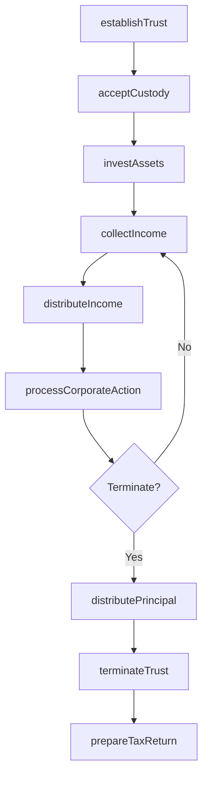
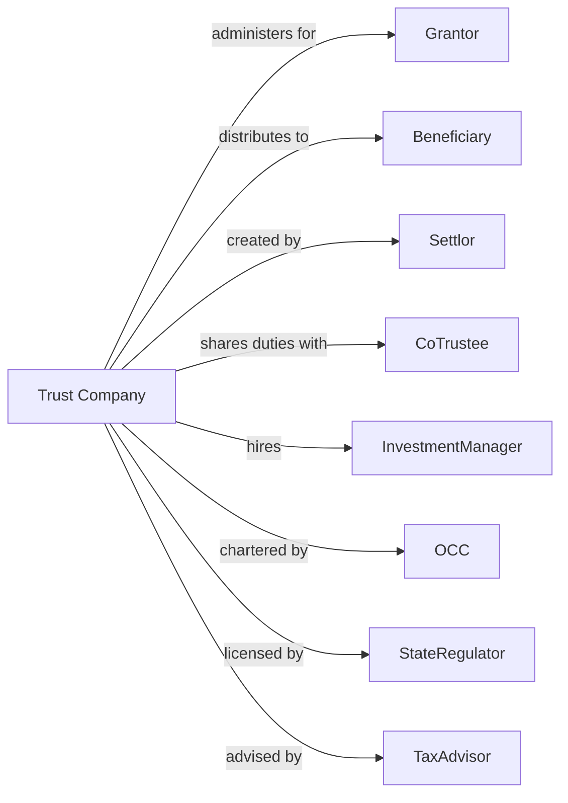

# Trust, Fiduciary, and Custody Activities

> Business-as-Code definition for trust and custody operations. Models fiduciary administration from account establishment through asset safekeeping, income collection, and beneficiary distributions.

## Overview

Trust companies and custodians hold and administer assets on behalf of beneficiaries according to trust agreements, wills, or custody contracts. This definition exposes actions for trust establishment, asset custody, income distribution, and fiduciary reporting, enabling programmatic access to trust banking operations.

## Actors

| Actor | Description |
|-------|-------------|
| Grantor | Individual establishing trust and transferring assets |
| Beneficiary | Person or entity receiving trust benefits |
| Settlor | Party creating trust through legal agreement |
| CoTrustee | Partner sharing fiduciary responsibilities |
| InvestmentManager | Adviser managing trust investments |
| OCC | Office of the Comptroller of the Currency chartering trust banks |
| StateRegulator | Authority licensing trust companies |
| TaxAdvisor | Professional providing trust tax guidance |

## Roles

| Role | Description |
|------|-------------|
| TrustOfficer | Professional administering trust accounts |
| CustodySpecialist | Staff safekeeping securities and processing transactions |
| TaxAccountant | Professional preparing trust tax returns |
| ComplianceOfficer | Specialist ensuring fiduciary adherence |
| ClientAdvisor | Professional communicating with grantors and beneficiaries |
| OperationsManager | Staff overseeing custody and settlement |

## Entities

| Entity | Description |
|--------|-------------|
| Trust | Legal arrangement holding assets for beneficiaries |
| CustodyAccount | Account holding securities on behalf of owner |
| TrustAgreement | Document defining trust terms and administration |
| Beneficiary | Individual or entity entitled to trust benefits |
| IncomeDistribution | Payment of earnings to beneficiaries |
| PrincipalDistribution | Payment from trust corpus to beneficiaries |
| CorporateAction | Dividend, split, or merger affecting held securities |
| Escrow | Funds held pending transaction completion |
| FiduciaryFee | Charges for trust administration |
| TaxReturn | Annual filing reporting trust income and distributions |

## Actions

| Action | Description |
|--------|-------------|
| establishTrust | Create trust account and accept initial assets |
| acceptCustody | Take possession of securities for safekeeping |
| collectIncome | Receive dividends, interest, and other earnings |
| distributeIncome | Pay earnings to beneficiaries per agreement |
| distributePrincipal | Make corpus payments to beneficiaries |
| processCorporateAction | Handle dividends, splits, and mergers |
| investAssets | Manage trust investments per policy |
| settleTransaction | Complete trade settlement and delivery |
| prepareTaxReturn | File trust income tax return |
| terminateTrust | Distribute remaining assets and close trust |
| holdEscrow | Safekeep funds pending condition satisfaction |
| reportToFiduciary | Provide statements to trustees and beneficiaries |

## Events

| Event | Description |
|-------|-------------|
| trustEstablished | Trust account created |
| custodyAccepted | Securities received for safekeeping |
| incomeCollected | Earnings received |
| incomeDistributed | Earnings paid to beneficiaries |
| principalDistributed | Corpus paid to beneficiaries |
| corporateActionProcessed | Security event handled |
| assetsInvested | Portfolio updated |
| transactionSettled | Trade completed |
| taxReturnPrepared | Filing completed |
| trustTerminated | Account closed and assets distributed |
| escrowHeld | Funds safekept pending condition |
| fiduciaryReported | Statements delivered |

## Searches

| Search | Description |
|--------|-------------|
| findTrusts | List trust accounts by type or beneficiary |
| getCustodyHoldings | Retrieve securities held for account |
| getIncomeActivity | List dividends and interest received |
| getDistributionHistory | Retrieve payments to beneficiaries |
| findPendingCorporateActions | Identify upcoming security events |
| getFiduciaryFees | Calculate administration charges |
| getEscrowBalances | Retrieve funds held in escrow |

## Workflow



## Actor Relationships



## Usage

### Calling Actions

```typescript
import { investAssets } from '@headlessly/invest-assets'

const trustCo = investAssets()

// Review existing trusts for grantor
const trusts = await trustCo.findTrusts({ grantorId: 'grantor-12345', type: 'revocable' })

// Establish new trust
const trust = await trustCo.establishTrust({
  grantorId: 'grantor-12345',
  trustType: 'revocable',
  beneficiaries: [
    { id: 'ben-1', share: 50, type: 'income' },
    { id: 'ben-2', share: 50, type: 'remainder' }
  ],
  initialAssets: 5_000_000
})

// Accept custody of securities
await trustCo.acceptCustody({
  trustId: trust.id,
  securities: [
    { cusip: '037833100', quantity: 1000 }, // Apple
    { cusip: '594918104', quantity: 500 }   // Microsoft
  ]
})

// Check pending corporate actions before distributing
const actions = await trustCo.findPendingCorporateActions({ trustId: trust.id })

// Distribute income to beneficiaries
await trustCo.distributeIncome({
  trustId: trust.id,
  period: '2024-Q1',
  totalIncome: 25000,
  allocation: 'perAgreement'
})
```

### Event-Driven Automation

```typescript
// Auto-collect and distribute income
trustCo.incomeCollected(async ({ trustId, amount, source }) => {
  const trust = await trustCo.findTrusts({ trustId })
  if (trust.distributionFrequency === 'immediate') {
    await trustCo.distributeIncome({
      trustId,
      amount,
      beneficiaries: trust.incomeBeneficiaries
    })
  }
})

// Process corporate actions automatically
trustCo.corporateActionProcessed(async ({ trustId, action, security }) => {
  await trustCo.reportToFiduciary({
    trustId,
    reportType: 'corporateAction',
    details: { action, security }
  })
})
```
