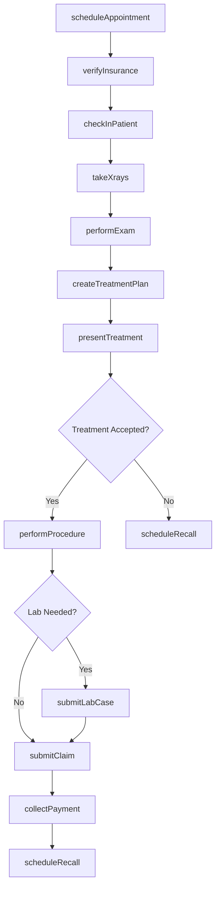
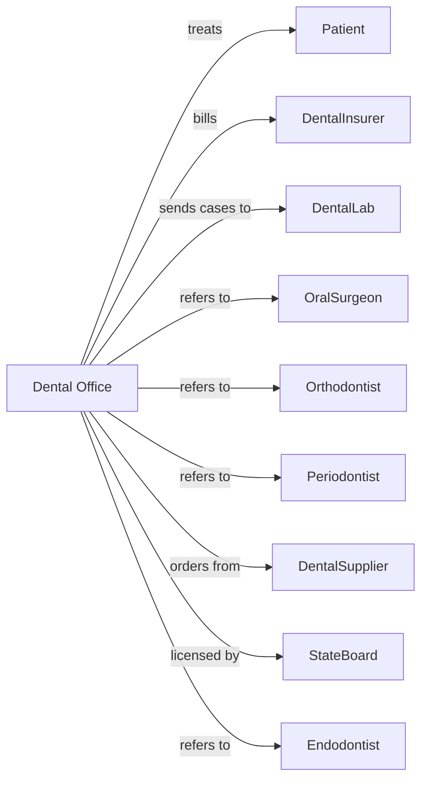

# Offices of Dentists

> Business-as-Code definition for dental practice operations. Models the complete dental care lifecycle from scheduling through treatment completion and follow-up.

## Overview

Dental offices provide oral health care including examinations, cleanings, restorations, and oral surgery. This definition exposes actions for patient management, treatment planning, and procedure documentation, with events for recall scheduling and insurance processing.

## Actors

| Actor | Description |
|-------|-------------|
| Patient | Individual seeking dental examination and treatment |
| DentalInsurer | Provides dental coverage and reimburses for services |
| DentalLab | Fabricates crowns, bridges, dentures, and appliances |
| OralSurgeon | Provides complex extractions and surgical procedures |
| Orthodontist | Provides teeth alignment and orthodontic treatment |
| Periodontist | Provides gum disease treatment and implant placement |
| Endodontist | Provides root canal therapy |
| DentalSupplier | Provides materials, instruments, and equipment |
| StateBoard | Licenses dentists and regulates dental practice |

## Roles

| Role | Description |
|------|-------------|
| Dentist | Diagnoses oral conditions and performs dental procedures |
| DentalHygienist | Performs cleanings and preventive treatments |
| DentalAssistant | Assists chairside during procedures and takes X-rays |
| FrontDesk | Manages scheduling and patient check-in |
| InsuranceCoordinator | Handles claims and benefits verification |
| OfficeManager | Oversees practice operations and staff |

## Entities

| Entity | Description |
|--------|-------------|
| Patient | Individual receiving dental care |
| Appointment | Scheduled dental visit |
| Exam | Comprehensive oral evaluation findings |
| TreatmentPlan | Proposed procedures with sequencing and fees |
| Procedure | Dental service performed using CDT codes |
| Xray | Radiographic images of teeth and jaw |
| Chart | Dental record with tooth conditions and history |
| Claim | Insurance billing submission |
| Recall | Scheduled preventive care reminder |
| LabCase | Work order sent to dental laboratory |
| Prescription | Medication order for dental treatment |
| Consent | Patient authorization for treatment |

## Actions

| Action | Description |
|--------|-------------|
| scheduleAppointment | Book patient visit for specific date and time |
| verifyInsurance | Confirm coverage and estimate patient portion |
| checkInPatient | Register patient arrival and update forms |
| takeXrays | Capture radiographic images for diagnosis |
| performExam | Conduct comprehensive oral evaluation |
| createTreatmentPlan | Document proposed procedures and sequence |
| presentTreatment | Discuss treatment options and fees with patient |
| performProcedure | Execute dental treatment and document completion |
| submitLabCase | Send impression or scan to dental laboratory |
| prescribeMedication | Write prescription for antibiotics or pain relief |
| submitClaim | Send billing claim to dental insurer |
| scheduleRecall | Book next preventive care appointment |
| collectPayment | Process patient payment for services |
| referToSpecialist | Send patient to specialist for advanced care |
| sendReminder | Notify patient of upcoming appointment or recall |

## Events

| Event | Description |
|-------|-------------|
| appointmentScheduled | Patient visit has been booked |
| insuranceVerified | Coverage has been confirmed |
| patientCheckedIn | Patient has arrived and registered |
| xraysTaken | Radiographic images have been captured |
| examCompleted | Oral evaluation has been performed |
| treatmentPlanCreated | Proposed procedures have been documented |
| treatmentAccepted | Patient has agreed to treatment plan |
| procedureCompleted | Dental treatment has been performed |
| labCaseSubmitted | Work has been sent to laboratory |
| labCaseReceived | Fabricated item has arrived from lab |
| claimSubmitted | Billing claim has been sent to insurer |
| paymentReceived | Payment has been collected |
| recallScheduled | Next preventive visit has been booked |
| recallBecameDue | Patient is due for preventive care |

## Searches

| Search | Description |
|--------|-------------|
| findPatients | List patients with filters for name or status |
| getAppointments | Retrieve scheduled visits by date or provider |
| getTreatmentPlans | Find pending treatment plans by patient |
| getPendingClaims | List claims awaiting payment or resolution |
| getRecallsDue | Find patients due for preventive care |
| getLabCases | Retrieve laboratory work orders by status |
| getOpenSlots | Get available appointment times for scheduling |
| getPatientBalance | Retrieve outstanding patient payments |

## Workflow



## Actor Relationships



## Usage

### Calling Actions

```typescript
import { treatTeeth } from '@headlessly/treat-teeth'

const practice = treatTeeth()

// Check patients due for recall
const recallsDue = await practice.getRecallsDue({ month: '2024-03' })

// Find available appointment slots
const slots = await practice.getOpenSlots({ providerId: 'dr-smith', date: '2024-03-18' })

// Schedule new patient exam
const appointment = await practice.scheduleAppointment({
  patientId: 'pat-45678',
  providerId: 'dr-smith',
  appointmentType: 'comprehensive-exam',
  dateTime: '2024-03-18T10:00:00',
  duration: 60
})

// Verify insurance before appointment
const benefits = await practice.verifyInsurance({
  patientId: 'pat-45678',
  insurerId: 'delta-dental',
  memberId: 'DD123456789'
})

// Perform exam and create treatment plan
await practice.performExam({
  patientId: 'pat-45678',
  findings: {
    tooth14: { condition: 'caries', surface: 'MO' },
    tooth30: { condition: 'fracture', surface: 'B' }
  },
  perioStatus: 'healthy',
  oralCancerScreen: 'negative'
})

await practice.createTreatmentPlan({
  patientId: 'pat-45678',
  procedures: [
    { tooth: 14, code: 'D2392', description: 'Composite 2 surfaces' },
    { tooth: 30, code: 'D2740', description: 'Crown porcelain' }
  ],
  priority: 'tooth-30-first',
  estimatedTotal: 1850.00
})
```

### Event-Driven Automation

```typescript
// Auto-submit claim after procedure completion
practice.procedureCompleted(async ({ patientId, procedures }) => {
  await practice.submitClaim({
    patientId,
    procedures,
    submissionDate: new Date()
  })
})

// Send recall reminders when due
practice.recallBecameDue(async ({ patientId, lastVisit }) => {
  await practice.sendReminder({
    patientId,
    type: 'recall',
    message: 'Time for your 6-month checkup and cleaning'
  })
})

// Alert when lab case arrives
practice.labCaseReceived(async ({ patientId, caseType }) => {
  const patient = await practice.findPatients({ id: patientId })

  await practice.scheduleAppointment({
    patientId,
    appointmentType: `${caseType}-delivery`,
    notify: true
  })
})
```
