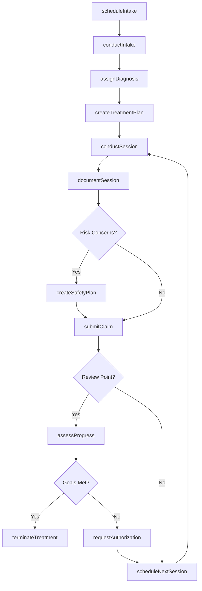
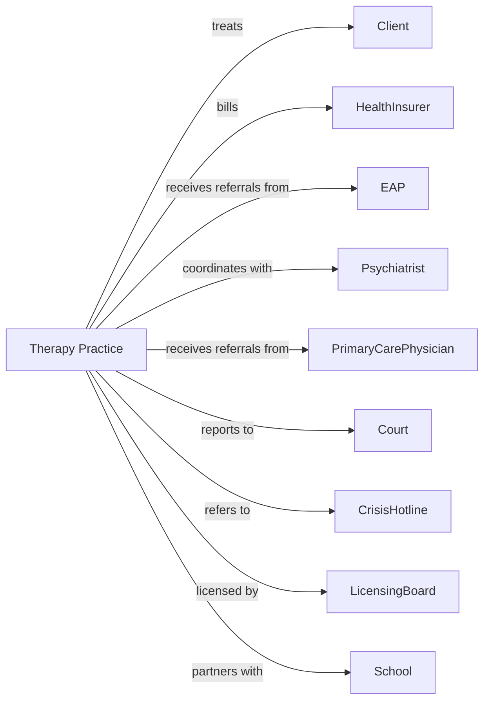

# Offices of Mental Health Practitioners (except Physicians)

> Business-as-Code definition for non-physician mental health practice operations. Models the complete therapy lifecycle from intake through treatment completion.

## Overview

Non-physician mental health practices provide psychotherapy, counseling, and behavioral health services through licensed practitioners including psychologists, clinical social workers, and licensed counselors. This definition exposes actions for client assessment, treatment delivery, and progress monitoring, with events for session scheduling and insurance coordination.

## Actors

| Actor | Description |
|-------|-------------|
| Client | Individual seeking therapy or counseling services |
| HealthInsurer | Provides mental health coverage and reimbursement |
| EAP | Employee assistance program providing referrals |
| Psychiatrist | Provides medication management collaboration |
| PrimaryCarePhysician | Refers patients and coordinates medical care |
| School | Refers students and coordinates with counselors |
| Court | Mandates treatment and receives progress reports |
| CrisisHotline | Provides emergency mental health intervention |
| LicensingBoard | Licenses practitioners and regulates practice |

## Roles

| Role | Description |
|------|-------------|
| Psychologist | Provides psychological assessment and psychotherapy |
| ClinicalSocialWorker | Provides therapy and connects clients to resources |
| LicensedCounselor | Provides individual and group counseling |
| MarriageTherapist | Provides couples and family therapy |
| IntakeCoordinator | Conducts initial screenings and schedules |
| OfficeManager | Oversees practice operations and billing |

## Entities

| Entity | Description |
|--------|-------------|
| Client | Individual receiving mental health services |
| Appointment | Scheduled therapy session |
| IntakeAssessment | Initial evaluation and history gathering |
| Diagnosis | Mental health condition using DSM-5 codes |
| TreatmentPlan | Documented goals, interventions, and timeline |
| ProgressNote | Session documentation and observations |
| Outcome | Measured improvement using validated instruments |
| SafetyPlan | Crisis intervention protocol for at-risk clients |
| Consent | Client authorization for treatment and releases |
| Referral | Authorization from insurer or referring party |
| Claim | Insurance billing submission |
| GroupSession | Therapy session with multiple participants |

## Actions

| Action | Description |
|--------|-------------|
| scheduleIntake | Book initial assessment appointment |
| conductIntake | Perform comprehensive assessment and history |
| assignDiagnosis | Identify mental health condition using DSM-5 |
| createTreatmentPlan | Develop goals, interventions, and timeline |
| conductSession | Deliver individual therapy session |
| conductGroupSession | Facilitate group therapy meeting |
| conductFamilySession | Deliver couples or family therapy |
| assessProgress | Administer outcome measures and evaluate change |
| documentSession | Record session notes and observations |
| assessRisk | Evaluate client for safety concerns |
| createSafetyPlan | Develop crisis intervention protocol |
| submitClaim | Send billing claim to insurance payer |
| requestAuthorization | Obtain approval for continued sessions |
| coordinateWithPrescriber | Communicate with psychiatrist about medications |
| terminateTreatment | Complete care and document outcomes |

## Events

| Event | Description |
|-------|-------------|
| intakeScheduled | Initial assessment has been booked |
| intakeCompleted | Comprehensive assessment has been performed |
| diagnosisAssigned | Mental health condition has been identified |
| treatmentPlanCreated | Goals and interventions have been documented |
| sessionCompleted | Therapy session has been conducted |
| progressAssessed | Outcome measures have been administered |
| riskIdentified | Safety concern has been detected |
| safetyPlanCreated | Crisis protocol has been established |
| authorizationReceived | Insurer has approved additional sessions |
| claimSubmitted | Billing claim has been sent |
| treatmentGoalMet | Client has achieved therapeutic objective |
| treatmentTerminated | Care has been completed |
| appointmentCanceled | Session has been canceled by client |

## Searches

| Search | Description |
|--------|-------------|
| findClients | List clients with filters for diagnosis or status |
| getAppointments | Retrieve scheduled sessions by date or clinician |
| getActiveTreatmentPlans | Find clients with ongoing treatment |
| getPendingIntakes | List clients awaiting initial assessment |
| getOutcomeMeasures | Retrieve progress data for client |
| getHighRiskClients | Find clients with active safety concerns |
| getPendingAuthorizations | List requests awaiting insurer approval |
| getSessionNotes | Retrieve documentation for client |

## Workflow



## Actor Relationships



## Usage

### Calling Actions

```typescript
import { treatMentalHealth } from '@headlessly/treat-mental-health'

const practice = treatMentalHealth()

// Review pending intakes and high-risk clients
const pendingIntakes = await practice.getPendingIntakes({ clinicianId: 'th-williams' })
const highRisk = await practice.getHighRiskClients({ activeSafetyPlan: true })

// Schedule intake assessment
const intake = await practice.scheduleIntake({
  clientId: 'cli-45678',
  clinicianId: 'th-williams',
  dateTime: '2024-03-22T14:00:00',
  duration: 90,
  referralSource: 'self'
})

// Conduct intake and establish diagnosis
await practice.conductIntake({
  clientId: 'cli-45678',
  presentingProblem: 'Anxiety affecting work performance',
  psychiatricHistory: 'Previous therapy 2 years ago',
  substanceUse: 'none',
  suicidalIdeation: false
})

await practice.assignDiagnosis({
  clientId: 'cli-45678',
  dsmCode: 'F41.1',
  description: 'Generalized anxiety disorder'
})

// Create treatment plan
await practice.createTreatmentPlan({
  clientId: 'cli-45678',
  goals: [
    'Reduce anxiety symptoms to manageable level',
    'Develop coping strategies for work stress'
  ],
  interventions: ['CBT', 'Relaxation training', 'Exposure therapy'],
  frequency: 'weekly',
  estimatedDuration: '12 sessions'
})

// Document session
await practice.documentSession({
  clientId: 'cli-45678',
  sessionNumber: 1,
  interventions: ['Psychoeducation about anxiety', 'Introduced thought record'],
  clientResponse: 'Engaged and motivated',
  homework: 'Complete daily thought records'
})
```

### Event-Driven Automation

```typescript
// Request authorization before sessions run out
practice.sessionCompleted(async ({ clientId, sessionCount }) => {
  const plan = await practice.getActiveTreatmentPlans({ clientId })

  if (sessionCount >= plan.authorizedSessions - 2) {
    await practice.requestAuthorization({
      clientId,
      sessionsRequested: 12,
      justification: 'Continued treatment necessary for symptom management'
    })
  }
})

// Administer outcome measures at intervals
practice.sessionCompleted(async ({ clientId, sessionCount }) => {
  if (sessionCount % 4 === 0) {
    await practice.assessProgress({
      clientId,
      instruments: ['PHQ-9', 'GAD-7'],
      compareBaseline: true
    })
  }
})

// Alert for high-risk clients missing sessions
practice.appointmentCanceled(async ({ clientId }) => {
  const client = await practice.findClients({ id: clientId })

  if (client.riskLevel === 'high') {
    await practice.assessRisk({
      clientId,
      reason: 'Missed appointment',
      action: 'outreach-call'
    })
  }
})
```
