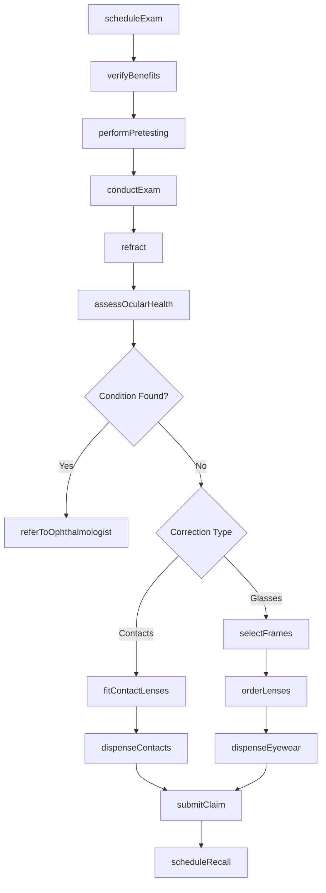
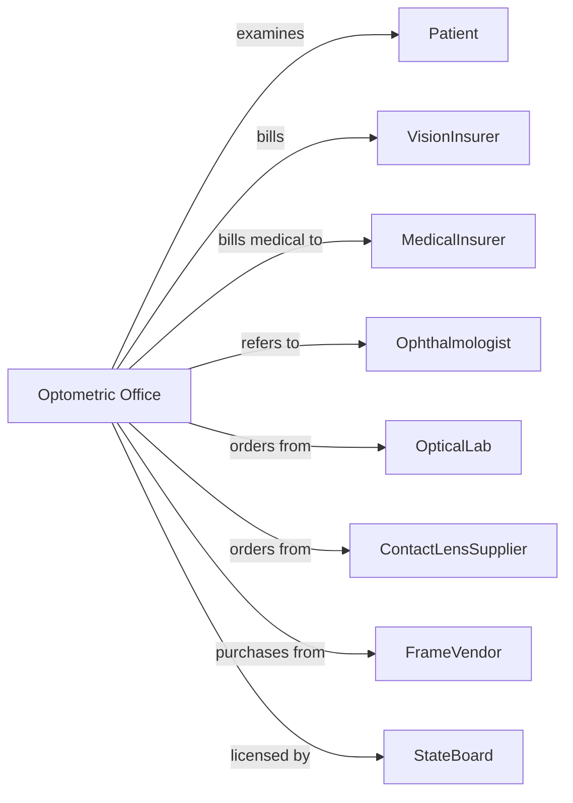

# Offices of Optometrists

> Business-as-Code definition for optometric practice operations. Models the complete vision care lifecycle from examination through eyewear dispensing and follow-up.

## Overview

Optometric offices provide comprehensive eye care including vision examinations, disease diagnosis, contact lens fitting, and eyewear dispensing. This definition exposes actions for patient assessment, prescription management, and optical sales, with events for recall scheduling and insurance coordination.

## Actors

| Actor | Description |
|-------|-------------|
| Patient | Individual seeking eye examination or vision correction |
| VisionInsurer | Provides vision coverage and reimburses for services |
| MedicalInsurer | Covers medical eye conditions and disease treatment |
| Ophthalmologist | Provides surgical and advanced medical eye care |
| OpticalLab | Fabricates prescription lenses and processes orders |
| ContactLensSupplier | Provides contact lens inventory and fulfillment |
| FrameVendor | Supplies eyeglass frames and displays |
| PrimaryCarePhysician | Refers patients and coordinates systemic care |
| StateBoard | Licenses optometrists and regulates practice |

## Roles

| Role | Description |
|------|-------------|
| Optometrist | Examines eyes, diagnoses conditions, and prescribes correction |
| Optician | Fits and dispenses eyeglasses and contact lenses |
| Technician | Performs preliminary testing and assists with exams |
| FrontDesk | Manages scheduling and patient check-in |
| InsuranceCoordinator | Handles claims and benefits verification |
| OfficeManager | Oversees practice operations and optical sales |

## Entities

| Entity | Description |
|--------|-------------|
| Patient | Individual receiving eye care |
| Appointment | Scheduled eye examination |
| Examination | Comprehensive eye evaluation findings |
| Prescription | Vision correction specification with sphere, cylinder, axis |
| ContactLensFit | Contact lens parameters and wearing schedule |
| Frame | Eyeglass frame selection with measurements |
| Lens | Prescription lens with material and coatings |
| Order | Optical product order for fulfillment |
| Claim | Insurance billing submission |
| Recall | Scheduled annual exam reminder |
| Referral | Authorization for specialist consultation |
| Diagnosis | Eye condition using ICD codes |

## Actions

| Action | Description |
|--------|-------------|
| scheduleExam | Book comprehensive eye examination appointment |
| verifyBenefits | Confirm vision and medical insurance coverage |
| performPretesting | Conduct preliminary measurements and tests |
| conductExam | Perform comprehensive eye examination |
| refract | Determine vision correction prescription |
| assessOcularHealth | Evaluate eye structures for disease |
| fitContactLenses | Determine contact lens parameters and trial |
| selectFrames | Help patient choose eyeglass frames |
| orderLenses | Submit lens fabrication order to lab |
| dispenseEyewear | Fit and deliver completed eyeglasses |
| dispenseContacts | Provide contact lenses and instructions |
| submitClaim | Send billing claim to insurer |
| referToOphthalmologist | Send patient for surgical or medical care |
| scheduleRecall | Book next annual examination |
| prescribeMedication | Write prescription for eye drops or treatment |

## Events

| Event | Description |
|-------|-------------|
| examScheduled | Eye examination has been booked |
| benefitsVerified | Insurance coverage has been confirmed |
| pretestingCompleted | Preliminary tests have been performed |
| examCompleted | Comprehensive evaluation has been performed |
| prescriptionIssued | Vision correction has been determined |
| contactFitCompleted | Contact lens fitting has been finished |
| framesSelected | Patient has chosen eyeglass frames |
| orderPlaced | Lens fabrication order has been submitted |
| orderReceived | Completed eyewear has arrived from lab |
| eyewearDispensed | Glasses have been delivered to patient |
| contactsDispensed | Contact lenses have been provided |
| claimSubmitted | Billing claim has been sent |
| recallDue | Patient is due for annual examination |
| conditionDetected | Eye disease or abnormality found |

## Searches

| Search | Description |
|--------|-------------|
| findPatients | List patients with filters for name or condition |
| getAppointments | Retrieve scheduled exams by date or provider |
| getPendingOrders | Find eyewear orders awaiting completion |
| getRecallsDue | List patients due for annual examination |
| getContactLensPatients | Find patients with active contact lens fits |
| getPendingClaims | List claims awaiting payment |
| getInventory | Retrieve frame and contact lens stock levels |
| getPrescriptionHistory | Get past prescriptions for patient |

## Workflow



## Actor Relationships



## Usage

### Calling Actions

```typescript
import { treatVision } from '@headlessly/treat-vision'

const practice = treatVision()

// Check patients due for annual recall and pending orders
const recallsDue = await practice.getRecallsDue({ month: '2024-03' })
const pendingOrders = await practice.getPendingOrders({ status: 'awaiting-lab' })

// Schedule comprehensive eye exam
const exam = await practice.scheduleExam({
  patientId: 'pat-34567',
  providerId: 'dr-lee',
  examType: 'comprehensive',
  dateTime: '2024-03-21T11:00:00',
  duration: 45
})

// Verify insurance benefits
const benefits = await practice.verifyBenefits({
  patientId: 'pat-34567',
  visionPlan: 'vsp',
  memberId: 'VSP987654321'
})

// Conduct exam and issue prescription
await practice.conductExam({
  patientId: 'pat-34567',
  findings: {
    visualAcuity: { od: '20/40', os: '20/30' },
    intraocularPressure: { od: 16, os: 17 },
    fundusExam: 'normal'
  }
})

const prescription = await practice.refract({
  patientId: 'pat-34567',
  od: { sphere: -2.25, cylinder: -0.50, axis: 180 },
  os: { sphere: -1.75, cylinder: -0.75, axis: 175 },
  add: null,
  pd: 63
})

// Order eyeglasses
await practice.selectFrames({
  patientId: 'pat-34567',
  frameId: 'rayban-5154',
  size: '52-18-145',
  color: 'tortoise'
})

await practice.orderLenses({
  patientId: 'pat-34567',
  prescriptionId: prescription.id,
  material: 'polycarbonate',
  coatings: ['anti-reflective', 'scratch-resistant'],
  tint: 'none'
})
```

### Event-Driven Automation

```typescript
// Notify patient when order arrives
practice.orderReceived(async ({ patientId, orderType }) => {
  await practice.notifyPatient({
    patientId,
    message: `Your ${orderType} are ready for pickup`,
    method: 'sms'
  })
})

// Send recall reminders
practice.recallDue(async ({ patientId, lastExamDate }) => {
  await practice.sendReminder({
    patientId,
    type: 'annual-exam',
    message: 'Time for your annual eye examination'
  })
})

// Alert for medical conditions requiring referral
practice.conditionDetected(async ({ patientId, condition, severity }) => {
  if (severity === 'urgent') {
    await practice.referToOphthalmologist({
      patientId,
      condition,
      urgency: 'immediate',
      notes: 'Requires surgical evaluation'
    })
  }
})
```
