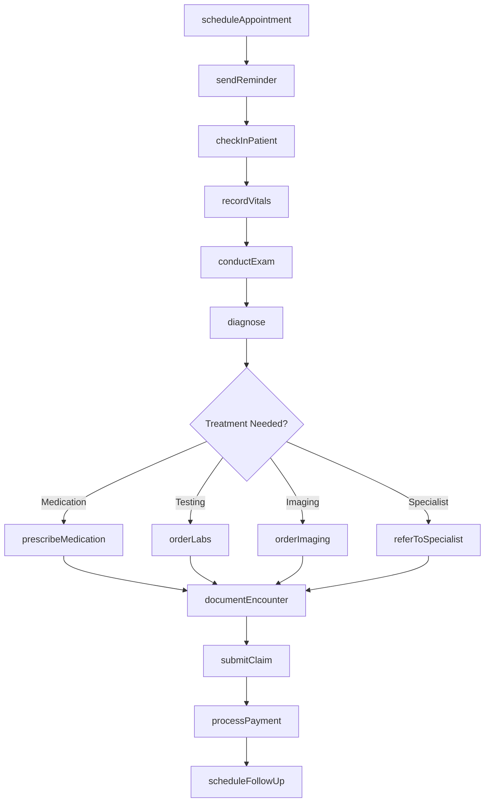
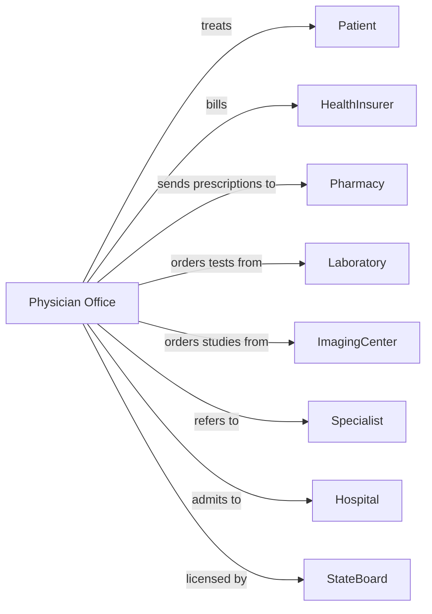

# Offices of Physicians (except Mental Health Specialists)

> Business-as-Code definition for physician office operations. Models the complete patient care lifecycle from scheduling through follow-up care.

## Overview

Physician offices provide outpatient medical care including examinations, diagnoses, and treatments for acute and chronic conditions. This definition exposes actions for patient management, clinical workflows, and billing operations, with events for care coordination and automation.

## Actors

| Actor | Description |
|-------|-------------|
| Patient | Individual seeking medical care and treatment |
| HealthInsurer | Provides coverage and reimburses for medical services |
| Pharmacy | Fills prescriptions and dispenses medications |
| Laboratory | Performs diagnostic tests and provides results |
| ImagingCenter | Conducts radiological and diagnostic imaging studies |
| Specialist | Provides referral consultations for specific conditions |
| Hospital | Admits patients requiring inpatient care |
| MedicalSupplier | Provides medical equipment and supplies |
| StateBoard | Licenses physicians and regulates medical practice |

## Roles

| Role | Description |
|------|-------------|
| Physician | Diagnoses conditions and provides medical treatment |
| NursePractitioner | Provides clinical care under physician supervision |
| MedicalAssistant | Assists with clinical tasks and patient preparation |
| FrontDesk | Manages scheduling, check-in, and patient communications |
| Biller | Handles claims submission and payment processing |
| PracticeManager | Oversees operations, staff, and compliance |

## Entities

| Entity | Description |
|--------|-------------|
| Patient | Individual receiving medical care |
| Appointment | Scheduled visit for medical services |
| Encounter | Documented patient visit with clinical details |
| MedicalRecord | Comprehensive patient health history |
| Prescription | Medication order for patient treatment |
| Diagnosis | Identified medical condition using ICD codes |
| Procedure | Medical service performed using CPT codes |
| Referral | Authorization for specialist consultation |
| Claim | Insurance billing submission |
| Vitals | Patient measurements including BP, pulse, weight |
| LabOrder | Request for diagnostic testing |
| CarePlan | Treatment protocol for ongoing conditions |

## Actions

| Action | Description |
|--------|-------------|
| scheduleAppointment | Book patient visit for specific date and time |
| checkInPatient | Register patient arrival and verify insurance |
| recordVitals | Capture blood pressure, pulse, temperature, weight |
| conductExam | Perform physical examination and assessment |
| diagnose | Identify medical condition and assign ICD code |
| prescribeMedication | Create prescription order for pharmacy |
| orderLabs | Request diagnostic tests from laboratory |
| orderImaging | Request X-ray, MRI, or other imaging studies |
| referToSpecialist | Send patient to specialist for consultation |
| documentEncounter | Record visit notes and treatment details |
| submitClaim | Send billing claim to insurance payer |
| scheduleFollowUp | Book subsequent appointment for ongoing care |
| processPayment | Collect copay or patient balance |
| sendReminder | Notify patient of upcoming appointment |
| requestPriorAuth | Obtain insurance approval for procedure |

## Events

| Event | Description |
|-------|-------------|
| appointmentScheduled | Patient visit has been booked |
| patientCheckedIn | Patient has arrived and registered |
| vitalsRecorded | Patient measurements have been captured |
| examCompleted | Physical examination has been performed |
| diagnosisAssigned | Medical condition has been identified |
| prescriptionSent | Medication order transmitted to pharmacy |
| labsOrdered | Diagnostic tests have been requested |
| imagingOrdered | Imaging study has been requested |
| referralCreated | Specialist consultation authorized |
| encounterDocumented | Visit notes have been recorded |
| claimSubmitted | Billing claim sent to payer |
| paymentReceived | Payment has been collected |
| priorAuthApproved | Insurance has authorized procedure |
| resultsReceived | Lab or imaging results are available |
| appointmentMissed | Patient did not attend scheduled visit |

## Searches

| Search | Description |
|--------|-------------|
| findPatients | List patients with filters for name, DOB, or condition |
| getAppointments | Retrieve scheduled visits by date or provider |
| getEncounters | Find patient visits with diagnosis or procedure filters |
| getPendingClaims | List claims awaiting payment or resolution |
| getLabResults | Retrieve diagnostic test results for patient |
| findOpenSlots | Get available appointment times for scheduling |
| getPatientBalance | Retrieve outstanding patient payments |
| getMedicationHistory | List prescriptions for a patient |

## Workflow



## Actor Relationships



## Usage

### Calling Actions

```typescript
import { treatPatients } from '@headlessly/treat-patients'

const practice = treatPatients()

// Look up patient records and medication history
const patients = await practice.findPatients({ name: 'Smith', status: 'active' })
const medications = await practice.getMedicationHistory({ patientId: 'pat-12345' })

// Schedule a new patient appointment
const appointment = await practice.scheduleAppointment({
  patientId: 'pat-12345',
  providerId: 'dr-smith',
  appointmentType: 'annual-physical',
  dateTime: '2024-03-15T09:00:00',
  duration: 30
})

// Check in patient and record vitals
await practice.checkInPatient({
  appointmentId: appointment.id,
  insuranceVerified: true,
  copayCollected: 25.00
})

await practice.recordVitals({
  encounterId: appointment.encounterId,
  bloodPressure: { systolic: 120, diastolic: 80 },
  pulse: 72,
  temperature: 98.6,
  weight: 175
})

// Document diagnosis and prescribe treatment
await practice.diagnose({
  encounterId: appointment.encounterId,
  icdCode: 'J06.9',
  description: 'Acute upper respiratory infection'
})

await practice.prescribeMedication({
  patientId: 'pat-12345',
  medication: 'Amoxicillin',
  dosage: '500mg',
  frequency: 'TID',
  duration: 10,
  pharmacy: 'cvs-main-st'
})
```

### Event-Driven Automation

```typescript
// Auto-submit claim after encounter documentation
practice.encounterDocumented(async ({ encounterId, diagnoses, procedures }) => {
  await practice.submitClaim({
    encounterId,
    diagnoses,
    procedures,
    submissionDate: new Date()
  })
})

// Send reminder for upcoming appointments
practice.appointmentScheduled(async ({ patientId, dateTime }) => {
  const reminderDate = new Date(dateTime)
  reminderDate.setDate(reminderDate.getDate() - 1)

  await practice.sendReminder({
    patientId,
    appointmentDate: dateTime,
    sendAt: reminderDate
  })
})

// Alert provider when critical lab results arrive
practice.resultsReceived(async ({ patientId, testType, results }) => {
  if (results.critical) {
    await practice.alertProvider({
      patientId,
      urgency: 'high',
      message: `Critical ${testType} results require review`
    })
  }
})
```
