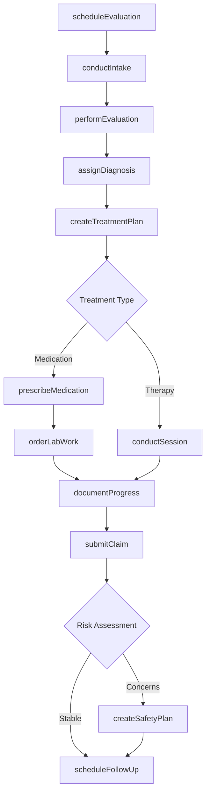
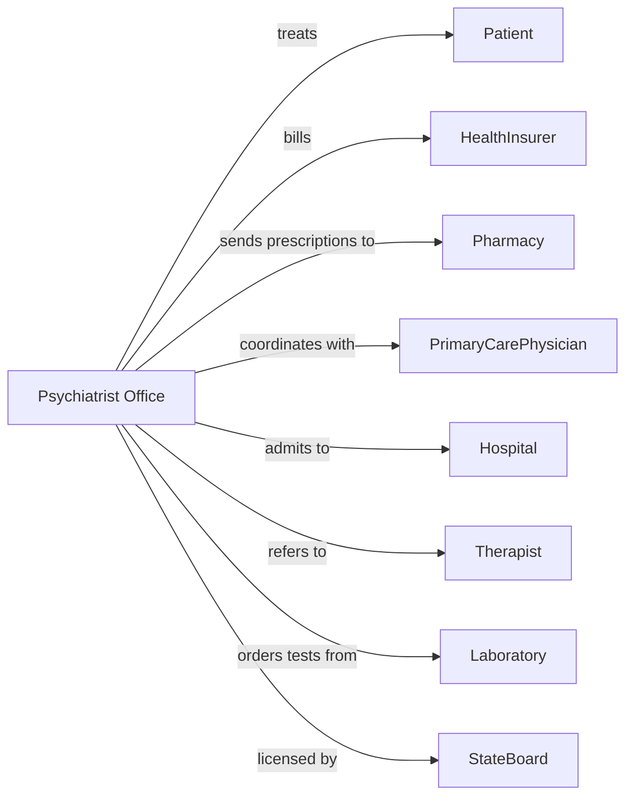

# Offices of Physicians, Mental Health Specialists

> Business-as-Code definition for psychiatric practice operations. Models the complete mental health care lifecycle from intake through ongoing treatment management.

## Overview

Psychiatric physician offices provide outpatient mental health care including diagnostic evaluations, medication management, and psychotherapy. This definition exposes actions for patient assessment, treatment planning, and prescription management, with events for care coordination and compliance monitoring.

## Actors

| Actor | Description |
|-------|-------------|
| Patient | Individual seeking psychiatric evaluation and treatment |
| HealthInsurer | Provides mental health coverage and reimbursement |
| Pharmacy | Fills psychiatric medication prescriptions |
| PrimaryCarePhysician | Refers patients and coordinates medical care |
| Hospital | Provides inpatient psychiatric admission when needed |
| Therapist | Provides adjunct psychotherapy services |
| Laboratory | Performs medication monitoring blood tests |
| CrisisCenter | Provides emergency mental health intervention |
| StateBoard | Licenses physicians and regulates practice |

## Roles

| Role | Description |
|------|-------------|
| Psychiatrist | Diagnoses mental health conditions and prescribes treatment |
| PsychiatricNurse | Assists with patient care and medication education |
| IntakeCoordinator | Conducts initial assessments and schedules evaluations |
| OfficeManager | Oversees practice operations and compliance |
| Biller | Manages insurance claims and patient accounts |
| MedicalRecordsClerk | Maintains patient documentation and releases |

## Entities

| Entity | Description |
|--------|-------------|
| Patient | Individual receiving psychiatric care |
| Appointment | Scheduled psychiatric session |
| Evaluation | Comprehensive diagnostic assessment |
| TreatmentPlan | Documented care goals and interventions |
| Prescription | Psychiatric medication order |
| Diagnosis | Mental health condition using DSM-5 codes |
| ProgressNote | Session documentation and clinical observations |
| SafetyPlan | Crisis intervention protocol for at-risk patients |
| Referral | Authorization for additional services |
| PriorAuthorization | Insurance approval for medications or services |
| LabResult | Medication monitoring test results |
| Consent | Patient authorization for treatment |

## Actions

| Action | Description |
|--------|-------------|
| scheduleEvaluation | Book initial psychiatric assessment appointment |
| conductIntake | Complete intake paperwork and preliminary screening |
| performEvaluation | Conduct comprehensive psychiatric diagnostic assessment |
| assignDiagnosis | Identify mental health condition using DSM-5 criteria |
| createTreatmentPlan | Develop documented care goals and interventions |
| prescribeMedication | Write prescription for psychiatric medication |
| conductSession | Perform medication management or therapy session |
| orderLabWork | Request medication monitoring blood tests |
| assessRisk | Evaluate patient for safety concerns |
| createSafetyPlan | Develop crisis intervention protocol |
| documentProgress | Record session notes and clinical observations |
| submitClaim | Send billing claim to insurance payer |
| requestPriorAuth | Obtain approval for medications or services |
| coordinateCare | Communicate with other treating providers |
| scheduleFollowUp | Book subsequent appointment |

## Events

| Event | Description |
|-------|-------------|
| evaluationScheduled | Initial assessment has been booked |
| intakeCompleted | Intake documentation has been gathered |
| evaluationCompleted | Diagnostic assessment has been performed |
| diagnosisAssigned | Mental health condition has been identified |
| treatmentPlanCreated | Care goals have been documented |
| medicationPrescribed | Prescription has been sent to pharmacy |
| sessionCompleted | Appointment has been conducted |
| labResultsReceived | Medication monitoring results are available |
| riskIdentified | Safety concern has been detected |
| safetyPlanCreated | Crisis protocol has been established |
| priorAuthApproved | Insurance has authorized service |
| claimSubmitted | Billing claim has been sent |
| appointmentMissed | Patient did not attend session |
| medicationRefillDue | Prescription renewal is needed |

## Searches

| Search | Description |
|--------|-------------|
| findPatients | List patients with filters for diagnosis or status |
| getAppointments | Retrieve scheduled sessions by date or provider |
| getPendingEvaluations | List patients awaiting initial assessment |
| getMedicationList | Retrieve current prescriptions for patient |
| getLabResults | Find medication monitoring test results |
| getHighRiskPatients | List patients with active safety concerns |
| getPendingPriorAuths | Retrieve authorization requests awaiting approval |
| getNoShowPatients | Find patients who missed recent appointments |

## Workflow



## Actor Relationships



## Usage

### Calling Actions

```typescript
import { treatPsychiatricPatients } from '@headlessly/treat-psychiatric-patients'

const practice = treatPsychiatricPatients()

// Schedule initial psychiatric evaluation
const evaluation = await practice.scheduleEvaluation({
  patientId: 'pat-78901',
  providerId: 'dr-jones',
  evaluationType: 'comprehensive',
  dateTime: '2024-03-20T14:00:00',
  duration: 60
})

// Conduct intake and gather history
await practice.conductIntake({
  patientId: 'pat-78901',
  chiefComplaint: 'Persistent sadness and low energy',
  psychiatricHistory: true,
  substanceHistory: true,
  familyHistory: true
})

// Assign diagnosis and create treatment plan
await practice.assignDiagnosis({
  patientId: 'pat-78901',
  dsmCode: 'F32.1',
  description: 'Major depressive disorder, single episode, moderate'
})

await practice.createTreatmentPlan({
  patientId: 'pat-78901',
  goals: ['Reduce depressive symptoms', 'Improve sleep quality'],
  interventions: ['Medication management', 'Weekly therapy referral'],
  reviewDate: '2024-04-20'
})

// Prescribe medication with monitoring
await practice.prescribeMedication({
  patientId: 'pat-78901',
  medication: 'Sertraline',
  dosage: '50mg',
  frequency: 'QD',
  instructions: 'Take in the morning with food',
  pharmacy: 'walgreens-oak-ave'
})
```

### Event-Driven Automation

```typescript
// Request prior auth for controlled substances
practice.medicationPrescribed(async ({ patientId, medication, controlled }) => {
  if (controlled) {
    await practice.requestPriorAuth({
      patientId,
      medication,
      justification: 'Medical necessity documented in treatment plan'
    })
  }
})

// Alert for missed high-risk patient appointments
practice.appointmentMissed(async ({ patientId }) => {
  const patient = await practice.findPatients({ id: patientId })

  if (patient.riskLevel === 'high') {
    await practice.coordinateCare({
      patientId,
      action: 'welfare-check',
      urgency: 'immediate',
      contacts: ['emergency-contact', 'primary-care']
    })
  }
})

// Schedule lab work for medication monitoring
practice.medicationPrescribed(async ({ patientId, medication }) => {
  const requiresMonitoring = ['Lithium', 'Valproate', 'Clozapine']

  if (requiresMonitoring.includes(medication)) {
    await practice.orderLabWork({
      patientId,
      tests: ['metabolic-panel', 'drug-level'],
      frequency: 'monthly'
    })
  }
})
```
