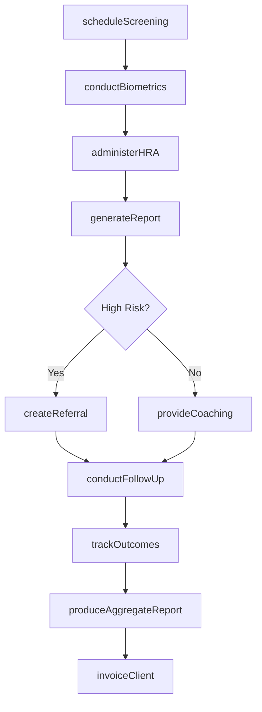
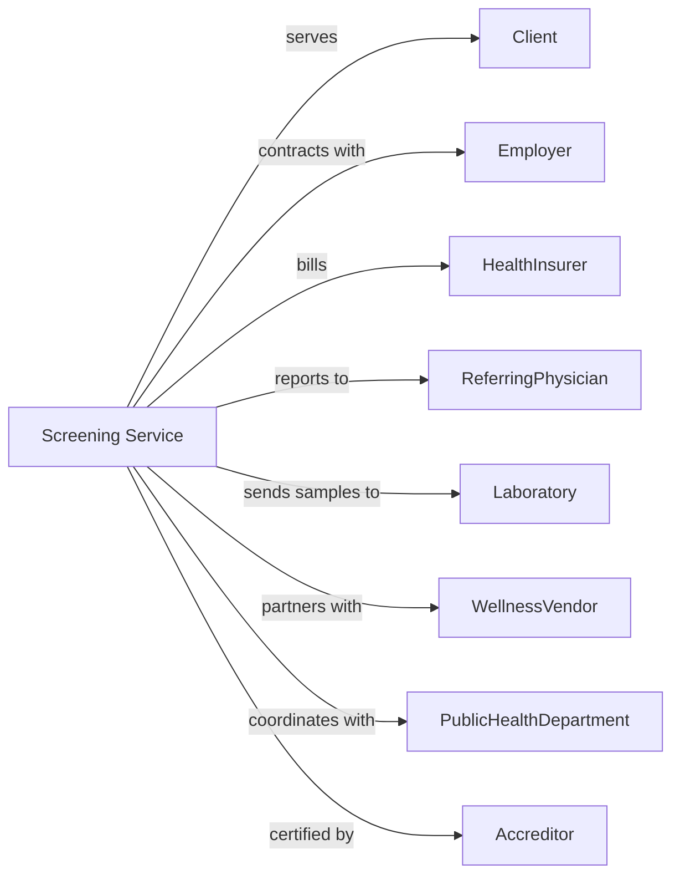

# All Other Miscellaneous Ambulatory Health Care Services

> Business-as-Code definition for specialized ambulatory health services. Models the complete service lifecycle for health screening, fitness evaluation, and specialty testing services.

## Overview

Miscellaneous ambulatory health care services provide specialized screening, testing, and evaluation services including health fairs, fitness assessments, sleep studies, and pacemaker monitoring. This definition exposes actions for service scheduling, testing protocols, and result reporting, with events for client management and quality assurance.

## Actors

| Actor | Description |
|-------|-------------|
| Client | Individual receiving screening or evaluation |
| Employer | Sponsors workplace health programs |
| HealthInsurer | Provides coverage for select services |
| ReferringPhysician | Orders specialized testing |
| Laboratory | Processes samples from screenings |
| EquipmentVendor | Provides testing devices and supplies |
| PublicHealthDepartment | Sponsors community health initiatives |
| Accreditor | Certifies testing programs and quality |
| WellnessVendor | Partners for corporate wellness programs |

## Roles

| Role | Description |
|------|-------------|
| ProgramDirector | Oversees screening and wellness programs |
| HealthScreener | Conducts biometric and health assessments |
| SleepTechnologist | Performs sleep studies and monitoring |
| FitnessEvaluator | Conducts physical fitness assessments |
| HealthCoach | Provides wellness counseling and guidance |
| QualityCoordinator | Maintains program standards and compliance |
| DataAnalyst | Produces health reports and analytics |
| EventCoordinator | Manages health fairs and screening events |

## Entities

| Entity | Description |
|--------|-------------|
| Client | Individual receiving health service |
| Appointment | Scheduled screening or evaluation |
| ScreeningEvent | Health fair or workplace screening |
| BiometricResult | Health measurements with risk assessment |
| SleepStudy | Polysomnography or home sleep test |
| FitnessAssessment | Physical evaluation with recommendations |
| HealthRiskAssessment | Questionnaire-based risk evaluation |
| Report | Results document for client or employer |
| Program | Corporate wellness or screening initiative |
| Referral | Recommendation for follow-up care |
| Invoice | Billing for services rendered |
| AggregateReport | Population health summary for employer |

## Actions

| Action | Description |
|--------|-------------|
| scheduleScreening | Book individual or group health assessment |
| conductBiometrics | Measure BP, glucose, cholesterol, BMI |
| administerHRA | Complete health risk assessment questionnaire |
| performFitnessTest | Conduct cardiovascular and strength evaluation |
| conductSleepStudy | Perform polysomnography or home sleep test |
| monitorPacemaker | Check implanted device function remotely |
| generateReport | Create individual results document |
| provideCoaching | Deliver wellness guidance and goal-setting |
| createReferral | Recommend follow-up with physician |
| coordinateEvent | Plan and execute health fair |
| produceAggregateReport | Generate population health summary |
| invoiceClient | Bill for services rendered |
| trackOutcomes | Monitor program effectiveness |
| certifyCompliance | Document regulatory adherence |
| conductFollowUp | Check progress on health goals |

## Events

| Event | Description |
|-------|-------------|
| screeningScheduled | Appointment has been booked |
| biometricsCompleted | Health measurements have been taken |
| HRAcompleted | Risk assessment has been submitted |
| fitnessTestCompleted | Physical evaluation has been performed |
| sleepStudyCompleted | Sleep test has been conducted |
| pacemakerChecked | Device monitoring has been performed |
| reportGenerated | Results document has been created |
| coachingDelivered | Wellness guidance has been provided |
| referralCreated | Follow-up recommendation has been made |
| eventCompleted | Health fair has been conducted |
| abnormalResultDetected | High-risk finding identified |
| invoiceSent | Billing has been submitted |
| outcomeTracked | Program metrics have been recorded |

## Searches

| Search | Description |
|--------|-------------|
| findClients | List clients with filters for program or risk |
| getSchedule | Retrieve appointments by date or location |
| getScreeningResults | Find biometric data for client |
| getHighRiskClients | List individuals with elevated risk factors |
| getEventParticipants | Find attendees for screening event |
| getProgramMetrics | Retrieve aggregate outcomes data |
| getPendingReferrals | List clients needing follow-up care |
| getCoachingProgress | Find clients with active wellness plans |

## Workflow



## Actor Relationships



## Usage

### Calling Actions

```typescript
import { treatAmbulatoryPatients } from '@headlessly/treat-ambulatory-patients'

const service = treatAmbulatoryPatients()

// Review high-risk clients and upcoming events
const highRisk = await service.getHighRiskClients({ riskScore: 'high', needsFollowUp: true })
const schedule = await service.getSchedule({ date: '2024-04-15', eventType: 'workplace-screening' })

// Schedule workplace screening event
const event = await service.coordinateEvent({
  eventId: 'EVT-456789',
  eventType: 'workplace-screening',
  client: 'acme-corporation',
  location: '789 Corporate Drive',
  date: '2024-04-15',
  expectedParticipants: 150,
  services: ['biometrics', 'HRA', 'flu-shots']
})

// Conduct individual screening
const screening = await service.conductBiometrics({
  clientId: 'CLI-234567',
  eventId: 'EVT-456789',
  measurements: {
    bloodPressure: { systolic: 142, diastolic: 92 },
    glucose: { fasting: false, value: 145 },
    cholesterol: { total: 232, hdl: 42, ldl: 158 },
    height: 70,
    weight: 210,
    bmi: 30.1,
    waistCircumference: 42
  }
})

await service.administerHRA({
  clientId: 'CLI-234567',
  responses: {
    smokingStatus: 'former',
    exerciseFrequency: 'rarely',
    alcoholUse: 'moderate',
    stressLevel: 'high',
    sleepHours: 5,
    familyHistory: ['diabetes', 'heart-disease']
  }
})

// Generate report and coaching
await service.generateReport({
  clientId: 'CLI-234567',
  riskFactors: ['hypertension', 'pre-diabetes', 'obesity'],
  riskScore: 'high',
  recommendations: [
    'Follow up with PCP for blood pressure management',
    'Consider diabetes screening',
    'Increase physical activity to 150 min/week'
  ]
})

await service.createReferral({
  clientId: 'CLI-234567',
  referralType: 'physician-follow-up',
  reason: 'Elevated blood pressure and glucose',
  urgency: 'within-2-weeks'
})
```

### Event-Driven Automation

```typescript
// Alert for critical findings
service.abnormalResultDetected(async ({ clientId, finding, severity }) => {
  if (severity === 'critical') {
    await service.createReferral({
      clientId,
      referralType: 'urgent-care',
      reason: finding,
      urgency: 'immediate'
    })

    await service.notifyClient({
      clientId,
      message: 'Important: Please contact your doctor today'
    })
  }
})

// Schedule coaching for high-risk clients
service.reportGenerated(async ({ clientId, riskScore }) => {
  if (riskScore === 'high') {
    await service.provideCoaching({
      clientId,
      program: 'lifestyle-modification',
      goals: ['blood-pressure', 'weight-management'],
      frequency: 'monthly'
    })
  }
})

// Produce aggregate reports for employers
service.eventCompleted(async ({ eventId, employer }) => {
  await service.produceAggregateReport({
    eventId,
    employer,
    metrics: ['participation-rate', 'risk-distribution', 'year-over-year'],
    deidentified: true
  })
})
```
