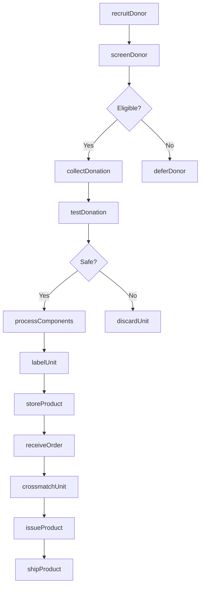
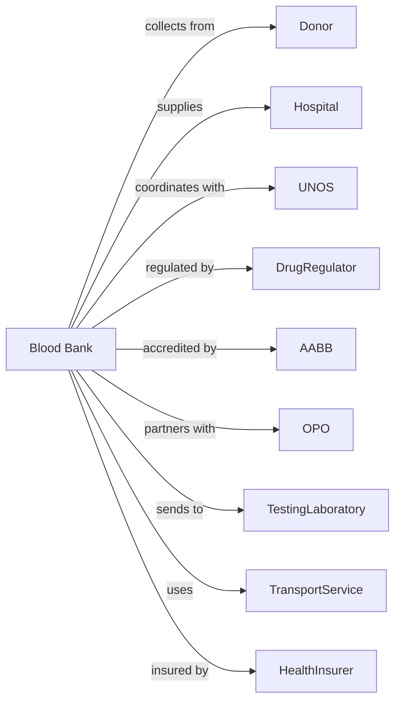

# Blood and Organ Banks

> Business-as-Code definition for blood bank and organ procurement operations. Models the complete donation lifecycle from recruitment through distribution and transplant coordination.

## Overview

Blood and organ banks collect, process, test, store, and distribute blood products and coordinate organ procurement and allocation. This definition exposes actions for donor management, product processing, and distribution, with events for inventory management and regulatory compliance.

## Actors

| Actor | Description |
|-------|-------------|
| Donor | Individual providing blood or registering for organ donation |
| Hospital | Orders blood products and performs transplants |
| UNOS | Allocates organs through national registry |
| DrugRegulator | Regulates blood products and manufacturing |
| AABB | Accredits blood banks and sets standards |
| OPO | Coordinates organ recovery and distribution |
| TestingLaboratory | Performs infectious disease and compatibility testing |
| TransportService | Provides specialized transport for products |
| HealthInsurer | Reimburses for blood products |

## Roles

| Role | Description |
|------|-------------|
| MedicalDirector | Oversees clinical operations and compliance |
| BloodBankPhysician | Reviews donor eligibility and reactions |
| Phlebotomist | Collects blood donations |
| ProcessingTechnician | Prepares blood components and products |
| TransfusionSpecialist | Performs compatibility testing |
| DonorRecruitmentCoordinator | Manages donor outreach and drives |
| OrganProcurementCoordinator | Coordinates organ recovery operations |
| QualityManager | Maintains regulatory compliance |

## Entities

| Entity | Description |
|--------|-------------|
| Donor | Individual providing donation |
| Donation | Collected blood or registered organ pledge |
| Unit | Processed blood product with unique identifier |
| Component | Blood product type (RBC, plasma, platelets) |
| TestResult | Infectious disease and compatibility testing |
| Inventory | Available products by type and blood group |
| Order | Hospital request for blood products |
| Crossmatch | Compatibility testing for specific patient |
| Organ | Procured organ for transplantation |
| WaitlistPatient | Recipient on transplant waiting list |
| Recall | Product withdrawal due to safety concern |
| DonorReaction | Adverse event during or after donation |

## Actions

| Action | Description |
|--------|-------------|
| recruitDonor | Engage potential donor for blood drive |
| screenDonor | Evaluate eligibility with health history |
| collectDonation | Perform blood collection procedure |
| testDonation | Conduct infectious disease screening |
| processComponents | Separate whole blood into components |
| labelUnit | Apply barcode and product information |
| storeProduct | Place in appropriate storage conditions |
| receiveOrder | Accept hospital request for products |
| crossmatchUnit | Test compatibility for patient |
| issueProduct | Release product for transfusion |
| coordinateProcurement | Manage organ recovery operation |
| allocateOrgan | Submit organ for UNOS matching |
| shipProduct | Transport product to requesting facility |
| conductRecall | Withdraw products for safety concern |
| reportReaction | Document donor adverse event |

## Events

| Event | Description |
|-------|-------------|
| donorRecruited | Individual has registered to donate |
| donorScreened | Eligibility has been determined |
| donationCollected | Blood has been obtained |
| donationTested | Infectious disease results are available |
| componentProcessed | Blood products have been prepared |
| unitLabeled | Product is ready for inventory |
| productStored | Unit has been placed in storage |
| orderReceived | Hospital request has been logged |
| crossmatchCompleted | Compatibility has been verified |
| productIssued | Unit has been released |
| organProcured | Organ has been recovered |
| organAllocated | UNOS has matched recipient |
| productShipped | Unit is in transit |
| recallInitiated | Safety withdrawal has begun |
| reactionReported | Adverse event has been documented |

## Searches

| Search | Description |
|--------|-------------|
| getInventory | Retrieve available products by type and group |
| getDonorHistory | Find donation records for individual |
| getPendingOrders | List hospital requests awaiting fulfillment |
| getExpiringUnits | Find products nearing expiration |
| getTestResults | Retrieve testing data for donation |
| getOrganWaitlist | List patients awaiting transplant |
| getRecalls | Find active product withdrawals |
| getDonorReactions | Retrieve adverse event reports |

## Workflow



## Actor Relationships



## Usage

### Calling Actions

```typescript
import { collectBlood } from '@headlessly/collect-blood'

const bank = collectBlood()

// Check inventory levels and expiring units
const inventory = await bank.getInventory({ bloodType: 'O-positive', component: 'packed-RBC' })
const expiring = await bank.getExpiringUnits({ expiresWithin: '5-days' })

// Screen and collect donation
const donor = await bank.screenDonor({
  donorId: 'DON-789012',
  healthHistory: {
    recentIllness: 'none',
    medications: 'none',
    travelHistory: 'domestic-only',
    lastDonation: '2024-01-15'
  },
  vitals: { bp: '118/76', pulse: 68, temp: 98.2, hgb: 14.5 },
  eligibility: 'approved'
})

const donation = await bank.collectDonation({
  donorId: 'DON-789012',
  collectionSite: 'main-center',
  collectionType: 'whole-blood',
  volume: 450,
  phlebotomist: 'tech-smith',
  bagLot: 'BG-240410-001'
})

// Process and test
await bank.testDonation({
  donationId: donation.id,
  tests: ['HIV', 'HCV', 'HBV', 'HTLV', 'Syphilis', 'WNV', 'Zika'],
  bloodType: 'O-positive',
  antibodyScreen: 'negative'
})

await bank.processComponents({
  donationId: donation.id,
  components: [
    { type: 'packed-RBC', unitId: 'RBC-240410-0156', expiration: '2024-05-22' },
    { type: 'FFP', unitId: 'FFP-240410-0089', expiration: '2025-04-10' },
    { type: 'platelets', unitId: 'PLT-240410-0034', expiration: '2024-04-15' }
  ]
})

// Fulfill hospital order
const order = await bank.receiveOrder({
  orderId: 'ORD-345678',
  hospital: 'regional-medical-center',
  patient: { mrn: 'PAT-111222', bloodType: 'O-positive' },
  products: [
    { type: 'packed-RBC', quantity: 2, urgency: 'routine' }
  ],
  orderTime: '2024-04-10T10:30:00'
})

await bank.crossmatchUnit({
  orderId: order.id,
  unitId: 'RBC-240410-0156',
  patientSample: 'SAMP-999888',
  result: 'compatible',
  expirationOfCrossmatch: '2024-04-13T10:30:00'
})

await bank.issueProduct({
  orderId: order.id,
  unitId: 'RBC-240410-0156',
  issuedTo: 'regional-medical-center',
  pickupPerson: 'transport-jones',
  issueTime: '2024-04-10T11:15:00'
})
```

### Event-Driven Automation

```typescript
// Alert for expiring inventory
bank.productStored(async ({ unitId, expiration }) => {
  const daysToExpiration = calculateDays(expiration)

  if (daysToExpiration <= 3) {
    await bank.alertInventory({
      unitId,
      urgency: 'critical',
      message: 'Unit expiring - prioritize for use'
    })
  }
})

// Initiate recall for positive test
bank.donationTested(async ({ donationId, results }) => {
  if (results.some(r => r.positive)) {
    await bank.conductRecall({
      donationId,
      reason: 'positive-infectious-marker',
      scope: 'all-components-from-donation'
    })
  }
})

// Coordinate organ allocation
bank.organProcured(async ({ organId, organType, donor }) => {
  await bank.allocateOrgan({
    organId,
    organType,
    donorInfo: donor,
    submitToUNOS: true
  })
})
```
