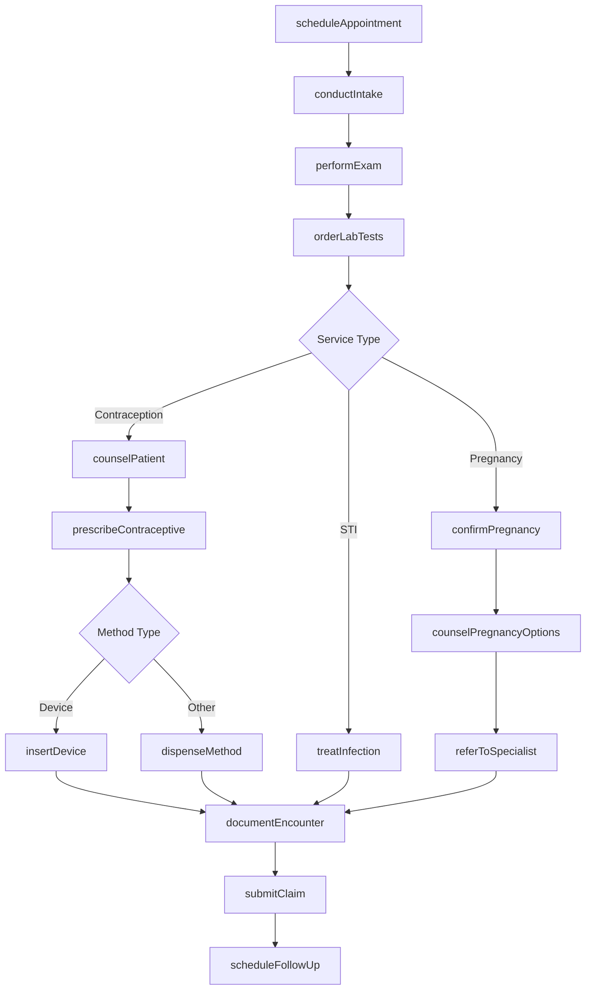
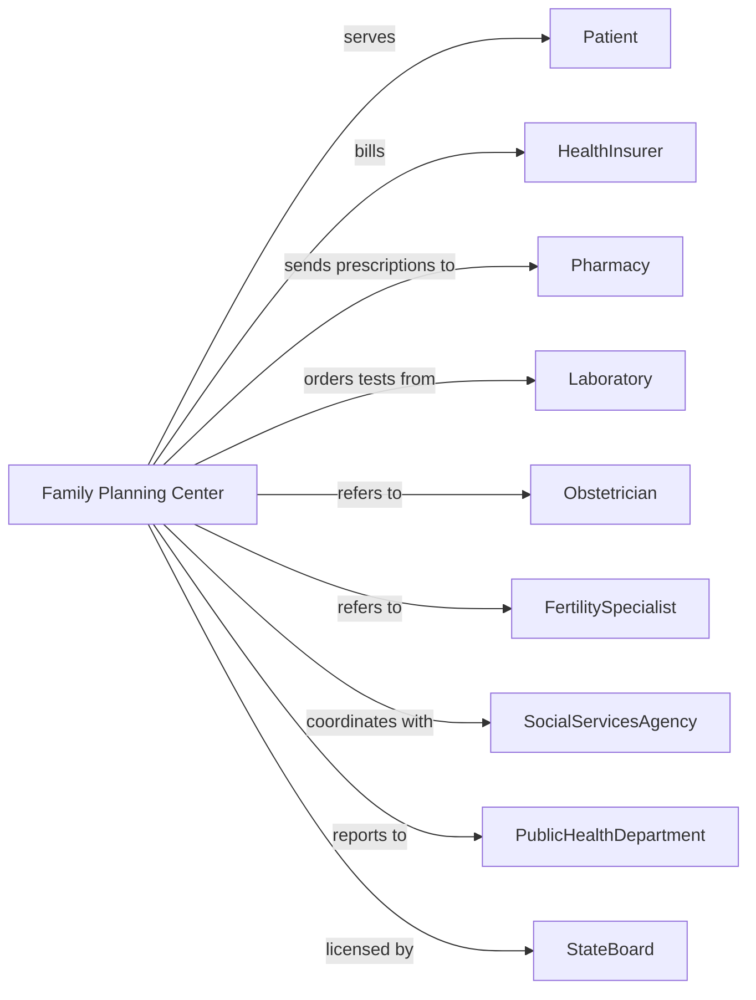

# Family Planning Centers

> Business-as-Code definition for family planning clinic operations. Models the complete reproductive health lifecycle from counseling through treatment and follow-up care.

## Overview

Family planning centers provide comprehensive reproductive health services including contraceptive counseling, fertility services, prenatal care, and pregnancy options counseling. This definition exposes actions for patient assessment, contraceptive management, and counseling services, with events for appointment scheduling and care coordination.

## Actors

| Actor | Description |
|-------|-------------|
| Patient | Individual seeking reproductive health services |
| HealthInsurer | Provides coverage for family planning services |
| Pharmacy | Fills contraceptive prescriptions |
| Laboratory | Performs STI testing and pregnancy tests |
| Obstetrician | Provides prenatal and obstetric care referrals |
| FertilitySpecialist | Provides advanced reproductive services |
| SocialServicesAgency | Provides referrals and support services |
| PublicHealthDepartment | Provides funding and disease reporting oversight |
| StateBoard | Licenses practitioners and regulates services |

## Roles

| Role | Description |
|------|-------------|
| Physician | Provides medical examinations and prescribes treatment |
| NursePractitioner | Provides clinical care and contraceptive counseling |
| NurseMidwife | Provides prenatal and reproductive health services |
| HealthEducator | Delivers patient education and counseling |
| MedicalAssistant | Assists with clinical procedures and lab work |
| FrontDesk | Manages scheduling and patient registration |

## Entities

| Entity | Description |
|--------|-------------|
| Patient | Individual receiving reproductive health services |
| Appointment | Scheduled clinic visit |
| Encounter | Documented patient visit with services provided |
| Contraceptive | Birth control method or device |
| Prescription | Medication order for contraceptives |
| LabTest | STI or pregnancy test with results |
| Counseling | Documented education and counseling session |
| Pregnancy | Confirmed pregnancy with gestational details |
| Referral | Authorization for specialist services |
| Consent | Patient authorization for services |
| Claim | Insurance billing submission |
| FollowUp | Scheduled return visit |

## Actions

| Action | Description |
|--------|-------------|
| scheduleAppointment | Book clinic visit for services |
| conductIntake | Gather health history and reason for visit |
| performExam | Conduct physical and pelvic examination |
| orderLabTests | Request STI screening or pregnancy test |
| counselPatient | Provide education on reproductive health options |
| prescribeContraceptive | Write prescription for birth control method |
| insertDevice | Place IUD or contraceptive implant |
| removeDevice | Remove IUD or contraceptive implant |
| confirmPregnancy | Verify pregnancy with test and examination |
| counselPregnancyOptions | Discuss prenatal care, adoption, or termination |
| provideEmergencyContraception | Dispense emergency contraceptive |
| referToSpecialist | Send patient for advanced services |
| documentEncounter | Record visit notes and services provided |
| submitClaim | Send billing claim to payer |
| scheduleFollowUp | Book return appointment for ongoing care |

## Events

| Event | Description |
|-------|-------------|
| appointmentScheduled | Clinic visit has been booked |
| intakeCompleted | Health history has been gathered |
| examCompleted | Physical examination has been performed |
| labTestOrdered | Diagnostic test has been requested |
| labResultReceived | Test results are available |
| contraceptivePrescribed | Birth control has been prescribed |
| deviceInserted | IUD or implant has been placed |
| deviceRemoved | IUD or implant has been removed |
| pregnancyConfirmed | Pregnancy test is positive |
| counselingCompleted | Education session has been documented |
| referralCreated | Specialist referral has been generated |
| claimSubmitted | Billing claim has been sent |
| followUpScheduled | Return visit has been booked |
| STIdetected | Positive STI result requiring treatment |

## Searches

| Search | Description |
|--------|-------------|
| findPatients | List patients with filters for service type or status |
| getAppointments | Retrieve scheduled visits by date or provider |
| getLabResults | Find test results for patient |
| getPendingFollowUps | List patients due for return visits |
| getDevicePatients | Find patients with active IUDs or implants |
| getPregnantPatients | List patients with confirmed pregnancies |
| getSTIcases | Find patients requiring treatment follow-up |
| getPendingClaims | List claims awaiting payment |

## Workflow



## Actor Relationships



## Usage

### Calling Actions

```typescript
import { treatReproductiveHealth } from '@headlessly/treat-reproductive-health'

const clinic = treatReproductiveHealth()

// Review pending follow-ups and device patients
const followUps = await clinic.getPendingFollowUps({ dueWithin: '7-days' })
const devicePatients = await clinic.getDevicePatients({ deviceType: 'IUD', expiresWithin: '6-months' })

// Schedule family planning visit
const appointment = await clinic.scheduleAppointment({
  patientId: 'pat-89012',
  visitType: 'contraceptive-counseling',
  dateTime: '2024-03-28T10:00:00',
  duration: 30
})

// Conduct intake and exam
await clinic.conductIntake({
  patientId: 'pat-89012',
  lastMenstrualPeriod: '2024-03-01',
  sexualHistory: true,
  contraceptiveHistory: 'oral-contraceptive-2-years'
})

await clinic.performExam({
  patientId: 'pat-89012',
  examType: 'annual-wellness',
  findings: {
    vitals: { bp: '118/76', weight: 145 },
    pelvicExam: 'normal',
    breastExam: 'normal'
  }
})

// Counsel and prescribe contraceptive
await clinic.counselPatient({
  patientId: 'pat-89012',
  topics: ['IUD-options', 'implant-options', 'hormonal-methods'],
  patientPreference: 'long-acting-reversible'
})

await clinic.insertDevice({
  patientId: 'pat-89012',
  deviceType: 'Mirena-IUD',
  insertionDate: '2024-03-28',
  expirationDate: '2031-03-28',
  complications: 'none'
})
```

### Event-Driven Automation

```typescript
// Schedule follow-up after device insertion
clinic.deviceInserted(async ({ patientId, deviceType }) => {
  await clinic.scheduleFollowUp({
    patientId,
    visitType: 'device-check',
    interval: '4-6 weeks',
    instructions: 'String check and symptom review'
  })
})

// Alert for positive STI results
clinic.STIdetected(async ({ patientId, infection }) => {
  await clinic.notifyPatient({
    patientId,
    urgency: 'high',
    message: 'Important test results - please contact clinic'
  })

  await clinic.scheduleAppointment({
    patientId,
    visitType: 'treatment',
    priority: 'urgent'
  })
})

// Coordinate prenatal referral
clinic.pregnancyConfirmed(async ({ patientId, gestationalAge }) => {
  await clinic.counselPregnancyOptions({
    patientId,
    options: ['prenatal-care', 'adoption', 'termination'],
    documentDecision: true
  })
})
```
