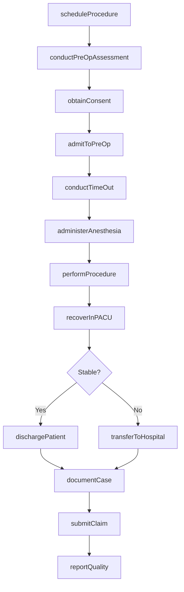
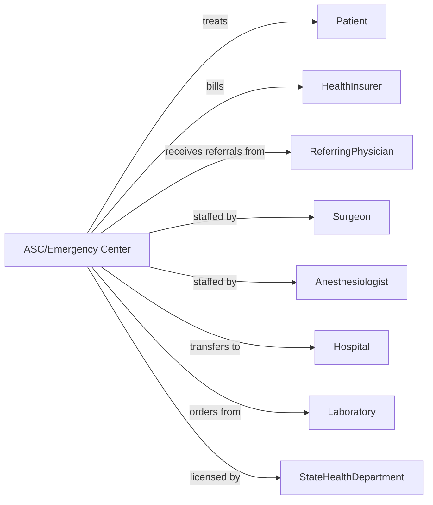

# Freestanding Ambulatory Surgical and Emergency Centers

> Business-as-Code definition for ambulatory surgery center and urgent care operations. Models the complete surgical and emergency care lifecycle from scheduling through discharge.

## Overview

Freestanding ambulatory surgical and emergency centers provide outpatient surgical procedures and urgent care services outside of hospital settings. This definition exposes actions for procedure scheduling, surgical care delivery, and emergency treatment, with events for patient flow and quality monitoring.

## Actors

| Actor | Description |
|-------|-------------|
| Patient | Individual receiving surgical or emergency care |
| HealthInsurer | Provides coverage for procedures and visits |
| ReferringPhysician | Sends patients for surgery or evaluation |
| Surgeon | Performs outpatient surgical procedures |
| Anesthesiologist | Provides sedation and anesthesia services |
| Hospital | Receives transfers for complications or admissions |
| Laboratory | Provides pre-operative testing |
| MedicalSupplyVendor | Provides surgical instruments and supplies |
| StateHealthDepartment | Licenses facility and conducts inspections |

## Roles

| Role | Description |
|------|-------------|
| MedicalDirector | Oversees clinical operations and credentialing |
| Surgeon | Performs outpatient surgical procedures |
| Anesthesiologist | Administers anesthesia and monitors sedation |
| ORnurse | Assists during surgical procedures |
| PACUnurse | Monitors patients in post-anesthesia recovery |
| EmergencyPhysician | Evaluates and treats urgent care patients |
| PreOpCoordinator | Manages surgical scheduling and preparation |
| FrontDesk | Handles registration and patient flow |

## Entities

| Entity | Description |
|--------|-------------|
| Patient | Individual receiving care at the center |
| Procedure | Scheduled surgical operation with CPT code |
| Encounter | Emergency or urgent care visit record |
| OperatingRoom | Surgical suite assignment and schedule |
| AnesthesiaRecord | Sedation documentation and monitoring |
| Consent | Surgical and anesthesia authorization |
| PreOpClearance | Medical clearance for surgery |
| RecoveryNote | Post-anesthesia care documentation |
| DischargeInstructions | Post-procedure patient guidance |
| Claim | Insurance billing submission |
| QualityMetric | Surgical outcomes and safety measures |
| Transfer | Hospital transfer documentation |

## Actions

| Action | Description |
|--------|-------------|
| scheduleProcedure | Book surgical case with OR time |
| conductPreOpAssessment | Evaluate patient readiness for surgery |
| obtainConsent | Secure surgical and anesthesia authorization |
| admitToPreOp | Check in patient and prepare for surgery |
| administerAnesthesia | Induce sedation or anesthesia |
| performProcedure | Execute surgical operation |
| recoverInPACU | Monitor patient post-anesthesia |
| dischargePatient | Release patient with instructions |
| treatEmergency | Evaluate and treat urgent care patient |
| orderImaging | Request X-ray or other diagnostic study |
| transferToHospital | Send patient requiring admission |
| documentCase | Record procedure notes and outcomes |
| submitClaim | Send billing to insurance payer |
| reportQuality | Submit outcomes and safety data |
| conductTimeOut | Verify patient, site, and procedure pre-surgery |

## Events

| Event | Description |
|-------|-------------|
| procedureScheduled | Surgical case has been booked |
| preOpCompleted | Patient has been cleared for surgery |
| patientAdmitted | Patient has checked in for procedure |
| anesthesiaInduced | Sedation has begun |
| procedureStarted | Surgery has commenced |
| procedureCompleted | Surgery has ended |
| recoveryBegan | Patient entered PACU |
| patientDischarged | Patient has been released |
| emergencyTreated | Urgent care visit has been completed |
| complicationOccurred | Adverse event has been identified |
| transferInitiated | Patient sent to hospital |
| claimSubmitted | Billing has been sent |
| qualityEventReported | Safety incident has been documented |
| caseDelayed | Procedure has been postponed |

## Searches

| Search | Description |
|--------|-------------|
| getSchedule | Retrieve surgical schedule by date or room |
| findPatients | List patients with filters for procedure or status |
| getPendingCases | Find procedures awaiting pre-op clearance |
| getRecoveryPatients | List patients currently in PACU |
| getEmergencyVisits | Find urgent care encounters |
| getComplicationReport | Retrieve adverse events and outcomes |
| getPendingClaims | List claims awaiting payment |
| getORutilization | Get operating room usage statistics |

## Workflow



## Actor Relationships



## Usage

### Calling Actions

```typescript
import { treatSurgicalPatients } from '@headlessly/treat-surgical-patients'

const center = treatSurgicalPatients()

// Review OR schedule and pending pre-op clearances
const orSchedule = await center.getSchedule({ date: '2024-04-15', room: 'OR-2' })
const pendingPreOp = await center.getPendingCases({ status: 'awaiting-clearance' })

// Schedule outpatient surgical procedure
const procedure = await center.scheduleProcedure({
  patientId: 'pat-01234',
  procedureCode: '29881',
  description: 'Arthroscopic knee meniscectomy',
  surgeon: 'dr-ortho',
  anesthesia: 'general',
  estimatedDuration: 45,
  scheduledDate: '2024-04-15',
  scheduledTime: '08:00',
  operatingRoom: 'OR-2'
})

// Complete pre-operative assessment
await center.conductPreOpAssessment({
  patientId: 'pat-01234',
  clearanceStatus: 'approved',
  labResults: { cbc: 'normal', metabolic: 'normal' },
  ekg: 'normal-sinus',
  npoVerified: true,
  allergies: ['penicillin'],
  medications: { held: ['aspirin'], continued: ['lisinopril'] }
})

// Document surgical case
await center.performProcedure({
  patientId: 'pat-01234',
  startTime: '08:15',
  endTime: '08:52',
  findings: 'Medial meniscus tear, posterior horn',
  intervention: 'Partial meniscectomy performed',
  specimens: 'none',
  complications: 'none',
  estimatedBloodLoss: 'minimal'
})

// Recover and discharge patient
await center.recoverInPACU({
  patientId: 'pat-01234',
  admitTime: '08:55',
  vitals: [
    { time: '09:00', bp: '128/78', pulse: 72, spo2: 98 },
    { time: '09:30', bp: '122/74', pulse: 68, spo2: 99 }
  ],
  painLevel: 3,
  aldrete: 10
})

await center.dischargePatient({
  patientId: 'pat-01234',
  dischargeTime: '10:30',
  responsibleAdult: 'verified',
  instructions: ['ice-20-min-hourly', 'elevate-leg', 'weight-bearing-as-tolerated'],
  medications: ['norco-5-325-q6h-prn', 'ibuprofen-600-q8h'],
  followUp: '2-weeks-dr-ortho'
})
```

### Event-Driven Automation

```typescript
// Alert for complications
center.complicationOccurred(async ({ patientId, complication }) => {
  if (complication.severity === 'severe') {
    await center.transferToHospital({
      patientId,
      reason: complication.description,
      receivingFacility: 'regional-medical-center'
    })
  }

  await center.reportQuality({
    eventType: 'adverse-event',
    patientId,
    details: complication
  })
})

// Monitor recovery time
center.recoveryBegan(async ({ patientId, procedureType }) => {
  const expectedRecovery = getExpectedRecoveryTime(procedureType)

  setTimeout(async () => {
    const patient = await center.getRecoveryPatients({ patientId })

    if (patient.stillInPACU) {
      await center.alertStaff({
        patientId,
        alert: 'Extended recovery time - please evaluate'
      })
    }
  }, expectedRecovery * 60000)
})

// Auto-submit claims after discharge
center.patientDischarged(async ({ patientId, procedures }) => {
  await center.submitClaim({
    patientId,
    procedures,
    facilityFee: true,
    anesthesiaFee: true
  })
})
```
