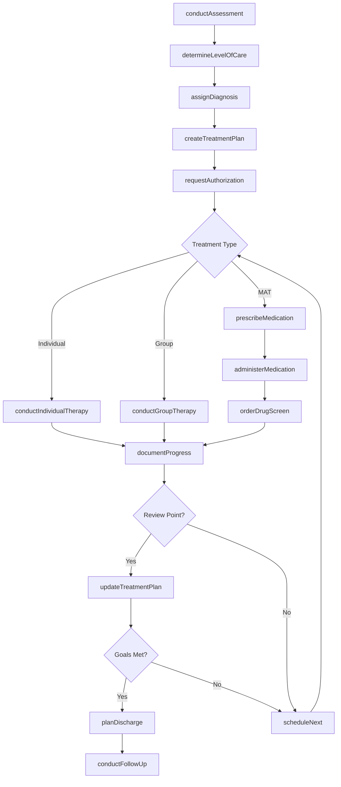
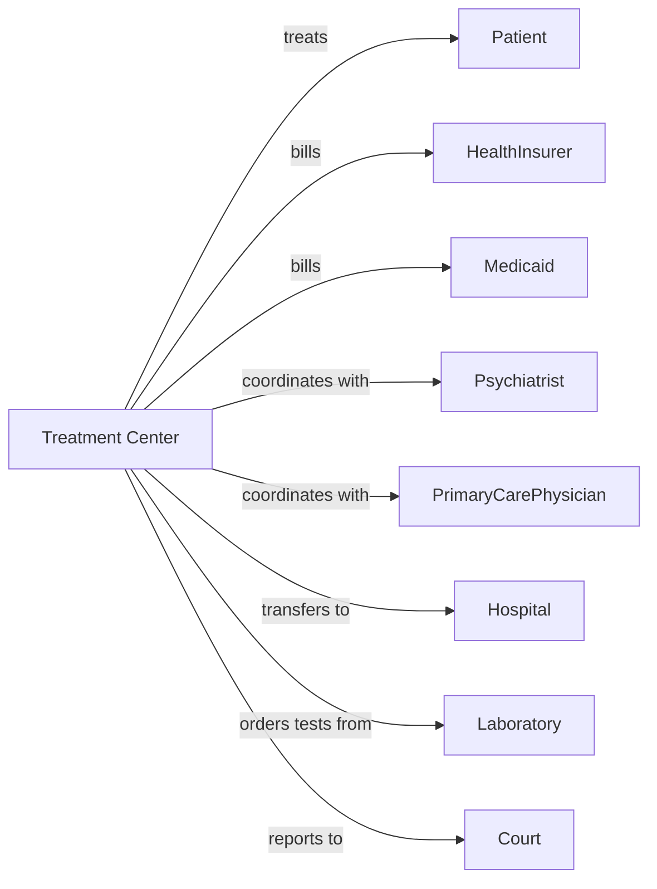

# Outpatient Mental Health and Substance Abuse Centers

> Business-as-Code definition for outpatient behavioral health center operations. Models the complete treatment lifecycle from assessment through recovery maintenance.

## Overview

Outpatient mental health and substance abuse centers provide diagnostic and treatment services for mental health disorders and addiction. This definition exposes actions for patient assessment, individual and group therapy, medication-assisted treatment, and care coordination, with events for treatment progress and compliance monitoring.

## Actors

| Actor | Description |
|-------|-------------|
| Patient | Individual seeking mental health or substance abuse treatment |
| HealthInsurer | Provides behavioral health coverage and reimbursement |
| Medicaid | Provides coverage for eligible patients |
| Psychiatrist | Prescribes psychiatric medications |
| PrimaryCarePhysician | Coordinates medical care and refers patients |
| Hospital | Provides inpatient stabilization when needed |
| Laboratory | Performs drug screening and monitoring tests |
| Court | Mandates treatment and monitors compliance |
| StateAgency | Licenses facilities and regulates services |

## Roles

| Role | Description |
|------|-------------|
| ClinicalDirector | Oversees treatment programs and clinical staff |
| Psychiatrist | Provides psychiatric evaluation and medication management |
| Counselor | Delivers individual and group therapy sessions |
| CaseManager | Coordinates care and connects patients to resources |
| NursingStaff | Administers medications and monitors patient health |
| IntakeCoordinator | Conducts assessments and determines level of care |
| PeerSupport | Provides recovery support from lived experience |
| AddictionsMedPhysician | Prescribes medication-assisted treatment for opioid and alcohol dependence |

## Entities

| Entity | Description |
|--------|-------------|
| Patient | Individual receiving behavioral health treatment |
| Assessment | Comprehensive evaluation for diagnosis and level of care |
| Diagnosis | Mental health or substance use disorder using DSM-5 |
| TreatmentPlan | Documented goals, interventions, and services |
| Session | Individual or group therapy encounter |
| Medication | Psychiatric or medication-assisted treatment drug |
| DrugScreen | Urine or blood test for substance detection |
| Authorization | Insurer approval for treatment services |
| CourtOrder | Legal mandate for treatment compliance |
| ProgressNote | Session documentation and observations |
| Discharge | Treatment completion or transfer documentation |
| RecoveryPlan | Post-treatment maintenance and support plan |

## Actions

| Action | Description |
|--------|-------------|
| conductAssessment | Perform comprehensive biopsychosocial evaluation |
| determineLevelOfCare | Assess appropriate treatment intensity |
| assignDiagnosis | Identify mental health or substance use disorder |
| createTreatmentPlan | Develop individualized care plan with goals |
| conductIndividualTherapy | Deliver one-on-one counseling session |
| conductGroupTherapy | Facilitate therapeutic group session |
| prescribeMedication | Order psychiatric or MAT medication |
| administerMedication | Dispense observed medication dose |
| orderDrugScreen | Request substance testing |
| documentProgress | Record session notes and treatment progress |
| requestAuthorization | Obtain insurer approval for services |
| coordinateCare | Communicate with external providers |
| reportToCourtcourt | Submit compliance report for mandated patients |
| planDischarge | Prepare transition and aftercare arrangements |
| conductFollowUp | Perform post-discharge check-in |

## Events

| Event | Description |
|-------|-------------|
| assessmentCompleted | Biopsychosocial evaluation has been performed |
| levelOfCareDetermined | Treatment intensity has been assigned |
| diagnosisAssigned | Disorder has been identified |
| treatmentPlanCreated | Care plan has been documented |
| sessionCompleted | Therapy session has been delivered |
| medicationPrescribed | Psychiatric or MAT drug has been ordered |
| medicationAdministered | Observed dose has been dispensed |
| drugScreenCompleted | Substance test has been performed |
| drugScreenPositive | Substance detected in screening |
| authorizationReceived | Insurer has approved services |
| authorizationDenied | Insurer has denied services |
| courtReportSubmitted | Compliance report has been filed |
| patientDischarged | Treatment has been completed or transferred |
| relapseIdentified | Patient has returned to substance use |

## Searches

| Search | Description |
|--------|-------------|
| findPatients | List patients with filters for diagnosis or status |
| getSchedule | Retrieve appointments and group sessions |
| getActivePatients | Find patients currently in treatment |
| getDrugScreenResults | Retrieve testing history for patient |
| getPendingAuthorizations | List requests awaiting insurer decision |
| getCourtMandatedPatients | Find patients with legal requirements |
| getMATpatients | List patients on medication-assisted treatment |
| getDischargeReadyPatients | Find patients approaching treatment completion |

## Workflow



## Actor Relationships



## Usage

### Calling Actions

```typescript
import { treatAddiction } from '@headlessly/treat-addiction'

const center = treatAddiction()

// Conduct comprehensive assessment
const assessment = await center.conductAssessment({
  patientId: 'pat-90123',
  assessmentType: 'biopsychosocial',
  presentingProblem: 'Opioid use disorder, daily heroin use',
  substanceHistory: {
    primarySubstance: 'heroin',
    durationOfUse: '3 years',
    lastUse: '2024-03-27'
  },
  mentalHealthHistory: 'Depression, anxiety',
  socialSupports: 'limited'
})

// Determine level of care and create treatment plan
await center.determineLevelOfCare({
  patientId: 'pat-90123',
  asam: {
    withdrawal: 2,
    biomedical: 1,
    emotional: 2,
    readiness: 3,
    relapse: 3,
    environment: 2
  },
  recommendedLevel: 'intensive-outpatient'
})

await center.createTreatmentPlan({
  patientId: 'pat-90123',
  diagnoses: ['F11.20', 'F32.1'],
  goals: [
    'Achieve abstinence from opioids',
    'Reduce depressive symptoms',
    'Develop coping skills'
  ],
  services: ['individual-therapy', 'group-therapy', 'MAT'],
  frequency: '3x/week'
})

// Initiate medication-assisted treatment
await center.prescribeMedication({
  patientId: 'pat-90123',
  medication: 'Buprenorphine-Naloxone',
  dosage: '16mg-4mg',
  frequency: 'daily',
  dispensing: 'observed'
})
```

### Event-Driven Automation

```typescript
// Alert for positive drug screen
center.drugScreenPositive(async ({ patientId, substance }) => {
  await center.documentProgress({
    patientId,
    event: 'positive-screen',
    substance,
    clinicalResponse: 'Review treatment plan'
  })

  await center.scheduleSession({
    patientId,
    sessionType: 'individual-crisis',
    priority: 'urgent'
  })
})

// Request continued authorization
center.authorizationExpiring(async ({ patientId, daysRemaining }) => {
  if (daysRemaining <= 5) {
    const progress = await center.getProgressNotes({ patientId })

    await center.requestAuthorization({
      patientId,
      servicesRequested: 30,
      justification: progress.summary,
      documentation: progress.notes
    })
  }
})

// Court compliance reporting
center.sessionCompleted(async ({ patientId }) => {
  const patient = await center.findPatients({ id: patientId })

  if (patient.courtMandated) {
    await center.reportToCourt({
      patientId,
      reportType: 'progress',
      attendance: patient.attendanceRecord,
      compliance: patient.complianceStatus
    })
  }
})
```
