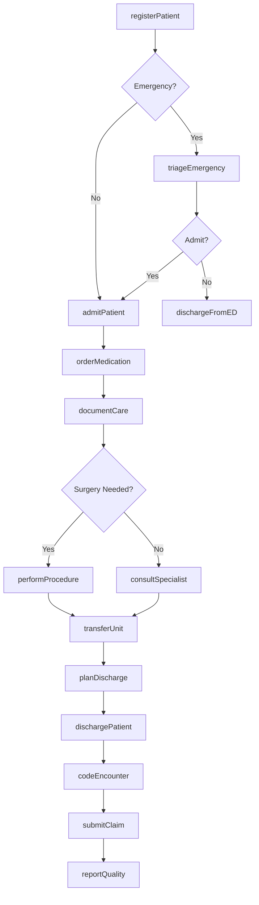
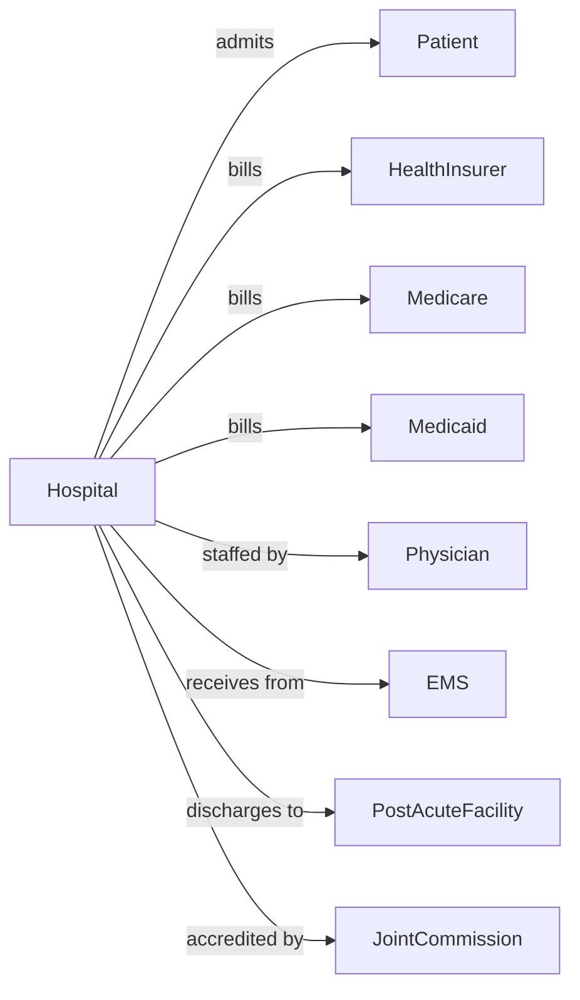

# General Medical and Surgical Hospitals

> Business-as-Code definition for general hospital operations. Models the complete inpatient care lifecycle from admission through discharge with surgical, medical, and emergency services.

## Overview

General medical and surgical hospitals provide comprehensive inpatient diagnostic and treatment services including surgery, emergency care, intensive care, and specialty services. This definition exposes actions for patient admission, clinical care, and discharge planning, with events for census management and quality reporting.

## Actors

| Actor | Description |
|-------|-------------|
| Patient | Individual receiving inpatient hospital care |
| HealthInsurer | Provides coverage for hospital services |
| Medicare | Reimburses under DRG payment system |
| Medicaid | Covers eligible patients for hospital stays |
| Physician | Admits patients and directs medical care |
| EMS | Transports emergency patients to hospital |
| PostAcuteFacility | Receives discharged patients for continued care |
| MedicalSupplyVendor | Provides equipment and supplies |
| JointCommission | Accredits hospital and sets standards |
| CMSsurveyor | Inspects and enforces conditions of participation |

## Roles

| Role | Description |
|------|-------------|
| CEO | Oversees hospital administration |
| CMO | Directs medical staff and clinical quality |
| CNO | Oversees nursing operations and patient care |
| Hospitalist | Manages inpatient medical care |
| Surgeon | Performs surgical procedures |
| Nurse | Delivers bedside patient care |
| CaseManager | Coordinates utilization and discharge planning |
| Pharmacist | Manages medications and drug therapy |
| Registrar | Handles patient admission and registration |
| Coder | Assigns diagnosis and procedure codes |
| EmergencyPhysician | Evaluates and stabilizes patients presenting to the emergency department |
| Anesthesiologist | Administers anesthesia and manages pain during surgical procedures |

## Entities

| Entity | Description |
|--------|-------------|
| Patient | Individual admitted for hospital care |
| Admission | Hospital stay with admission details |
| Bed | Physical bed with unit assignment |
| Order | Physician directive for care |
| Medication | Drug administered during stay |
| Procedure | Surgical or diagnostic intervention |
| Diagnosis | Medical condition using ICD codes |
| DRG | Diagnosis-related group for billing |
| Discharge | End of stay with disposition |
| Census | Current inpatient population count |
| Claim | Insurance billing submission |
| QualityMeasure | CMS or Joint Commission metric |

## Actions

| Action | Description |
|--------|-------------|
| registerPatient | Create patient record and demographics |
| admitPatient | Assign bed and initiate inpatient stay |
| triageEmergency | Assess urgency in emergency department |
| orderMedication | Prescribe drug therapy |
| performProcedure | Execute surgical or diagnostic intervention |
| documentCare | Record nursing and physician notes |
| consultSpecialist | Request specialty physician evaluation |
| transferUnit | Move patient between care units |
| planDischarge | Coordinate post-hospital care |
| dischargePatient | Complete stay and release patient |
| codeEncounter | Assign ICD and CPT codes |
| submitClaim | Send billing to payer |
| reportQuality | Submit performance metrics |
| manageBed | Track bed availability and assignments |
| conductHandoff | Transfer care between shifts or providers |

## Events

| Event | Description |
|-------|-------------|
| patientRegistered | Record has been created |
| patientAdmitted | Inpatient stay has begun |
| emergencyTriaged | Urgency has been assessed |
| medicationOrdered | Drug therapy has been prescribed |
| procedureCompleted | Intervention has been performed |
| careDocumented | Clinical note has been recorded |
| consultRequested | Specialty evaluation has been ordered |
| patientTransferred | Unit assignment has changed |
| dischargePlanned | Post-hospital care has been arranged |
| patientDischarged | Stay has ended |
| encounterCoded | Billing codes have been assigned |
| claimSubmitted | Billing has been sent |
| qualityReported | Metrics have been submitted |
| bedAvailable | Bed is ready for new patient |
| codeBlue | Cardiac arrest response activated |

## Searches

| Search | Description |
|--------|-------------|
| getCensus | Retrieve current inpatient count by unit |
| findPatients | List patients with filters for unit or diagnosis |
| getAvailableBeds | Find open beds by type and unit |
| getPendingDischarges | List patients ready for release |
| getEmergencyWaiting | Find ED patients awaiting admission |
| getOrders | Retrieve active orders for patient |
| getQualityMetrics | Find performance data by measure |
| getPendingClaims | List claims awaiting payment |

## Workflow



## Actor Relationships



## Usage

### Calling Actions

```typescript
import { treatInpatients } from '@headlessly/treat-inpatients'

const hospital = treatInpatients()

// Admit patient from emergency department
const admission = await hospital.admitPatient({
  patientId: 'PAT-901234',
  admissionType: 'emergency',
  admittingPhysician: 'dr-hospitalist',
  diagnosis: 'Acute appendicitis',
  unit: 'surgical-floor',
  bedId: 'BED-4B-212',
  admissionTime: '2024-04-12T03:45:00'
})

// Order medication and document care
await hospital.orderMedication({
  patientId: 'PAT-901234',
  medication: 'Ceftriaxone',
  dose: '1g',
  route: 'IV',
  frequency: 'Q24H',
  indication: 'Surgical prophylaxis'
})

await hospital.documentCare({
  patientId: 'PAT-901234',
  noteType: 'admission-H&P',
  author: 'dr-hospitalist',
  content: {
    chiefComplaint: 'RLQ abdominal pain x 12 hours',
    hpi: 'Acute onset, progressively worsening',
    physicalExam: 'Guarding, rebound tenderness RLQ',
    assessment: 'Acute appendicitis',
    plan: 'Laparoscopic appendectomy in AM'
  }
})

// Perform surgery
await hospital.performProcedure({
  patientId: 'PAT-901234',
  procedure: 'Laparoscopic appendectomy',
  cptCode: '44970',
  surgeon: 'dr-general-surgery',
  anesthesia: 'general',
  startTime: '2024-04-12T08:30:00',
  endTime: '2024-04-12T09:15:00',
  findings: 'Inflamed appendix, no perforation',
  complications: 'none'
})

// Plan and execute discharge
await hospital.planDischarge({
  patientId: 'PAT-901234',
  disposition: 'home',
  dischargeDate: '2024-04-13',
  medications: ['Norco-5-325-PRN', 'Ibuprofen-600-Q6H'],
  instructions: ['Clear liquids advancing to regular diet', 'No heavy lifting 2 weeks'],
  followUp: 'Surgeon office 1 week'
})

await hospital.dischargePatient({
  patientId: 'PAT-901234',
  dischargeTime: '2024-04-13T11:30:00',
  dischargingPhysician: 'dr-hospitalist',
  primaryDiagnosis: 'K35.80',
  procedures: ['44970']
})
```

### Event-Driven Automation

```typescript
// Manage bed availability
hospital.patientDischarged(async ({ bedId, unit }) => {
  await hospital.manageBed({
    bedId,
    status: 'cleaning',
    notifyHousekeeping: true
  })
})

// Alert for emergency admissions
hospital.emergencyTriaged(async ({ patientId, acuityLevel }) => {
  if (acuityLevel <= 2) {
    await hospital.notifyAdmissions({
      patientId,
      urgency: 'immediate',
      bedType: 'monitored'
    })
  }
})

// Auto-submit quality metrics
hospital.patientDischarged(async ({ patientId, diagnoses, procedures }) => {
  await hospital.reportQuality({
    patientId,
    measures: determineApplicableMeasures(diagnoses, procedures),
    submissionDate: new Date()
  })
})
```
