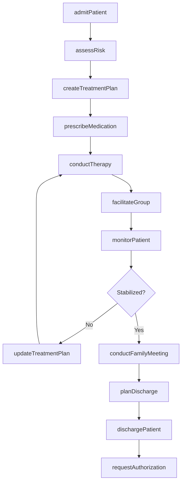
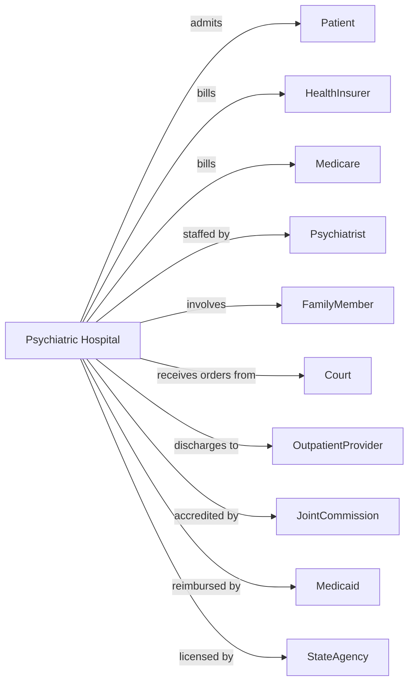

# Psychiatric and Substance Abuse Hospitals

> Business-as-Code definition for psychiatric hospital operations. Models the complete inpatient behavioral health lifecycle from admission through stabilization and discharge with aftercare planning.

## Overview

Psychiatric and substance abuse hospitals provide inpatient diagnostic and treatment services for mental illness and addiction, including crisis stabilization, medication management, and therapeutic programs. This definition exposes actions for patient admission, treatment delivery, and discharge planning, with events for safety monitoring and compliance.

## Actors

| Actor | Description |
|-------|-------------|
| Patient | Individual receiving inpatient psychiatric care |
| HealthInsurer | Provides behavioral health coverage |
| Medicare | Reimburses for psychiatric hospital services |
| Medicaid | Covers eligible patients for inpatient care |
| Psychiatrist | Admits patients and directs treatment |
| FamilyMember | Participates in treatment and discharge planning |
| Court | Orders involuntary commitment when applicable |
| OutpatientProvider | Receives discharged patients for continued care |
| StateAgency | Licenses facility and regulates services |
| JointCommission | Accredits hospital and sets standards |

## Roles

| Role | Description |
|------|-------------|
| MedicalDirector | Oversees clinical operations and quality |
| Psychiatrist | Diagnoses conditions and prescribes treatment |
| PsychiatricNurse | Delivers medication and monitors patients |
| Therapist | Conducts individual and group therapy |
| SocialWorker | Coordinates discharge and family involvement |
| MentalHealthTechnician | Provides direct patient care and observation |
| UtilizationReviewer | Manages authorization and length of stay |
| ActivityTherapist | Facilitates therapeutic recreation programs |

## Entities

| Entity | Description |
|--------|-------------|
| Patient | Individual admitted for psychiatric treatment |
| Admission | Hospital stay with legal status |
| Unit | Psychiatric care area with acuity level |
| TreatmentPlan | Documented goals and interventions |
| Medication | Psychiatric drug with monitoring |
| Session | Therapy or group session record |
| SafetyPlan | Crisis intervention protocol |
| Observation | Patient monitoring with risk level |
| LegalHold | Involuntary commitment documentation |
| Discharge | End of stay with aftercare plan |
| Authorization | Insurance approval for days |
| QualityMeasure | Behavioral health performance metric |

## Actions

| Action | Description |
|--------|-------------|
| admitPatient | Initiate inpatient psychiatric stay |
| assessRisk | Evaluate suicide and violence risk |
| createTreatmentPlan | Develop goals and interventions |
| prescribeMedication | Order psychiatric drug therapy |
| conductTherapy | Deliver individual counseling session |
| facilitateGroup | Lead therapeutic group session |
| monitorPatient | Observe behavior and safety |
| manageSeclusion | Apply and document restrictive intervention |
| updateLegalStatus | Modify voluntary or involuntary status |
| conductFamilyMeeting | Engage family in treatment planning |
| planDischarge | Arrange aftercare and follow-up |
| dischargePatient | Complete stay and release patient |
| requestAuthorization | Obtain insurance approval for continued stay |
| documentProgress | Record treatment notes and observations |
| reportIncident | Document safety event or adverse occurrence |

## Events

| Event | Description |
|-------|-------------|
| patientAdmitted | Inpatient stay has begun |
| riskAssessed | Safety evaluation has been completed |
| treatmentPlanCreated | Goals have been documented |
| medicationPrescribed | Drug therapy has been ordered |
| therapyCompleted | Counseling session has occurred |
| groupCompleted | Therapeutic group has been facilitated |
| patientMonitored | Observation has been documented |
| seclusionApplied | Restrictive intervention has been used |
| legalStatusChanged | Commitment status has been modified |
| familyMeetingHeld | Family session has occurred |
| dischargePlanned | Aftercare has been arranged |
| patientDischarged | Stay has ended |
| authorizationReceived | Insurance has approved days |
| authorizationDenied | Insurance has denied continued stay |
| incidentReported | Safety event has been documented |

## Searches

| Search | Description |
|--------|-------------|
| getCensus | Retrieve current inpatient count by unit |
| findPatients | List patients with filters for diagnosis or status |
| getHighRiskPatients | Find patients requiring close observation |
| getPendingDischarges | List patients ready for release |
| getSeclusionEvents | Find restrictive intervention records |
| getAuthorizationStatus | Retrieve insurance approval status |
| getTreatmentPlans | Find active care plans |
| getIncidentReports | Retrieve safety event documentation |

## Workflow



## Actor Relationships



## Usage

### Calling Actions

```typescript
import { hospitalizePsychiatricPatients } from '@headlessly/hospitalize-psychiatric-patients'

const hospital = hospitalizePsychiatricPatients()

// Check census and high-risk patients on acute unit
const census = await hospital.getCensus({ unit: 'acute-adult' })
const highRisk = await hospital.getHighRiskPatients({ unit: 'acute-adult', observationLevel: 'Q15-min' })

// Admit patient with risk assessment
const admission = await hospital.admitPatient({
  patientId: 'PSY-567890',
  admissionType: 'voluntary',
  admittingPhysician: 'dr-psychiatry',
  chiefComplaint: 'Suicidal ideation with plan',
  unit: 'acute-adult',
  legalStatus: 'voluntary',
  admissionTime: '2024-04-14T22:30:00'
})

await hospital.assessRisk({
  patientId: 'PSY-567890',
  suicideRisk: 'high',
  violenceRisk: 'low',
  elopementRisk: 'moderate',
  observationLevel: 'Q15-min',
  precautions: ['sharps-restriction', 'belt-restriction']
})

// Create treatment plan
await hospital.createTreatmentPlan({
  patientId: 'PSY-567890',
  diagnoses: ['F32.2', 'F41.1'],
  goals: [
    'Eliminate suicidal ideation',
    'Reduce anxiety symptoms',
    'Develop coping strategies'
  ],
  interventions: [
    'Medication management',
    'Individual therapy daily',
    'Group therapy BID',
    'Safety planning'
  ],
  estimatedLOS: '7-10 days'
})

// Prescribe and monitor
await hospital.prescribeMedication({
  patientId: 'PSY-567890',
  medications: [
    { name: 'Sertraline', dose: '100mg', frequency: 'QAM' },
    { name: 'Trazodone', dose: '100mg', frequency: 'QHS PRN' },
    { name: 'Lorazepam', dose: '1mg', frequency: 'Q6H PRN' }
  ]
})

await hospital.conductTherapy({
  patientId: 'PSY-567890',
  sessionType: 'individual',
  therapist: 'lcsw-johnson',
  focus: 'Safety planning and cognitive restructuring',
  duration: 45,
  patientEngagement: 'good'
})

// Plan and execute discharge
await hospital.planDischarge({
  patientId: 'PSY-567890',
  disposition: 'outpatient-treatment',
  aftercareProvider: 'community-mental-health-center',
  appointments: [
    { type: 'psychiatry', date: '2024-04-22' },
    { type: 'therapy', date: '2024-04-19' }
  ],
  medications: ['Sertraline-100mg-QD'],
  safetyPlan: 'documented-and-reviewed'
})
```

### Event-Driven Automation

```typescript
// Monitor high-risk patients
hospital.riskAssessed(async ({ patientId, suicideRisk }) => {
  if (suicideRisk === 'high') {
    await hospital.monitorPatient({
      patientId,
      observationLevel: 'constant',
      duration: '24-hours-minimum'
    })
  }
})

// Request authorization before days exhaust
hospital.authorizationReceived(async ({ patientId, approvedDays, daysRemaining }) => {
  if (daysRemaining <= 2) {
    await hospital.requestAuthorization({
      patientId,
      daysRequested: 5,
      justification: 'Continued stabilization required'
    })
  }
})

// Alert for seclusion events
hospital.seclusionApplied(async ({ patientId, duration }) => {
  await hospital.reportIncident({
    patientId,
    incidentType: 'seclusion',
    duration,
    debrief: 'required',
    review: 'within-24-hours'
  })
})
```
