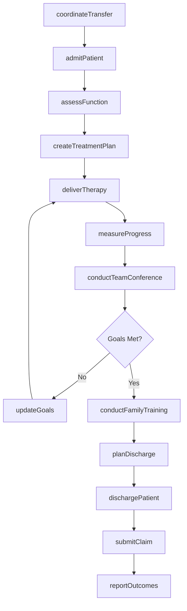
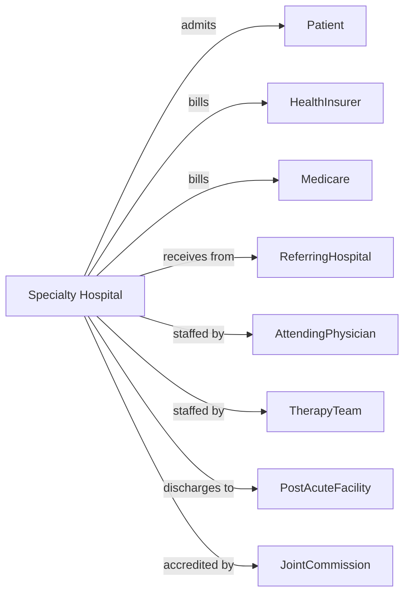

# Specialty (except Psychiatric and Substance Abuse) Hospitals

> Business-as-Code definition for specialty hospital operations. Models the complete inpatient care lifecycle for rehabilitation, long-term acute care, and specialty surgical hospitals.

## Overview

Specialty hospitals provide focused inpatient care for specific conditions including rehabilitation, long-term acute care, cardiac, orthopedic, and cancer treatment. This definition exposes actions for specialized admission, treatment protocols, and outcome measurement, with events for care coordination and quality reporting.

## Actors

| Actor | Description |
|-------|-------------|
| Patient | Individual receiving specialty hospital care |
| HealthInsurer | Provides coverage for specialty services |
| Medicare | Reimburses under specialty payment systems |
| Medicaid | Covers eligible patients for specialty care |
| ReferringHospital | Transfers patients for specialty treatment |
| AttendingPhysician | Directs specialized medical care |
| TherapyTeam | Delivers rehabilitation services |
| PostAcuteFacility | Receives discharged patients |
| HealthRegulatorSurveyor | Inspects and enforces conditions of participation |
| JointCommission | Accredits facility and sets standards |

## Roles

| Role | Description |
|------|-------------|
| MedicalDirector | Oversees clinical programs and quality |
| Physiatrist | Directs rehabilitation medicine programs |
| Intensivist | Manages long-term acute care patients |
| Surgeon | Performs specialty surgical procedures |
| RehabilitationNurse | Delivers specialized nursing care |
| PhysicalTherapist | Provides PT services and functional training |
| OccupationalTherapist | Addresses ADL and functional independence |
| CaseManager | Coordinates care and discharge planning |
| QualityCoordinator | Tracks outcomes and performance measures |

## Entities

| Entity | Description |
|--------|-------------|
| Patient | Individual admitted for specialty care |
| Admission | Hospital stay with specialty focus |
| Program | Specialty treatment program or track |
| TreatmentPlan | Individualized care protocol |
| FunctionalGoal | Measurable rehabilitation objective |
| TherapySession | Rehabilitation treatment encounter |
| OutcomeMeasure | Functional improvement metric |
| FIM | Functional Independence Measure score |
| VentilatorWeaning | Respiratory independence protocol |
| Discharge | End of stay with outcomes |
| CMG | Case Mix Group for IRF billing |
| Claim | Insurance billing submission |

## Actions

| Action | Description |
|--------|-------------|
| admitPatient | Initiate specialty hospital stay |
| assessFunction | Evaluate baseline functional status |
| createTreatmentPlan | Develop individualized care protocol |
| deliverTherapy | Provide rehabilitation services |
| conductTeamConference | Hold interdisciplinary care meeting |
| measureProgress | Track functional improvement |
| weanVentilator | Progress respiratory independence |
| performProcedure | Execute specialty surgical intervention |
| updateGoals | Modify treatment objectives based on progress |
| planDischarge | Arrange post-hospital care |
| dischargePatient | Complete stay and document outcomes |
| submitClaim | Send billing to payer |
| reportOutcomes | Submit quality and outcome data |
| coordinateTransfer | Arrange patient transfer from acute hospital |
| conductFamilyTraining | Educate caregivers for discharge |

## Events

| Event | Description |
|-------|-------------|
| patientAdmitted | Specialty stay has begun |
| functionAssessed | Baseline has been evaluated |
| treatmentPlanCreated | Care protocol has been documented |
| therapyDelivered | Rehabilitation session has occurred |
| teamConferenceHeld | Interdisciplinary meeting completed |
| progressMeasured | Functional improvement recorded |
| ventilatorWeaned | Respiratory independence achieved |
| procedureCompleted | Surgical intervention performed |
| goalsUpdated | Treatment objectives modified |
| dischargePlanned | Post-hospital care arranged |
| patientDischarged | Stay has ended |
| claimSubmitted | Billing has been sent |
| outcomesReported | Quality data submitted |
| goalAchieved | Treatment objective met |

## Searches

| Search | Description |
|--------|-------------|
| getCensus | Retrieve current inpatient count by program |
| findPatients | List patients with filters for diagnosis or program |
| getTherapySchedule | Retrieve therapy appointments by date |
| getProgressReports | Find functional improvement data |
| getPendingDischarges | List patients approaching release |
| getOutcomeMetrics | Retrieve quality performance data |
| getVentilatorPatients | Find patients on respiratory support |
| getTeamConferenceSchedule | Retrieve upcoming care meetings |

## Workflow



## Actor Relationships



## Usage

### Calling Actions

```typescript
import { treatSpecialtyPatients } from '@headlessly/treat-specialty-patients'

const hospital = treatSpecialtyPatients()

// Review census and therapy schedule for rehab unit
const census = await hospital.getCensus({ program: 'stroke-rehabilitation' })
const schedule = await hospital.getTherapySchedule({ date: '2024-04-16', program: 'stroke-rehabilitation' })

// Admit rehabilitation patient
const admission = await hospital.admitPatient({
  patientId: 'REH-234567',
  specialtyType: 'inpatient-rehabilitation',
  referringFacility: 'regional-medical-center',
  diagnosis: 'Stroke, left hemiparesis',
  icdCodes: ['I63.9', 'G81.14'],
  program: 'stroke-rehabilitation',
  admissionTime: '2024-04-16T14:00:00'
})

// Assess baseline function
await hospital.assessFunction({
  patientId: 'REH-234567',
  assessmentType: 'FIM',
  scores: {
    eating: 4,
    grooming: 3,
    bathing: 2,
    dressingUpper: 3,
    dressingLower: 2,
    toileting: 3,
    bladderManagement: 5,
    bowelManagement: 6,
    transfers: 3,
    locomotion: 2,
    stairs: 1,
    comprehension: 6,
    expression: 5,
    socialInteraction: 6,
    problemSolving: 5,
    memory: 5
  },
  totalFIM: 61
})

// Create treatment plan
await hospital.createTreatmentPlan({
  patientId: 'REH-234567',
  goals: [
    { domain: 'mobility', objective: 'Walk 150 feet with rolling walker', timeline: '2 weeks' },
    { domain: 'ADL', objective: 'Independent with dressing', timeline: '3 weeks' },
    { domain: 'transfers', objective: 'Standby assist for transfers', timeline: '10 days' }
  ],
  therapyHours: {
    pt: '3 hours/day',
    ot: '3 hours/day',
    slp: '1 hour/day'
  },
  estimatedLOS: '14-21 days'
})

// Deliver therapy and measure progress
await hospital.deliverTherapy({
  patientId: 'REH-234567',
  discipline: 'PT',
  therapist: 'pt-anderson',
  sessionDate: '2024-04-17',
  interventions: ['Gait training', 'Balance exercises', 'Strength training'],
  performance: 'Walked 75 feet with rolling walker, moderate assist',
  duration: 60
})

await hospital.measureProgress({
  patientId: 'REH-234567',
  measureDate: '2024-04-23',
  fimScores: { locomotion: 4, transfers: 5, dressingLower: 4 },
  notes: 'Significant improvement in mobility and transfers'
})
```

### Event-Driven Automation

```typescript
// Schedule team conference weekly
hospital.patientAdmitted(async ({ patientId, admissionDate }) => {
  await hospital.scheduleTeamConference({
    patientId,
    frequency: 'weekly',
    firstConference: addDays(admissionDate, 7)
  })
})

// Alert for goal achievement
hospital.progressMeasured(async ({ patientId, fimScores }) => {
  const goals = await hospital.getGoals({ patientId })

  for (const goal of goals) {
    if (fimScores[goal.domain] >= goal.targetScore) {
      await hospital.goalAchieved({
        patientId,
        goal: goal.id,
        achievementDate: new Date()
      })
    }
  }
})

// Initiate discharge planning at midpoint
hospital.progressMeasured(async ({ patientId, dayOfStay, estimatedLOS }) => {
  if (dayOfStay >= estimatedLOS / 2) {
    await hospital.planDischarge({
      patientId,
      initiateProcess: true,
      evaluateHomeSetup: true
    })
  }
})
```
