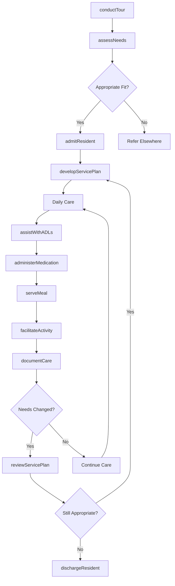
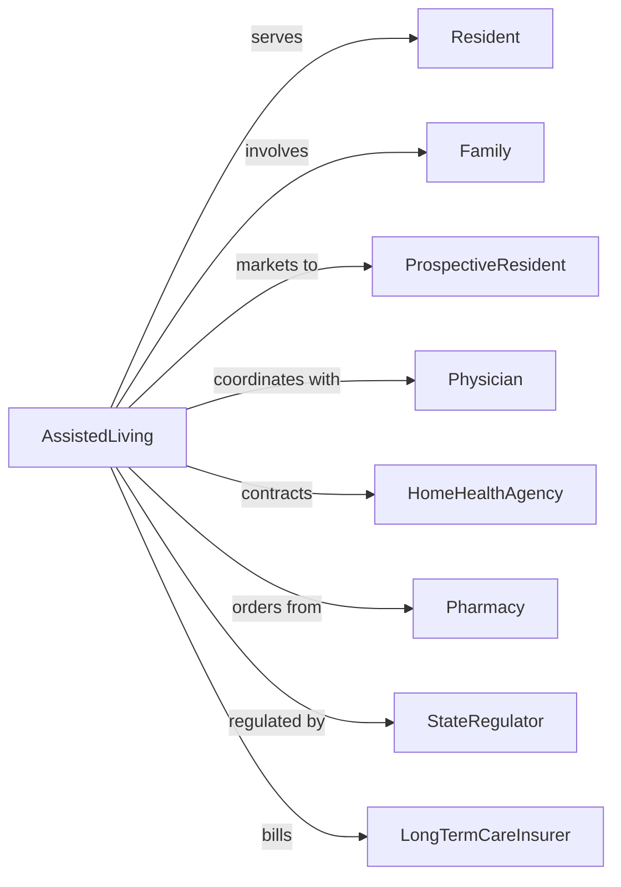

# Assisted Living Facilities for the Elderly

> Business-as-Code definition for assisted living operations. Models the complete resident experience from admission through daily living support, activities, and care coordination.

## Overview

Assisted living facilities provide residential care for elderly individuals who need help with daily activities but do not require 24-hour skilled nursing. This definition exposes actions for personal care assistance, events for resident monitoring, and searches for occupancy and service management.

## Actors

| Actor | Description |
|-------|-------------|
| Resident | Elderly individual receiving care |
| Family | Resident's support network and decision makers |
| ProspectiveResident | Individual considering the facility |
| Physician | Provides medical oversight |
| HomeHealthAgency | Delivers supplemental healthcare services |
| Pharmacy | Provides medication management |
| StateRegulator | Licenses and inspects facility |
| LongTermCareInsurer | Pays for covered services |

## Roles

| Role | Description |
|------|-------------|
| ExecutiveDirector | Oversees facility operations |
| ResidentCareDirector | Manages care services |
| MedicationAide | Administers medications |
| CaregiverAide | Provides personal care assistance |
| ActivitiesCoordinator | Plans resident programs |
| DiningServicesManager | Oversees meal preparation |
| SalesCoordinator | Handles marketing and admissions |
| MaintenanceDirector | Maintains facility and grounds |

## Entities

| Entity | Description |
|--------|-------------|
| Resident | Individual living in facility |
| Apartment | Resident living unit |
| ServicePlan | Documented care needs and services |
| Assessment | Evaluation of resident needs |
| MedicationRecord | Documentation of administered medications |
| DailyLog | Record of care and observations |
| Activity | Scheduled program or event |
| Meal | Dining service provision |
| Invoice | Monthly billing statement |
| IncidentReport | Documentation of falls or events |
| WaitList | Queue for prospective residents |
| Contract | Residency agreement |

## Actions

| Action | Description |
|--------|-------------|
| conductTour | Show facility to prospective resident |
| assessNeeds | Evaluate care requirements |
| admitResident | Process move-in |
| developServicePlan | Create personalized care approach |
| assistWithADLs | Help with bathing, dressing, grooming |
| administerMedication | Give prescribed medications |
| serveMeal | Provide dining services |
| facilitateActivity | Lead programs and events |
| documentCare | Record daily observations |
| coordinateHealthcare | Arrange medical appointments |
| respondToEmergency | Handle urgent situations |
| reviewServicePlan | Update care approach |
| billResident | Send monthly charges |
| dischargeResident | Process move-out |

## Events

| Event | Description |
|-------|-------------|
| tourCompleted | Prospect visited facility |
| needsAssessed | Care evaluation completed |
| residentAdmitted | New resident moved in |
| servicePlanDeveloped | Care approach documented |
| careProvided | Daily assistance given |
| medicationAdministered | Medication given |
| mealServed | Dining completed |
| activityAttended | Resident participated |
| careDocumented | Daily log updated |
| incidentOccurred | Fall or event happened |
| emergencyResponded | Urgent situation handled |
| servicePlanReviewed | Care updated |
| invoiceSent | Monthly charges billed |
| needsChanged | Resident care requirements have been identified as different from current plan |
| residentDischarged | Resident left facility |

## Searches

| Search | Description |
|--------|-------------|
| findResidents | List residents by status or needs |
| getOccupancy | View apartment availability |
| getServicePlans | Retrieve care documentation |
| findMedicationRecords | List medication history |
| getActivities | View scheduled programs |
| findIncidents | List incidents by type or date |
| getBillingStatus | Check payment history |
| getWaitList | View prospective resident queue |

## Workflow



## Actor Relationships



## Usage

### Calling Actions

```typescript
import { assistSeniors } from '@headlessly/assist-seniors'

const facility = assistSeniors()

// Check occupancy and waitlist before new admission
const occupancy = await facility.getOccupancy({ apartmentType: 'one-bedroom' })
const waitlist = await facility.getWaitList({ serviceLevel: 'level2' })

// Assess prospective resident needs
const assessment = await facility.assessNeeds({
  prospectId: 'prospect-789',
  adlNeeds: ['bathing', 'dressing', 'medicationManagement'],
  mobilityLevel: 'ambulatoryWithDevice',
  cognitiveStatus: 'mildImpairment',
  socialPreferences: ['groupActivities', 'diningRoom']
})

// Admit resident
const resident = await facility.admitResident({
  assessmentId: assessment.id,
  apartmentId: 'apt-302',
  moveInDate: '2024-04-15',
  monthlyRate: 5200,
  serviceLevel: 'level2'
})

// Develop service plan
await facility.developServicePlan({
  residentId: resident.id,
  services: [
    { type: 'bathingAssistance', frequency: 'daily' },
    { type: 'dressingAssistance', frequency: 'daily' },
    { type: 'medicationAdministration', frequency: 'scheduled' }
  ],
  preferences: { wakeTime: '07:30', mealSeating: 'table-4' }
})
```

### Event-Driven Automation

```typescript
// Alert on incident
facility.incidentOccurred(async ({ residentId, incidentType, severity }) => {
  await facility.respondToEmergency({
    residentId,
    type: incidentType,
    responseLevel: severity === 'major' ? 'ems' : 'internal'
  })

  await notifyFamily({
    residentId,
    message: `Incident reported: ${incidentType}`,
    severity
  })
})

// Auto-review service plan on needs change
facility.needsChanged(async ({ residentId, newNeeds, changeDate }) => {
  await facility.reviewServicePlan({
    residentId,
    reason: 'needsChange',
    effectiveDate: changeDate,
    proposedChanges: newNeeds
  })

  await scheduleCareMeeting({
    residentId,
    attendees: ['family', 'careDirector', 'physician']
  })
})
```

## Related

- [Continuing Care Retirement Communities](./623311-ContinuingCareRetirementCommunities.mdx)
- [Other Residential Care Facilities](../6239-OtherResidentialCareFacilities/623990-OtherResidentialCareFacilities.mdx)
