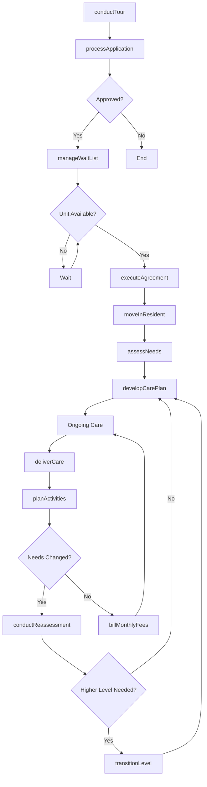
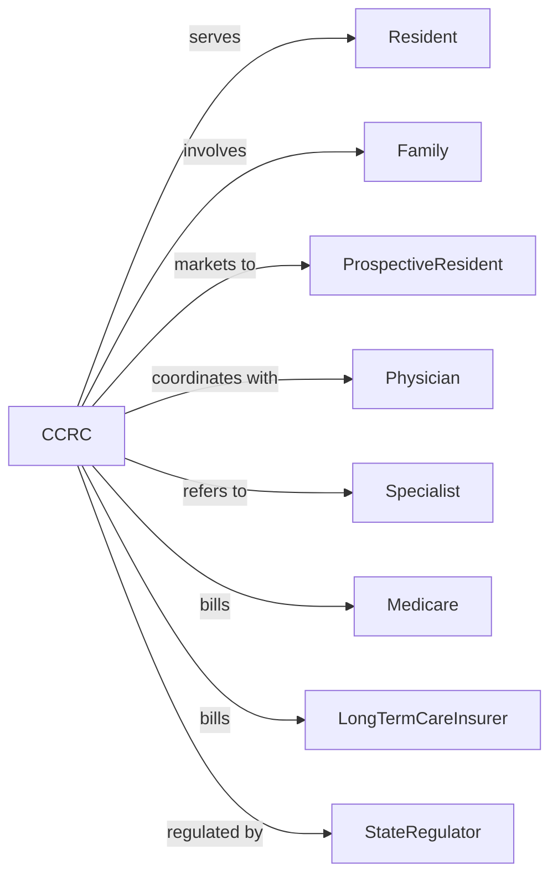

# Continuing Care Retirement Communities

> Business-as-Code definition for continuing care retirement community operations. Models the complete resident lifecycle from independent living through assisted care and skilled nursing.

## Overview

Continuing care retirement communities provide a continuum of housing and care services allowing residents to age in place, transitioning from independent living through assisted living to skilled nursing as needs change. This definition exposes actions for resident management, events for care transitions, and searches for occupancy and health monitoring.

## Actors

| Actor | Description |
|-------|-------------|
| Resident | Individual living in the community |
| Family | Resident's support network |
| ProspectiveResident | Individual considering the community |
| Physician | Provides medical oversight |
| Specialist | Delivers specialty medical services |
| Medicare | Federal healthcare payer |
| LongTermCareInsurer | Covers assisted living and nursing costs |
| StateRegulator | Licenses and oversees facility |

## Roles

| Role | Description |
|------|-------------|
| ExecutiveDirector | Oversees community operations |
| DirectorOfNursing | Manages skilled nursing services |
| ResidentServicesDirector | Coordinates resident activities and services |
| SalesDirector | Manages marketing and admissions |
| SocialWorker | Assists with transitions and resources |
| RegisteredNurse | Provides skilled nursing care |
| CertifiedNurseAide | Delivers personal care assistance |
| ActivitiesDirector | Plans programs and events |

## Entities

| Entity | Description |
|--------|-------------|
| Resident | Individual living in community |
| Unit | Apartment, cottage, or room |
| LevelOfCare | Independent, assisted, or skilled nursing |
| ResidencyAgreement | Contract for housing and services |
| CarePlan | Documented care needs and services |
| Assessment | Evaluation of resident health and function |
| EntranceFee | Upfront payment for admission |
| MonthlyFee | Ongoing service charges |
| WaitList | Queue for prospective residents |
| Activity | Scheduled program or event |
| Meal | Dining service |
| HealthRecord | Medical documentation |

## Actions

| Action | Description |
|--------|-------------|
| conductTour | Show community to prospective resident |
| processApplication | Evaluate prospective resident |
| executeAgreement | Sign residency contract |
| moveInResident | Transition resident to unit |
| assessNeeds | Evaluate resident care requirements |
| developCarePlan | Create personalized care approach |
| deliverCare | Provide nursing and personal care |
| transitionLevel | Move resident to different care level |
| coordinateMedical | Arrange healthcare appointments |
| planActivities | Schedule programs and events |
| billMonthlyFees | Charge for ongoing services |
| manageWaitList | Track prospective residents |
| conductReassessment | Evaluate changing care needs |
| planDischarge | Coordinate transition out of community |

## Events

| Event | Description |
|-------|-------------|
| tourCompleted | Prospect visited community |
| applicationReceived | Prospect applied for admission |
| applicationApproved | Prospect accepted |
| agreementExecuted | Contract signed |
| residentMovedIn | New resident arrived |
| assessmentCompleted | Needs evaluation finished |
| carePlanDeveloped | Care approach documented |
| levelTransitioned | Resident moved care levels |
| careDelivered | Services provided |
| activityAttended | Resident participated in program |
| monthlyFeesBilled | Charges sent |
| waitListUpdated | Queue position changed |
| healthStatusChanged | Resident condition changed |
| residentDischarged | Resident left community |

## Searches

| Search | Description |
|--------|-------------|
| findResidents | List residents by level or status |
| getOccupancy | View unit availability by type |
| getCarePlans | Retrieve care documentation |
| findAssessments | List evaluations by date |
| getWaitList | View prospective resident queue |
| getActivities | List scheduled programs |
| getBillingStatus | Check fee collection |
| getHealthMetrics | View resident health indicators |

## Workflow



## Actor Relationships



## Usage

### Calling Actions

```typescript
import { serveRetirees } from '@headlessly/serve-retirees'

const community = serveRetirees()

// Conduct tour for prospective resident
const tour = await community.conductTour({
  prospectId: 'prospect-456',
  tourDate: '2024-04-15',
  interestedLevels: ['independentLiving', 'assistedLiving'],
  financialQualification: 'verified'
})

// Process application
const application = await community.processApplication({
  prospectId: 'prospect-456',
  desiredLevel: 'independentLiving',
  desiredUnitType: 'oneBedroomCottage',
  entranceFeeType: 'lifecare',
  healthAssessment: 'approved'
})

// Execute residency agreement
await community.executeAgreement({
  applicationId: application.id,
  entranceFee: 350000,
  monthlyFee: 4500,
  unitId: 'cottage-204',
  moveInDate: '2024-06-01'
})
```

### Event-Driven Automation

```typescript
// Trigger reassessment on health change
community.healthStatusChanged(async ({ residentId, changeType, severity }) => {
  if (severity === 'significant') {
    await community.conductReassessment({
      residentId,
      reason: 'healthStatusChange',
      urgency: 'expedited'
    })
  }
})

// Coordinate level transition
community.levelTransitioned(async ({ residentId, fromLevel, toLevel, newUnitId }) => {
  await community.developCarePlan({
    residentId,
    levelOfCare: toLevel,
    effectiveDate: new Date()
  })

  await notifyFamily({
    residentId,
    message: `Resident transitioned from ${fromLevel} to ${toLevel}`,
    newUnit: newUnitId
  })
})
```

## Related

- [Assisted Living Facilities for the Elderly](./623312-AssistedLivingFacilitiesForTheElderly.mdx)
- [Other Residential Care Facilities](../6239-OtherResidentialCareFacilities/623990-OtherResidentialCareFacilities.mdx)
