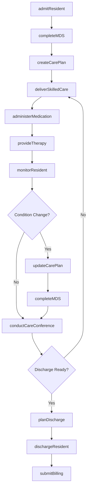
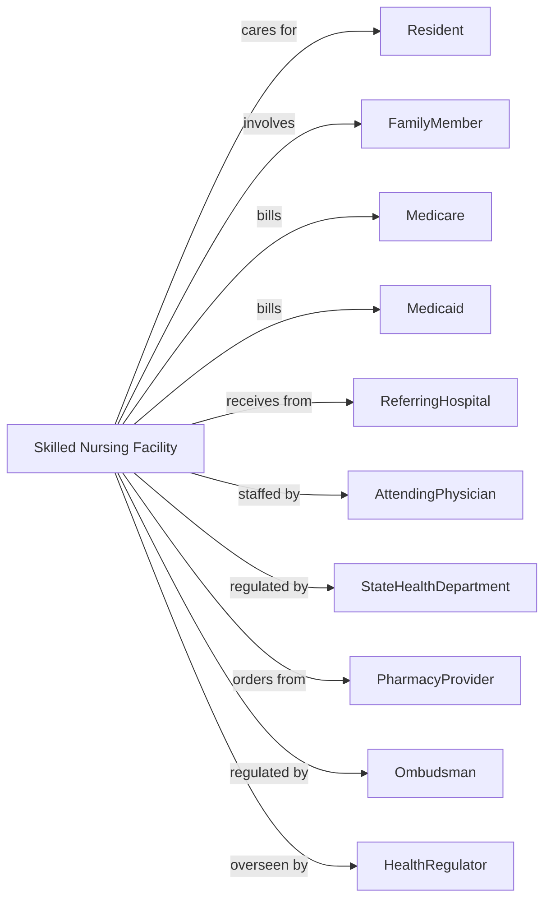

# Nursing Care Facilities (Skilled Nursing Facilities)

> Business-as-Code definition for skilled nursing facility operations. Models the complete resident care lifecycle from admission through long-term care and discharge planning.

## Overview

Skilled nursing facilities provide 24-hour nursing care and rehabilitation services for residents requiring extended medical supervision. This definition exposes actions for resident admission, care planning, therapy delivery, and MDS assessment, with events for quality monitoring and regulatory compliance.

## Actors

| Actor | Description |
|-------|-------------|
| Resident | Individual receiving skilled nursing care |
| FamilyMember | Participates in care decisions and visits |
| Medicare | Reimburses for post-acute skilled care |
| Medicaid | Covers long-term care for eligible residents |
| ReferringHospital | Transfers patients for post-acute care |
| AttendingPhysician | Directs medical care for residents |
| Ombudsman | Advocates for resident rights |
| StateHealthDepartment | Surveys facility and enforces regulations |
| HealthRegulator | Oversees Medicare certification and quality |
| PharmacyProvider | Supplies medications and reviews regimens |

## Roles

| Role | Description |
|------|-------------|
| Administrator | Oversees facility operations |
| DirectorOfNursing | Manages nursing staff and clinical quality |
| MDS Coordinator | Completes required assessment documentation |
| RegisteredNurse | Delivers skilled nursing care |
| LPN | Provides licensed nursing care |
| CNA | Delivers personal care and ADL assistance |
| PhysicalTherapist | Provides rehabilitation services |
| SocialWorker | Coordinates discharge and family involvement |
| Dietitian | Manages nutrition and dietary needs |
| Activities Director | Plans therapeutic recreation programs |

## Entities

| Entity | Description |
|--------|-------------|
| Resident | Individual living in facility |
| Admission | Entry into facility with payer source |
| Room | Physical bed assignment |
| CarePlan | Comprehensive care document |
| MDS | Minimum Data Set assessment |
| Medication | Drug administered to resident |
| TherapyOrder | Rehabilitation service prescription |
| Incident | Falls, injuries, or adverse events |
| Survey | State inspection findings |
| CaseMixGroup | RUG category for Medicare billing |
| Discharge | Exit from facility with disposition |
| QualityMeasure | CMS Five Star rating metric |

## Actions

| Action | Description |
|--------|-------------|
| admitResident | Process new resident intake |
| completeMDS | Document required assessment |
| createCarePlan | Develop comprehensive care plan |
| deliverSkilledCare | Provide skilled nursing services |
| administerMedication | Give prescribed medications |
| provideTherapy | Deliver PT, OT, or SLP services |
| monitorResident | Track health status and changes |
| conductCareConference | Hold family and team meeting |
| reportIncident | Document falls or adverse events |
| planDischarge | Arrange transition from facility |
| dischargeResident | Complete exit from facility |
| submitBilling | Send claims to Medicare or Medicaid |
| prepareForSurvey | Ready facility for state inspection |
| conductQAPI | Perform quality improvement activities |
| updateCarePlan | Modify care based on changes |

## Events

| Event | Description |
|-------|-------------|
| residentAdmitted | New resident has arrived |
| MDScompleted | Assessment has been documented |
| carePlanCreated | Care plan has been established |
| skilledCareDelivered | Nursing service has been provided |
| medicationAdministered | Drug has been given |
| therapyProvided | Rehabilitation session completed |
| conditionChanged | Health status has shifted |
| incidentOccurred | Fall or adverse event happened |
| careConferenceHeld | Family meeting has occurred |
| dischargePlanned | Exit has been arranged |
| residentDischarged | Exit has been completed |
| surveyCompleted | State inspection has concluded |
| deficiencyCited | Survey finding has been issued |
| billingSubmitted | Claim has been sent |

## Searches

| Search | Description |
|--------|-------------|
| getCensus | Retrieve current resident count by unit |
| findResidents | List residents with filters for payer or condition |
| getMDSdueList | Find assessments needing completion |
| getCarePlans | Retrieve care plans for residents |
| getIncidentReports | Find adverse event documentation |
| getTherapySchedule | Retrieve rehabilitation appointments |
| getDischargeReady | List residents preparing to leave |
| getQualityMetrics | Retrieve Five Star rating data |

## Workflow



## Actor Relationships



## Usage

### Calling Actions

```typescript
import { careElderly } from '@headlessly/care-elderly'

const facility = careElderly()

// Check census and MDS assessments due
const census = await facility.getCensus({ unit: 'rehab-wing' })
const mdsDue = await facility.getMDSdueList({ dueWithin: '7-days' })

// Admit new resident from hospital
const admission = await facility.admitResident({
  residentId: 'RES-345678',
  admissionSource: 'acute-hospital',
  referringFacility: 'regional-medical-center',
  payerSource: 'medicare-part-a',
  diagnoses: ['Hip fracture s/p ORIF', 'Hypertension', 'Type 2 diabetes'],
  room: '204-A',
  admissionDate: '2024-04-18'
})

// Complete MDS assessment
await facility.completeMDS({
  residentId: 'RES-345678',
  assessmentType: 'admission',
  assessmentReferenceDate: '2024-04-25',
  sections: {
    cognition: { bims: 13 },
    adl: { bedMobility: 3, transfer: 3, eating: 1, toileting: 3 },
    skinConditions: { pressureUlcer: false },
    medications: { count: 12 },
    therapyNeeds: { pt: true, ot: true, slp: false }
  }
})

// Create care plan
await facility.createCarePlan({
  residentId: 'RES-345678',
  problems: [
    { focus: 'Impaired mobility', goal: 'Walk 100 feet with walker', interventions: ['PT 5x/week', 'Ambulate TID'] },
    { focus: 'Fall risk', goal: 'No falls during stay', interventions: ['Bed alarm', 'Call light in reach', 'Non-skid footwear'] },
    { focus: 'Diabetes management', goal: 'Blood sugar 80-180', interventions: ['Sliding scale insulin', 'Diabetic diet', 'AC/HS glucose monitoring'] }
  ],
  careConferenceDate: '2024-04-25'
})

// Deliver skilled care
await facility.deliverSkilledCare({
  residentId: 'RES-345678',
  serviceDate: '2024-04-20',
  services: [
    { type: 'wound-care', site: 'surgical-incision', findings: 'Clean, dry, intact' },
    { type: 'medication-management', notes: 'Reviewed diabetes regimen with physician' }
  ],
  nurse: 'rn-smith'
})

// Provide therapy
await facility.provideTherapy({
  residentId: 'RES-345678',
  discipline: 'PT',
  therapist: 'pt-johnson',
  sessionDate: '2024-04-20',
  interventions: ['Gait training with rolling walker', 'Hip strengthening exercises'],
  performance: 'Ambulated 50 feet with moderate assist',
  duration: 45
})
```

### Event-Driven Automation

```typescript
// Alert for condition changes
facility.conditionChanged(async ({ residentId, changeType }) => {
  await facility.updateCarePlan({
    residentId,
    reason: changeType,
    reviewWithPhysician: true
  })

  if (changeType === 'significant') {
    await facility.completeMDS({
      residentId,
      assessmentType: 'significant-change'
    })
  }
})

// Track MDS due dates
facility.residentAdmitted(async ({ residentId, admissionDate }) => {
  await facility.scheduleMDS({
    residentId,
    assessments: [
      { type: '5-day', dueDate: addDays(admissionDate, 8) },
      { type: '14-day', dueDate: addDays(admissionDate, 14) },
      { type: '30-day', dueDate: addDays(admissionDate, 30) }
    ]
  })
})

// Report incidents immediately
facility.incidentOccurred(async ({ residentId, incidentType }) => {
  await facility.reportIncident({
    residentId,
    incidentType,
    immediateAction: 'assessed-by-nurse',
    notifyFamily: true,
    notifyPhysician: true
  })
})
```
