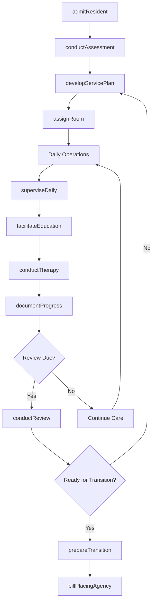
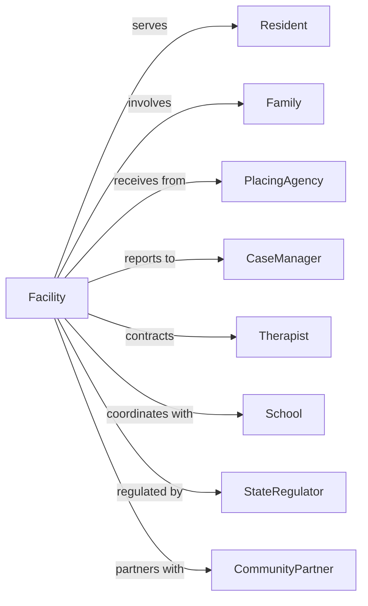

# Other Residential Care Facilities

> Business-as-Code definition for specialized residential care operations. Models group homes and residential programs for diverse populations including youth, the hearing impaired, and others requiring supervised living.

## Overview

Other residential care facilities provide supervised residential settings for populations not served by IDD, mental health, or elderly care facilities. This includes group homes for youth, deaf individuals, and others needing structured living environments. This definition exposes actions for resident care, events for program monitoring, and searches for census and compliance management.

## Actors

| Actor | Description |
|-------|-------------|
| Resident | Individual living in the facility |
| Family | Resident's support network |
| PlacingAgency | Government or private entity referring residents |
| CaseManager | Coordinates services and monitors progress |
| Therapist | Provides counseling or specialized services |
| School | Educational institution resident attends |
| StateRegulator | Licenses and inspects facility |
| CommunityPartner | Local organizations providing support |

## Roles

| Role | Description |
|------|-------------|
| ExecutiveDirector | Oversees facility operations |
| ProgramDirector | Manages resident programs |
| HouseParent | Provides daily supervision and care |
| ResidentialCounselor | Supports residents and implements plans |
| SocialWorker | Coordinates services and family contact |
| NightSupervisor | Provides overnight monitoring |
| MaintenanceStaff | Maintains facility and grounds |
| AdministrativeCoordinator | Handles billing and documentation |

## Entities

| Entity | Description |
|--------|-------------|
| Resident | Individual living in facility |
| ServicePlan | Documented care goals and services |
| Room | Resident living space |
| Placement | Arrangement with referring agency |
| Assessment | Evaluation of resident needs |
| ProgressReport | Documentation of resident advancement |
| IncidentReport | Documentation of significant events |
| Shift | Staff work period |
| Activity | Scheduled program or outing |
| Invoice | Bill for services |
| ComplianceDocument | Regulatory filing |
| FamilyVisit | Scheduled contact with family |

## Actions

| Action | Description |
|--------|-------------|
| admitResident | Process new resident intake |
| conductAssessment | Evaluate resident needs |
| developServicePlan | Create care approach |
| assignRoom | Place resident in living space |
| superviseDaily | Provide structure and oversight |
| facilitateEducation | Support school attendance |
| conductTherapy | Provide or coordinate counseling |
| documentProgress | Record resident advancement |
| coordinateFamily | Arrange visits and communication |
| manageBehavior | Implement behavior strategies |
| fileIncident | Report significant events |
| conductReview | Update service plan |
| prepareTransition | Plan for discharge or aging out |
| billPlacingAgency | Invoice for services |

## Events

| Event | Description |
|-------|-------------|
| residentAdmitted | New individual began residence |
| assessmentCompleted | Evaluation finished |
| servicePlanDeveloped | Care plan created |
| roomAssigned | Living space allocated |
| progressDocumented | Advancement recorded |
| incidentOccurred | Significant event happened |
| familyVisitCompleted | Contact occurred |
| therapyCompleted | Counseling session finished |
| reviewConducted | Service plan updated |
| transitionPlanned | Discharge preparation started |
| residentTransitioned | Individual left facility |
| billingSubmitted | Invoice sent |
| inspectionPassed | Regulatory review completed |
| agingOutApproaching | Resident is nearing the age threshold for transition out of the program |
| staffShiftChanged | Personnel rotation occurred |

## Searches

| Search | Description |
|--------|-------------|
| findResidents | List residents by status or placement |
| getCensus | View current occupancy |
| getServicePlans | Retrieve care documentation |
| findIncidents | List incidents by type or date |
| getStaffSchedule | View shift assignments |
| findPlacements | List active arrangements |
| getProgressReports | Retrieve advancement documentation |
| getComplianceStatus | Check regulatory requirements |

## Workflow



## Actor Relationships



## Usage

### Calling Actions

```typescript
import { shelterResidents } from '@headlessly/shelter-residents'

const facility = shelterResidents()

// Review census and compliance status
const census = await facility.getCensus({ facility: 'sunrise-house' })
const compliance = await facility.getComplianceStatus({ dueWithin: '30-days' })

// Admit new resident
const resident = await facility.admitResident({
  name: 'Alex Johnson',
  dateOfBirth: '2008-03-15',
  placingAgencyId: 'dcs-region-5',
  reason: 'fosterCareTransition',
  specialNeeds: ['hearingImpaired']
})

// Conduct intake assessment
const assessment = await facility.conductAssessment({
  residentId: resident.id,
  assessmentType: 'intake',
  domains: ['behavioral', 'educational', 'social'],
  assessor: 'sw-001'
})

// Develop service plan
await facility.developServicePlan({
  residentId: resident.id,
  assessmentId: assessment.id,
  goals: [
    { area: 'education', objective: 'maintainGradeLevel', targetDate: '2024-12-01' },
    { area: 'lifeskills', objective: 'independentMealPrep', targetDate: '2024-10-01' }
  ]
})
```

### Event-Driven Automation

```typescript
// Notify on incident
facility.incidentOccurred(async ({ residentId, incidentType, severity }) => {
  await facility.fileIncident({
    residentId,
    type: incidentType,
    severity,
    reportedDate: new Date()
  })

  if (severity === 'major') {
    await notifyPlacingAgency({
      residentId,
      reportType: 'criticalIncident'
    })
  }
})

// Trigger transition planning
facility.agingOutApproaching(async ({ residentId, turnsEighteen }) => {
  await facility.prepareTransition({
    residentId,
    transitionType: 'agingOut',
    targetDate: turnsEighteen,
    services: ['housingAssistance', 'employmentSupport', 'independentLiving']
  })
})
```

## Related

- [Residential Mental Health and Substance Abuse Facilities](../6232-ResidentialIntellectualAndDevelopmentalDisabilityMentalHealthAndSubstanceAbuseFacilities/623220-ResidentialMentalHealthAndSubstanceAbuseFacilities.mdx)
- [Child and Youth Services](../../624-SocialAssistance/6241-IndividualAndFamilyServices/624110-ChildAndYouthServices.mdx)
