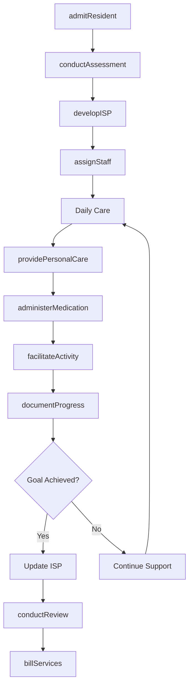
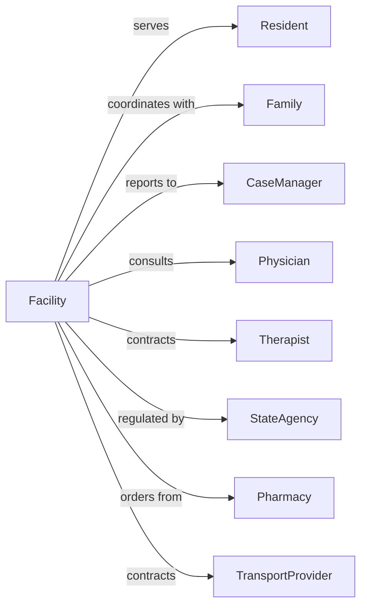

# Residential Intellectual and Developmental Disability Facilities

> Business-as-Code definition for IDD residential care operations. Models the complete lifecycle from intake through daily living support, skill development, and care coordination.

## Overview

Residential intellectual and developmental disability facilities provide room, board, and supervised care for individuals with conditions such as autism, Down syndrome, and other developmental disabilities. This definition exposes actions for person-centered care, events for progress tracking, and searches for resident and compliance management.

## Actors

| Actor | Description |
|-------|-------------|
| Resident | Individual receiving residential care services |
| Family | Resident's legal guardians or family members |
| CaseManager | Coordinates services and funding |
| Physician | Provides medical oversight and prescriptions |
| Therapist | Delivers PT, OT, speech, or behavioral therapy |
| StateAgency | Funds and regulates IDD services |
| Pharmacy | Dispenses medications for residents |
| TransportProvider | Provides transportation to activities |

## Roles

| Role | Description |
|------|-------------|
| ExecutiveDirector | Oversees facility operations |
| ProgramDirector | Manages resident programs and services |
| QualifiedIntellectualDisabilitiesProfessional | Leads care planning and assessments |
| DirectSupportProfessional | Provides daily care and supervision |
| HouseManager | Manages specific residence operations |
| Nurse | Administers medications and health monitoring |
| BehaviorSpecialist | Develops behavior support plans |
| AdministrativeCoordinator | Handles billing and documentation |

## Entities

| Entity | Description |
|--------|-------------|
| Resident | Individual living in the facility |
| IndividualSupportPlan | Personalized care and goal document |
| Assessment | Evaluation of resident needs and abilities |
| GoalObjective | Specific measurable target for skill development |
| MedicationRecord | Documentation of administered medications |
| IncidentReport | Documentation of injuries or behaviors |
| BehaviorPlan | Strategies for managing challenging behaviors |
| Shift | Staff work period |
| Room | Resident living space |
| Activity | Scheduled program or outing |
| Invoice | Bill for services rendered |
| ComplianceDocument | Regulatory filing or certification |

## Actions

| Action | Description |
|--------|-------------|
| admitResident | Process new resident intake |
| conductAssessment | Evaluate resident needs and abilities |
| developISP | Create individualized support plan |
| assignStaff | Schedule direct support professionals |
| providePersonalCare | Assist with bathing, dressing, and hygiene |
| administerMedication | Give prescribed medications |
| facilitateActivity | Lead skills training or recreation |
| documentProgress | Record goal achievement data |
| manageBehavior | Implement behavior support strategies |
| coordinateMedical | Arrange healthcare appointments |
| fileIncident | Report and document incidents |
| conductReview | Evaluate ISP progress and update goals |
| billServices | Submit claims for reimbursement |
| trainStaff | Provide required certifications |

## Events

| Event | Description |
|-------|-------------|
| residentAdmitted | New individual began residence |
| assessmentCompleted | Evaluation finished |
| ispDeveloped | Support plan created |
| ispReviewed | Annual plan update completed |
| goalAchieved | Resident met objective |
| medicationAdministered | Medication given |
| incidentOccurred | Reportable event happened |
| incidentReported | Incident documented and filed |
| behaviorEpisode | Challenging behavior occurred |
| appointmentCompleted | Medical visit finished |
| staffAssigned | DSP scheduled to shift |
| billingSubmitted | Claim sent to payer |
| inspectionPassed | Regulatory review completed |
| residentDischarged | Individual left facility |

## Searches

| Search | Description |
|--------|-------------|
| findResidents | List residents by status or home |
| getISPs | Retrieve support plans by review date |
| findStaffSchedule | View shift assignments |
| getGoalProgress | Track objective achievement |
| getMedicationRecords | Retrieve administration history |
| findIncidents | List incidents by type or date |
| getComplianceStatus | Check regulatory requirements |
| getBillingHistory | Retrieve submitted claims |

## Workflow



## Actor Relationships



## Usage

### Calling Actions

```typescript
import { careIDDResident } from '@headlessly/care-idd-resident'

const facility = careIDDResident()

// Review ISPs due for review and current residents
const ispsDue = await facility.getISPs({ reviewDueWithin: '30-days' })
const residents = await facility.findResidents({ home: 'sunrise-house', status: 'active' })

// Admit new resident
const resident = await facility.admitResident({
  name: 'John Smith',
  dateOfBirth: '1990-05-15',
  diagnosis: ['autism', 'intellectualDisability'],
  guardianId: 'guardian-123',
  fundingSource: 'medicaidWaiver',
  homeAssignment: 'sunrise-house'
})

// Conduct functional assessment
const assessment = await facility.conductAssessment({
  residentId: resident.id,
  assessmentType: 'functional',
  domains: ['selfCare', 'communication', 'socialSkills'],
  assessor: 'qidp-001'
})

// Develop individualized support plan
await facility.developISP({
  residentId: resident.id,
  assessmentId: assessment.id,
  goals: [
    { domain: 'selfCare', objective: 'independentTeethBrushing', targetDate: '2024-10-01' },
    { domain: 'communication', objective: 'useAAC', targetDate: '2024-12-01' }
  ]
})
```

### Event-Driven Automation

```typescript
// Track goal achievement
facility.goalAchieved(async ({ residentId, goalId, achievementDate }) => {
  await facility.documentProgress({
    residentId,
    goalId,
    status: 'achieved',
    date: achievementDate
  })

  await notifyTeam({
    residentId,
    message: 'Goal achieved! Schedule ISP review to set new objectives.'
  })
})

// Auto-report incidents
facility.incidentOccurred(async ({ residentId, incidentType, severity }) => {
  await facility.fileIncident({
    residentId,
    type: incidentType,
    severity,
    reportedDate: new Date()
  })

  if (severity === 'major') {
    await notifyStateAgency({
      reportType: 'criticalIncident',
      residentId
    })
  }
})
```

## Related

- [Residential Mental Health and Substance Abuse Facilities](./623220-ResidentialMentalHealthAndSubstanceAbuseFacilities.mdx)
- [Assisted Living Facilities for the Elderly](../6233-ContinuingCareRetirementCommunitiesAndAssistedLivingFacilitiesForTheElderly/623312-AssistedLivingFacilitiesForTheElderly.mdx)
