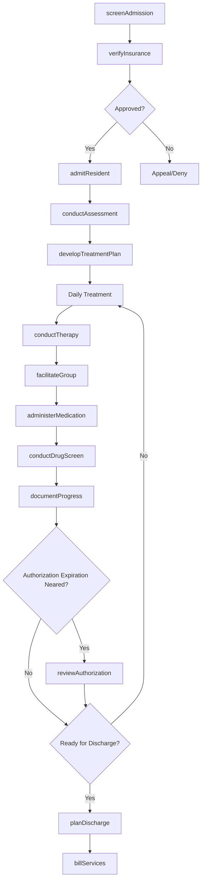
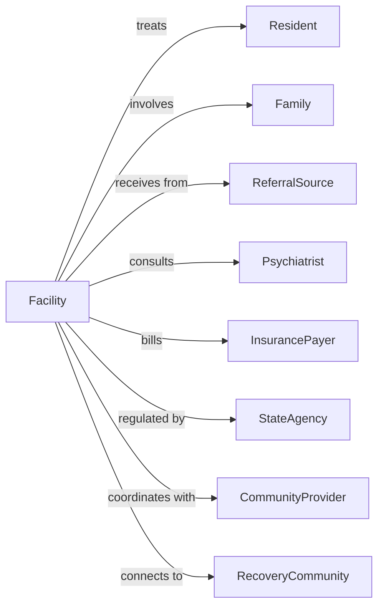

# Residential Mental Health and Substance Abuse Facilities

> Business-as-Code definition for residential treatment operations. Models the complete recovery journey from admission through treatment, counseling, and transition to independent living.

## Overview

Residential mental health and substance abuse facilities provide 24-hour supervised care and treatment for individuals recovering from mental illness or addiction. This definition exposes actions for therapeutic programming, events for recovery tracking, and searches for census and compliance management.

## Actors

| Actor | Description |
|-------|-------------|
| Resident | Individual receiving residential treatment |
| Family | Resident's support system |
| ReferralSource | Hospital, court, or agency making referral |
| Psychiatrist | Provides psychiatric evaluation and medication |
| InsurancePayer | Funds treatment services |
| StateAgency | Licenses and regulates facility |
| CommunityProvider | Outpatient services for post-discharge |
| RecoveryCommunity | Peer support organizations |

## Roles

| Role | Description |
|------|-------------|
| ExecutiveDirector | Oversees facility operations |
| ClinicalDirector | Manages treatment programming |
| LicensedCounselor | Provides individual and group therapy |
| CaseManager | Coordinates care and discharge planning |
| ResidentialAide | Provides 24-hour supervision and support |
| Nurse | Manages medications and health monitoring |
| PeerSpecialist | Shares lived experience for support |
| AdmissionsCoordinator | Processes intake and insurance verification |

## Entities

| Entity | Description |
|--------|-------------|
| Resident | Individual in treatment |
| TreatmentPlan | Individualized recovery goals and interventions |
| Assessment | Clinical evaluation of needs |
| TherapySession | Individual or group counseling |
| MedicationRecord | Documentation of prescribed medications |
| DrugScreen | Substance use testing result |
| ProgressNote | Clinical documentation of treatment |
| LevelOfCare | Intensity of services provided |
| Discharge | Transition out of residential care |
| Bed | Available residential capacity |
| InsuranceAuthorization | Approval for treatment days |
| ComplianceDocument | Regulatory filing |

## Actions

| Action | Description |
|--------|-------------|
| screenAdmission | Evaluate appropriateness for program |
| verifyInsurance | Confirm coverage and obtain authorization |
| admitResident | Process intake and orientation |
| conductAssessment | Complete clinical evaluation |
| developTreatmentPlan | Create recovery goals and interventions |
| conductTherapy | Provide individual or group counseling |
| facilitateGroup | Lead psychoeducational or process groups |
| administerMedication | Give prescribed medications |
| conductDrugScreen | Test for substance use |
| documentProgress | Write clinical notes |
| reviewAuthorization | Request continued stay approval |
| planDischarge | Arrange transition to next level of care |
| conductFamilySession | Involve family in treatment |
| billServices | Submit claims for reimbursement |

## Events

| Event | Description |
|-------|-------------|
| admissionScreened | Referral evaluated |
| insuranceVerified | Coverage confirmed |
| residentAdmitted | Individual began treatment |
| assessmentCompleted | Clinical evaluation finished |
| treatmentPlanDeveloped | Recovery plan created |
| therapyCompleted | Session finished |
| groupFacilitated | Group session held |
| medicationAdministered | Medication given |
| drugScreenCompleted | Test results received |
| progressDocumented | Clinical note written |
| authorizationApproved | Continued stay approved |
| authorizationDenied | Coverage denied |
| dischargeCompleted | Resident transitioned out |
| authorizationExpirationNeared | Insurance approval for continued stay is approaching expiration |
| dischargeNeared | Resident target discharge date is nearing |
| billingSubmitted | Claim sent to payer |

## Searches

| Search | Description |
|--------|-------------|
| findResidents | List residents by status or level of care |
| getCensus | View current bed utilization |
| getAuthorizations | Check insurance approvals by expiration |
| findAssessments | Retrieve clinical evaluations |
| getTreatmentPlans | List plans by review date |
| getDrugScreenResults | Retrieve testing history |
| getDischarges | List upcoming or completed transitions |
| getBillingStatus | Check claim submissions |

## Workflow



## Actor Relationships



## Usage

### Calling Actions

```typescript
import { treatRecoveryResident } from '@headlessly/treat-recovery-resident'

const facility = treatRecoveryResident()

// Review census and expiring authorizations
const census = await facility.getCensus({ levelOfCare: 'residentialTreatment' })
const expiringAuths = await facility.getAuthorizations({ expiresWithin: '7-days' })

// Screen admission referral
const screening = await facility.screenAdmission({
  referralSource: 'hospital-er',
  diagnosis: ['substanceUseDisorder', 'majorDepression'],
  substancesOfConcern: ['alcohol', 'opioids'],
  urgency: 'urgent',
  insurance: 'bluecross-ppo'
})

// Verify insurance and obtain authorization
const auth = await facility.verifyInsurance({
  screeningId: screening.id,
  insurerId: 'bluecross',
  memberId: 'BC123456',
  requestedDays: 30,
  levelOfCare: 'residentialTreatment'
})

// Admit resident after approval
const resident = await facility.admitResident({
  screeningId: screening.id,
  authorizationId: auth.id,
  roomAssignment: 'room-204',
  admissionDate: '2024-04-01'
})
```

### Event-Driven Automation

```typescript
// Alert on authorization expiring
facility.authorizationExpirationNeared(async ({ residentId, authorizationId, daysRemaining }) => {
  if (daysRemaining <= 3) {
    await facility.reviewAuthorization({
      residentId,
      currentAuthId: authorizationId,
      requestedDays: 14,
      clinicalJustification: 'continuedTreatmentNeeded'
    })
  }
})

// Coordinate discharge planning
facility.dischargeNeared(async ({ residentId, targetDate }) => {
  await facility.planDischarge({
    residentId,
    targetDate,
    disposition: 'outpatientTreatment',
    referrals: ['counselor', 'psychiatrist', 'peerSupport']
  })

  await notifyFamily({
    residentId,
    message: 'Discharge planning meeting scheduled'
  })
})
```

## Related

- [Residential Intellectual and Developmental Disability Facilities](./623210-ResidentialIntellectualAndDevelopmentalDisabilityFacilities.mdx)
- [Other Residential Care Facilities](../6239-OtherResidentialCareFacilities/623990-OtherResidentialCareFacilities.mdx)
