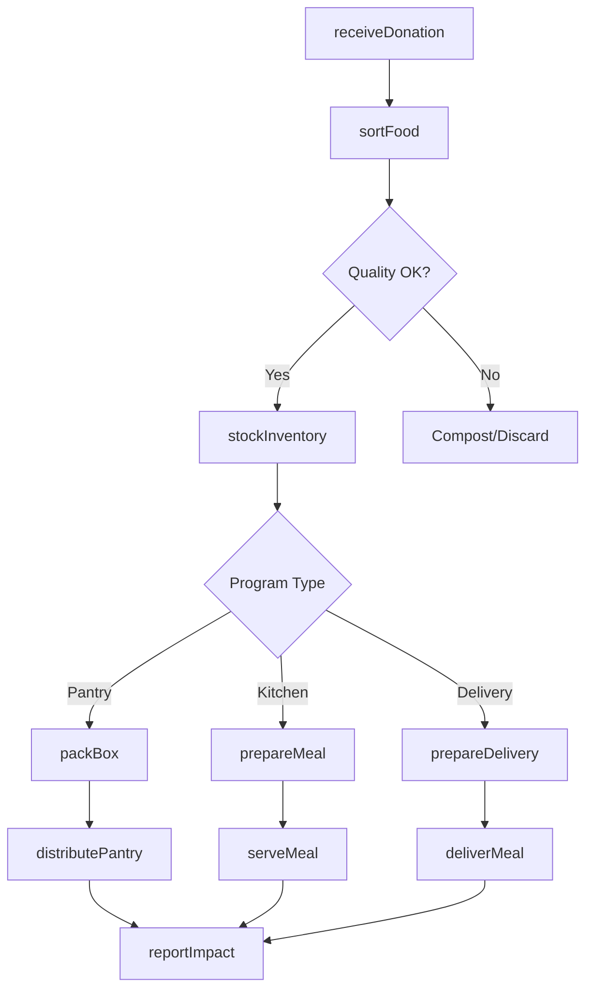
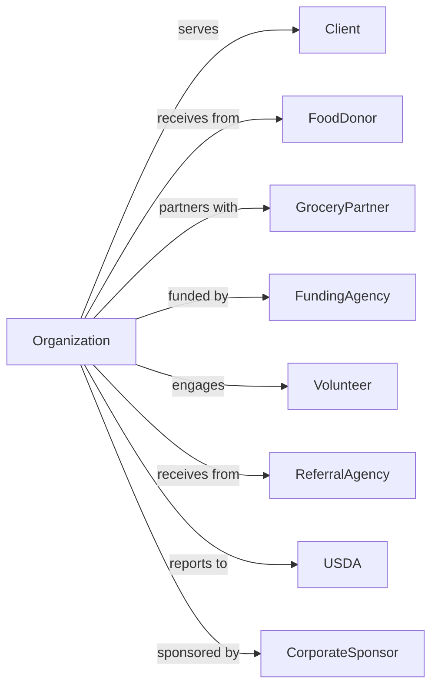

# Community Food Services

> Business-as-Code definition for community food service operations. Models food banks, meal delivery programs, soup kitchens, and food pantries serving individuals facing food insecurity.

## Overview

Community food services collect, prepare, and deliver food to individuals and families facing hunger. This includes food banks coordinating regional food distribution, meal delivery programs serving homebound seniors and disabled individuals, soup kitchens providing hot meals, and food pantries offering groceries. This definition exposes actions for food acquisition and distribution, events for inventory and client tracking, and searches for program and donor management.

## Actors

| Actor | Description |
|-------|-------------|
| Client | Individual or family receiving food assistance |
| FoodDonor | Business or individual donating food items |
| GroceryPartner | Retailer providing rescued food |
| FundingAgency | Government or private funder providing grants |
| Volunteer | Community member providing unpaid service |
| ReferralAgency | Organization connecting clients to services |
| USDA | Provides commodity foods and program oversight |
| CorporateSponsor | Business providing financial support |

## Roles

| Role | Description |
|------|-------------|
| ExecutiveDirector | Oversees organization operations |
| ProgramManager | Coordinates food programs |
| FoodBankCoordinator | Manages warehouse and distribution |
| KitchenManager | Oversees meal preparation |
| OutreachWorker | Connects with clients and community |
| VolunteerCoordinator | Recruits and manages volunteers |
| NutritionEducator | Provides food and health education |
| DeliveryDriver | Transports meals and food |
| FoodRescueCoordinator | Recovers surplus food from retailers and restaurants for redistribution |

## Entities

| Entity | Description |
|--------|-------------|
| Client | Individual receiving food services |
| FoodItem | Donated or purchased food product |
| Donation | Contributed food or funds |
| Meal | Prepared food serving |
| Pantry | Food distribution location |
| Inventory | Stock of available food items |
| DeliveryRoute | Path for meal distribution |
| PartnerAgency | Organization receiving bulk food |
| Volunteer | Community helper record |
| Grant | Funding award for programs |
| Distribution | Food allocation event |
| NutritionPlan | Dietary guidelines for meals |

## Actions

| Action | Description |
|--------|-------------|
| intakeClient | Register individual for food services |
| receiveDonation | Accept food or monetary contribution |
| sortFood | Categorize and inspect donated items |
| stockInventory | Place food in warehouse storage |
| packBox | Assemble food boxes for distribution |
| prepareMeal | Cook and plate meals for service |
| distributePantry | Provide groceries at pantry location |
| serveMeal | Provide hot meal at dining facility |
| deliverMeal | Transport meals to homebound clients |
| rescueFood | Collect surplus from retailers |
| educateNutrition | Provide healthy eating information |
| reportImpact | Document program outcomes |
| recruitVolunteer | Enlist community helpers |
| applyGrant | Request program funding |

## Events

| Event | Description |
|-------|-------------|
| clientIntaked | New individual registered |
| donationReceived | Food or funds accepted |
| foodSorted | Items categorized and inspected |
| inventoryStocked | Food placed in storage |
| boxPacked | Food box assembled |
| mealPrepared | Food cooked and ready |
| pantryDistributed | Groceries provided to clients |
| mealServed | Hot meal given to client |
| mealDelivered | Food transported to homebound |
| foodRescued | Surplus collected from retailer |
| nutritionEducated | Health information shared |
| impactReported | Outcomes documented |
| volunteerRecruited | Helper enlisted |
| inventoryLow | Food stock has fallen below minimum threshold for an item type |
| grantAwarded | Funding received |

## Searches

| Search | Description |
|--------|-------------|
| findClients | List clients by status or need |
| getInventory | View available food stock |
| findDonations | List contributions by date or donor |
| getDeliveryRoutes | View scheduled deliveries |
| findVolunteers | List available helpers |
| getPantrySchedule | View distribution times |
| getImpactMetrics | Retrieve service statistics |
| findPartnerAgencies | List receiving organizations |

## Workflow



## Actor Relationships



## Usage

### Calling Actions

```typescript
import { aidHungry } from '@headlessly/aid-hungry'

const foodBank = aidHungry()

// Intake new client
const client = await foodBank.intakeClient({
  name: 'Maria Garcia',
  householdSize: 4,
  dietaryNeeds: ['diabetic', 'glutenFree'],
  incomeLevel: 'belowPovertyLine',
  referralSource: 'wicOffice'
})

// Receive food donation
const donation = await foodBank.receiveDonation({
  donorId: 'grocery-mart-123',
  items: [
    { type: 'cannedVegetables', quantity: 500, expirationDate: '2024-12-01' },
    { type: 'pasta', quantity: 200, expirationDate: '2025-06-01' }
  ],
  donationType: 'foodRescue'
})

// Pack food box for client
await foodBank.packBox({
  clientId: client.id,
  householdSize: 4,
  dietaryConsiderations: client.dietaryNeeds,
  includeItems: ['protein', 'grains', 'vegetables', 'fruit']
})
```

### Event-Driven Automation

```typescript
// Auto-schedule delivery when meal prepared for homebound
foodBank.mealPrepared(async ({ mealId, clientId, mealType }) => {
  const client = await foodBank.getClient(clientId)

  if (client.deliveryRequired) {
    await foodBank.scheduleDelivery({
      mealId,
      clientId,
      route: await findOptimalRoute(client.address),
      deliveryWindow: 'lunch'
    })
  }
})

// Alert when inventory low
foodBank.inventoryLow(async ({ itemType, currentQuantity }) => {
  await foodBank.alertPartners({
    itemType,
    urgency: currentQuantity < 50 ? 'critical' : 'moderate',
    requestedQuantity: 200
  })

  await notifyFoodRescueTeam({
    neededItems: [itemType],
    priority: 'high'
  })
})
```

## Related

- [Temporary Shelters](./624221-TemporaryShelters.mdx)
- [Emergency and Other Relief Services](./624230-EmergencyAndOtherReliefServices.mdx)
