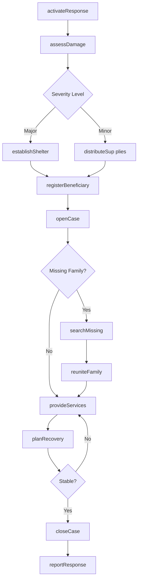
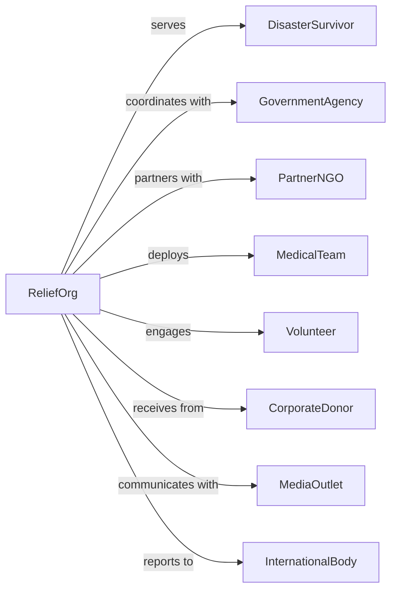

# Emergency and Other Relief Services

> Business-as-Code definition for disaster relief and emergency assistance operations. Models organizations providing food, shelter, medical care, and resettlement services to victims of natural disasters, conflicts, and humanitarian crises.

## Overview

Emergency and other relief services provide immediate assistance to individuals and communities affected by disasters including hurricanes, floods, wildfires, earthquakes, and armed conflicts. Services encompass emergency shelter, food distribution, medical care, family reunification, and long-term recovery support. This definition exposes actions for disaster response, events for relief coordination, and searches for resource and beneficiary management.

## Actors

| Actor | Description |
|-------|-------------|
| DisasterSurvivor | Individual affected by emergency event |
| GovernmentAgency | Federal, state, or local emergency management |
| PartnerNGO | Collaborating relief organization |
| MedicalTeam | Healthcare providers in disaster zones |
| Volunteer | Community member providing assistance |
| CorporateDonor | Business providing funding or supplies |
| MediaOutlet | Organization covering disaster response |
| InternationalBody | UN or other global coordination entity |

## Roles

| Role | Description |
|------|-------------|
| ExecutiveDirector | Oversees relief organization |
| DisasterResponseDirector | Leads emergency operations |
| FieldCoordinator | Manages on-ground relief efforts |
| CaseworkerSpecialist | Assists individual survivor needs |
| LogisticsManager | Coordinates supply chain and distribution |
| VolunteerManager | Organizes relief workforce |
| CommunicationsOfficer | Handles media and donor relations |
| MedicalCoordinator | Oversees health services delivery |

## Entities

| Entity | Description |
|--------|-------------|
| DisasterEvent | Emergency requiring response |
| Beneficiary | Individual receiving relief services |
| ShelterSite | Emergency housing location |
| DistributionPoint | Supply delivery location |
| ReliefSupply | Food, water, medical supplies |
| Case | Individual assistance record |
| Volunteer | Relief worker record |
| Donation | Contributed funds or supplies |
| Deployment | Staff assignment to disaster |
| Assessment | Damage and needs evaluation |
| RecoveryPlan | Long-term restoration approach |
| FamilyLink | Missing person search record |

## Actions

| Action | Description |
|--------|-------------|
| activateResponse | Launch disaster relief operations |
| assessDamage | Evaluate disaster impact |
| establishShelter | Set up emergency housing |
| distributeSupplies | Provide relief materials |
| provideFirstAid | Deliver emergency medical care |
| registerBeneficiary | Enroll survivor for assistance |
| openCase | Begin individual assistance |
| searchMissing | Locate family members |
| reuniteFamily | Connect separated individuals |
| deployVolunteers | Send helpers to disaster zone |
| coordinatePartners | Align with other relief organizations |
| planRecovery | Develop long-term restoration |
| solicitDonations | Request funds and supplies |
| reportResponse | Document relief activities |

## Events

| Event | Description |
|-------|-------------|
| responseActivated | Relief operations launched |
| damageAssessed | Impact evaluation completed |
| shelterEstablished | Emergency housing operational |
| suppliesDistributed | Relief materials provided |
| firstAidProvided | Medical care delivered |
| beneficiaryRegistered | Survivor enrolled |
| caseOpened | Individual assistance begun |
| missingFound | Family member located |
| familyReunited | Separated individuals connected |
| volunteersDeployed | Helpers sent to zone |
| partnersCoordinated | Organizations aligned |
| recoveryPlanned | Long-term plan created |
| donationReceived | Funds or supplies contributed |
| missingPersonReported | Family member has been reported as unaccounted for after disaster |
| responseDeactivated | Operations concluded |

## Searches

| Search | Description |
|--------|-------------|
| findBeneficiaries | List survivors by status or need |
| getShelterSites | View emergency housing locations |
| getDistributionPoints | Find supply delivery sites |
| findVolunteers | List available relief workers |
| getMissingPersons | View family search cases |
| getSupplyInventory | Check available relief materials |
| getActiveDisasters | View current emergencies |
| getDonationStatus | Track contributed funds |

## Workflow



## Actor Relationships



## Usage

### Calling Actions

```typescript
import { aidDisasters } from '@headlessly/aid-disasters'

const reliefOrg = aidDisasters()

// Activate response to disaster
const response = await reliefOrg.activateResponse({
  disasterType: 'hurricane',
  location: 'Gulf Coast Region',
  severity: 'major',
  estimatedAffected: 50000,
  responseLevel: 'national'
})

// Establish emergency shelter
const shelter = await reliefOrg.establishShelter({
  responseId: response.id,
  location: 'Community Center, Mobile AL',
  capacity: 500,
  services: ['cots', 'meals', 'firstAid', 'charging'],
  duration: '2-weeks'
})

// Register disaster survivor
await reliefOrg.registerBeneficiary({
  responseId: response.id,
  name: 'Johnson Family',
  members: 5,
  needs: ['shelter', 'medications', 'clothing'],
  homeStatus: 'destroyed',
  insuranceStatus: 'underinsured'
})
```

### Event-Driven Automation

```typescript
// Auto-distribute supplies when shelter established
reliefOrg.shelterEstablished(async ({ shelterId, location, capacity }) => {
  await reliefOrg.distributeSupplies({
    shelterId,
    items: [
      { type: 'cots', quantity: capacity },
      { type: 'blankets', quantity: capacity * 2 },
      { type: 'hygiene kits', quantity: capacity }
    ],
    priority: 'immediate'
  })

  await reliefOrg.deployVolunteers({
    shelterId,
    roles: ['registration', 'food service', 'childcare'],
    shiftsNeeded: 24
  })
})

// Initiate family reunification when missing reported
reliefOrg.missingPersonReported(async ({ beneficiaryId, missingPerson }) => {
  await reliefOrg.searchMissing({
    reportedBy: beneficiaryId,
    missingPerson,
    lastKnownLocation: missingPerson.lastSeen,
    searchMethods: ['shelterRegistries', 'hospitalRecords', 'socialMedia']
  })

  await notifyFamilyLinkNetwork({
    inquiry: missingPerson,
    urgency: 'high'
  })
})
```

## Related

- [Community Food Services](./624210-CommunityFoodServices.mdx)
- [Temporary Shelters](./624221-TemporaryShelters.mdx)
