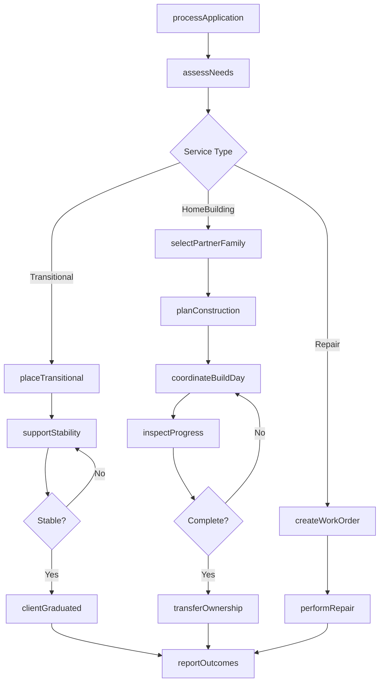
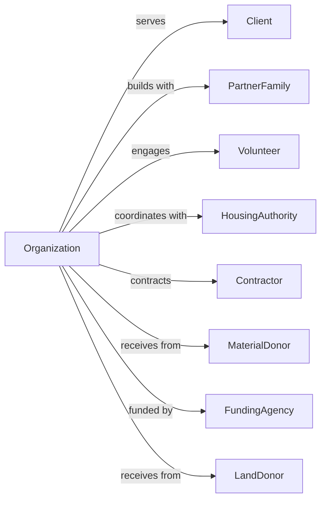

# Other Community Housing Services

> Business-as-Code definition for community housing assistance operations. Models transitional housing programs, volunteer home construction, and home repair services for low-income, elderly, and disabled homeowners.

## Overview

Other community housing services provide housing assistance beyond emergency shelters including transitional housing for families stabilizing after homelessness, volunteer-based home construction with partner families, and critical home repairs for elderly and disabled homeowners. This definition exposes actions for housing placement and construction, events for program tracking, and searches for client and project management.

## Actors

| Actor | Description |
|-------|-------------|
| Client | Individual or family receiving housing services |
| PartnerFamily | Household participating in home construction |
| Volunteer | Community member providing labor |
| HousingAuthority | Public agency managing subsidized housing |
| Contractor | Professional tradesperson for specialized work |
| MaterialDonor | Business providing construction supplies |
| FundingAgency | Government or foundation providing grants |
| LandDonor | Entity contributing property for development |

## Roles

| Role | Description |
|------|-------------|
| ExecutiveDirector | Oversees organization operations |
| ProgramManager | Coordinates housing programs |
| CaseManager | Supports client stability and success |
| ConstructionManager | Oversees building projects |
| VolunteerCoordinator | Recruits and manages volunteers |
| HomeworkerSpecialist | Evaluates repair needs |
| FamilyServicesCoordinator | Supports partner families |
| DevelopmentDirector | Manages fundraising and donations |

## Entities

| Entity | Description |
|--------|-------------|
| Client | Individual receiving housing services |
| TransitionalUnit | Temporary housing accommodation |
| HomeProject | Construction or renovation undertaking |
| Application | Request for housing assistance |
| Assessment | Evaluation of housing needs |
| RepairWorkOrder | Documented repair task |
| SweatEquityHours | Partner family labor contribution |
| BuildDay | Scheduled construction event |
| Material | Construction supplies |
| Volunteer | Helper participation record |
| Grant | Funding award |
| Property | Land or existing home |

## Actions

| Action | Description |
|--------|-------------|
| processApplication | Review housing assistance request |
| assessNeeds | Evaluate client housing situation |
| placeTransitional | Assign to transitional housing |
| selectPartnerFamily | Choose family for home construction |
| planConstruction | Design and schedule building project |
| coordinateBuildDay | Organize volunteer construction event |
| logSweatEquity | Record partner family labor hours |
| inspectProgress | Review construction quality |
| performRepair | Complete home maintenance work |
| procureMaterials | Obtain construction supplies |
| supportStability | Provide case management services |
| transferOwnership | Complete homeownership process |
| reportOutcomes | Document program impact |
| recruitVolunteers | Enlist community helpers |

## Events

| Event | Description |
|-------|-------------|
| applicationReceived | Housing request submitted |
| needsAssessed | Evaluation completed |
| transitionalPlaced | Client moved to housing |
| partnerFamilySelected | Home recipient chosen |
| constructionPlanned | Building project scheduled |
| buildDayCompleted | Volunteer event finished |
| sweatEquityLogged | Labor hours recorded |
| progressInspected | Quality review completed |
| repairCompleted | Maintenance work finished |
| materialsReceived | Supplies delivered |
| ownershipTransferred | Home deeded to family |
| clientGraduated | Transitional program completed |
| outcomeReported | Impact documented |
| volunteerRecruited | Helper enlisted |

## Searches

| Search | Description |
|--------|-------------|
| findClients | List clients by program or status |
| getTransitionalUnits | View available housing |
| findApplications | List pending requests |
| getHomeProjects | Retrieve construction status |
| findRepairWorkOrders | List maintenance needs |
| getVolunteers | View registered helpers |
| getBuildSchedule | Retrieve upcoming events |
| getOutcomeMetrics | View program statistics |

## Workflow



## Actor Relationships



## Usage

### Calling Actions

```typescript
import { aidHousing } from '@headlessly/aid-housing'

const housingOrg = aidHousing()

// Review transitional unit availability and pending applications
const units = await housingOrg.getTransitionalUnits({ status: 'available' })
const applications = await housingOrg.findApplications({ programType: 'homeConstruction', status: 'pending' })

// Process partner family application
const application = await housingOrg.processApplication({
  familyName: 'Johnson Family',
  members: 4,
  currentHousing: 'rentBurdened',
  income: 38000,
  programType: 'homeConstruction',
  sweatEquityCommitment: true
})

// Select partner family for home build
const partnerFamily = await housingOrg.selectPartnerFamily({
  applicationId: application.id,
  selectionCriteria: ['needLevel', 'abilityToRepay', 'sweatEquityCommitment'],
  approvalDate: '2024-04-01'
})

// Plan construction project
await housingOrg.planConstruction({
  partnerFamilyId: partnerFamily.id,
  homeModel: 'threeBedroomRanch',
  lotId: 'lot-567',
  estimatedBuildDays: 15,
  startDate: '2024-06-01'
})
```

### Event-Driven Automation

```typescript
// Schedule next build day when previous completes
housingOrg.buildDayCompleted(async ({ projectId, progressPercentage }) => {
  if (progressPercentage < 100) {
    await housingOrg.coordinateBuildDay({
      projectId,
      scheduledDate: getNextSaturday(),
      volunteersNeeded: 25,
      tasksPlanned: await getNextTasks(projectId)
    })
  } else {
    await housingOrg.scheduleInspection({
      projectId,
      inspectionType: 'final'
    })
  }
})

// Celebrate homeownership transfer
housingOrg.ownershipTransferred(async ({ partnerFamilyId, propertyId }) => {
  await housingOrg.reportOutcomes({
    metric: 'homesBuilt',
    familyId: partnerFamilyId,
    propertyId,
    completionDate: new Date()
  })

  await notifyStakeholders({
    event: 'homeComplete',
    family: partnerFamilyId,
    celebrationDate: getNextDedicationDate()
  })
})
```

## Related

- [Temporary Shelters](./624221-TemporaryShelters.mdx)
- [Emergency and Other Relief Services](./624230-EmergencyAndOtherReliefServices.mdx)
